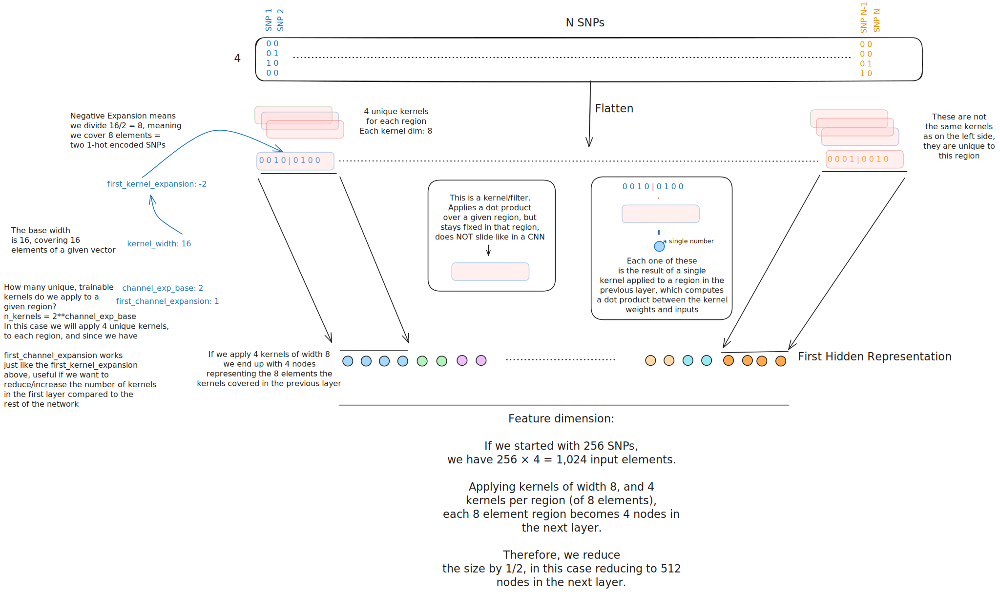

Genomics Guide
==============

Ready-to-use configurations for genetic data analysis
using the Genome Local Network (GLN) model.

- **Data format:** NumPy arrays + .bim variant files (from PLINK processing)
- **Model:** GLN - specifically designed for large-scale genomics data

.. note::
   **First step:** Copy the :doc:`../guides_index` global configuration as your ``globals.yaml``

.. contents::
   :local:
   :depth: 2

Quick Start
-----------

- **Use case:** Genomic prediction (for example T2D disease risk, or continuous traits like blood metabolites) from SNP data
- **Data requirements:** Individual-level genotype data, phenotype labels

**Files needed:**

.. code-block:: yaml
   :caption: inputs.yaml

   input_info:
     input_source: data/genotype_arrays/       # Path to your .npy genotype files
     input_name: genotype
     input_type: omics

   input_type_info:
     snp_file: data/variants.bim               # PLINK .bim file with variant information

   model_config:
     model_type: genome-local-net              # GLN model designed for genomics

.. note::
    The ``input_source`` should contain NumPy arrays of shape ``(4, n_SNPs)``,
    where each SNP is represented by 4 values (one-hot encoded). You can
    convert your ``.bed/.bim/.fam`` files to EIR format using the
    `plink pipelines <https://github.com/arnor-sigurdsson/plink_pipelines>`_ tool.

.. code-block:: yaml
   :caption: outputs.yaml

   output_info:
     output_name: disease_risk
     output_source: data/phenotypes.csv       # Must contain "ID" column + target
     output_type: tabular

   # Note: You don't have to include both ``target_cat_columns``
   # and ``target_con_columns``, but you can if you have both and multiple
   # targets in both categories if you want.
   output_type_info:
     target_cat_columns:
       - Disease_Status                        # Categorical target column
     target_con_columns:
       - BMI                                   # Continuous target column (optional)

**Run command:**

.. code-block:: bash

   eirtrain --global_configs globals.yaml \
            --input_configs inputs.yaml \
            --output_configs outputs.yaml

About the GLN Model
-------------------

**Full model configuration with all available parameters:**

.. code-block:: yaml
   :caption: Advanced GLN configuration

   model_config:
     model_type: genome-local-net
     model_init_config:
       # Architecture control
       layers: null                          # Auto-determine layers based on cutoff
       cutoff: 1024                          # Feature dimension where auto setup stops
       direction: "down"                     # "down" (compress) or "up" (expand)

       # Kernel configuration
       kernel_width: 16                      # Width of locally connected kernels (SNPs per window)
       first_kernel_expansion: -2            # Shrink first kernel (negative = divide, positive = multiply)
       num_lcl_chunks: null                  # Alternative: split input into N chunks

       # Kernel/feature configuration
       channel_exp_base: 2                   # Power of 2 for number of channels/weights applied to each local patch (2^2 = 4 channels)
       first_channel_expansion: 1            # Channel multiplier for first layer

       # Regularization
       rb_do: 0.10                          # Dropout in residual blocks
       stochastic_depth_p: 0.00             # Probability of dropping entire layers
       l1: 0.00                             # L1 regularization on first layer

       # Advanced features
       attention_inclusion_cutoff: null      # Add attention when feature length > cutoff

Feel free to click on the figure below
to see more information about the GLN model architecture
and how the different parameters above affect it:

|

Next section title
------------------

Large-Scale Cohorts (UK Biobank Scale)
--------------------------------------

**Use case:** Analysis on 100K+ samples with 500K+ variants
**Challenge:** Optimal parameter selection becomes more important at this scale

For large-scale genomics, parameter tuning more dataset-dependent.
That's one of the reason we created the
`EIR-auto-GP <https://github.com/arnor-sigurdsson/EIR-auto-GP>`_ project,
which performs automated parameter selection based data characteristics:

**Automated parameter selection examples:**

- **Learning rate** scales with SNP count: 1e-3 (< 1K SNPs) → 1e-5 (> 2M SNPs)
- **GLN kernel expansion** adapts to data size: -4 (small) → +8 (larger datasets)
- **Memory management** automatically detects available RAM and dataset size
- **Batch size & validation** dynamically sized based on sample count
- **Early stopping buffer** scales with iterations per epoch

**Manual Parameter Selection Guide**

If configuring manually, these are some of the criteria we found useful
(and are implemented in EIR-auto-GP):

**Learning Rate Selection:**

.. code-block:: yaml
   :caption: Choose learning rate based on SNP count

   # < 1,000 SNPs
   optimization:
     lr: 0.001

   # 1K - 10K SNPs
   optimization:
     lr: 0.0005

   # 10K - 100K SNPs
   optimization:
     lr: 0.0002

   # 100K - 500K SNPs
   optimization:
     lr: 0.0001

   # 500K - 2M SNPs
   optimization:
     lr: 0.00005

   # > 2M SNPs
   optimization:
     lr: 0.00001

**GLN Kernel Parameters:**

.. code-block:: yaml
   :caption: Kernel expansion scales with data complexity

   # < 1K SNPs: Smaller kernels for limited data
   model_init_config:
     kernel_width: 16
     first_kernel_expansion: -4    # 16/4 = 4 (covers 1 SNP)

   # 1K - 10K SNPs
   model_init_config:
     kernel_width: 16
     first_kernel_expansion: -2    # 16/2 = 8 (covers 2 SNPs)

   # 10K - 100K SNPs
   model_init_config:
     kernel_width: 16
     first_kernel_expansion: 1     # 16*1 = 16 (covers 4 SNPs)

   # 100K - 500K SNPs
   model_init_config:
     kernel_width: 16
     first_kernel_expansion: 2     # 16*2 = 32 (covers 8 SNPs)

   # > 500K SNPs: Higher context to reduce feature size more aggressively
   model_init_config:
     kernel_width: 16
     first_kernel_expansion: 4     # 16*4 = 64 (covers 16 SNPs)

**Memory and Performance:**

.. code-block:: yaml
   :caption: Resource management based on dataset size

   basic_experiment:
     # Memory dataset decision: dataset_size < 60% of available RAM
     # Formula: (n_snps × n_samples × 4 bytes) < (0.6 × RAM)
     memory_dataset: false          # Use for large datasets

     # Batch size: balance memory usage with training stability
     batch_size: 64                 # Standard for most genomics datasets
     batch_size: 32                 # Reduce if GPU memory limited

     # Workers: scale with CPU cores and memory usage
     dataloader_workers: 8          # ~80% of available cores for disk loading
     dataloader_workers: 0          # Use when memory_dataset: true

   training_control:
     # Early stopping buffer: min(5000, iterations_per_epoch × 5)
     early_stopping_buffer: 2000    # Large datasets need more burn-in time

     # Sample interval: min(1000, iterations_per_epoch)
     sample_interval: 1000          # Less frequent evaluation for efficiency

**Complete large-scale configuration:**

.. code-block:: yaml
   :caption: globals.yaml

   basic_experiment:
     output_folder: "results/ukb_analysis"
     n_epochs: 50
     batch_size: 64
     memory_dataset: false
     dataloader_workers: 8

   optimization:
     lr: 0.0001                    # For 100K-500K SNPs

   training_control:
     early_stopping_patience: 15
     early_stopping_buffer: 2000

   attribution_analysis:
     compute_attributions: true
     max_attributions_per_class: 1024

.. code-block:: yaml
   :caption: inputs.yaml

   input_info:
     input_source: data/ukb_genotypes/
     input_name: genotype
     input_type: omics

   input_type_info:
     snp_file: data/ukb_variants.bim

   model_config:
     model_type: genome-local-net
     model_init_config:
       kernel_width: 16
       first_kernel_expansion: 2     # For 100K-500K SNPs

.. note::
   **Recommended approach:** Use `EIR-auto-GP <https://github.com/arnor-sigurdsson/EIR-auto-GP>`_
   for automatic parameter optimization on large-scale data. It handles the complexity
   of parameter selection based on your specific dataset characteristics.