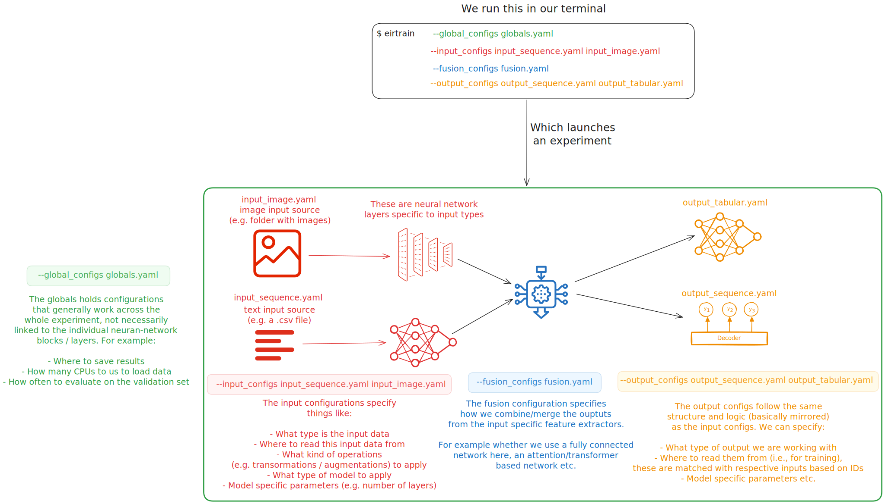

.. _how-eir-works:

How EIR Works
=============

The idea with EIR is to make deep learning
**modular, reproducible, and accessible across different data types**.

Core Design Philosophy
----------------------

**Declarative Design**
    Everything, from data sources, how data is processed,
    to model architectures and output specifications,
    is defined in YAML files.
    No scripting required for standard workflows.

**Modular Architecture**
    Each component (inputs, fusion, outputs) is independent and configurable.
    Mix and match different data types (kind of like LEGO blocks)
    and models without changing code.

**Consistent Interface**
    Whether you're working with genomics, images, text or something else
    - the workflow is the same:
    **configure → train → predict/serve**.

Architecture Overview
---------------------

The diagram below shows a typical workflow in EIR
and, what each configuration file is responsible for,
and how the different neural network "blocks" specified
via the configurations interact with each other.
**Click on the image to enlarge it.**

|

Why This Design?
----------------

**Reproducibility**
    YAML configs capture the entire experiment and can be shared easily.

**Extensibility**
    Add new data types or models without breaking existing workflows.
    The modular design means you can experiment with one
    component while keeping others fixed.

**Practical ML**
    Real-world problems often involve multiple data types,
    where different samples can be missing for different modalities.
    EIR makes developing models for this type of multi-modal data easier.

**From Research to Production**
    The same model that trains on your laptop,
    or on your HPC cluster,
    can be deployed as a web service with one command.

Other Key Features
------------------

**Explainability**
    Built-in attribution analysis shows which features matter most for predictions
    when doing supervised learning (classification and regression).

**Streaming Support**
   Implement your own data streaming logic to handle large datasets, or if you
   want to customize how data is fed into the model.

**Easy Deployment**
    Every trained model becomes a REST API with ``eirserve``.
    No additional infrastructure needed.

Getting Started
---------------

The best way to understand EIR is to try it,
check :ref:`01-genotype-tutorial` to see the basic workflow
