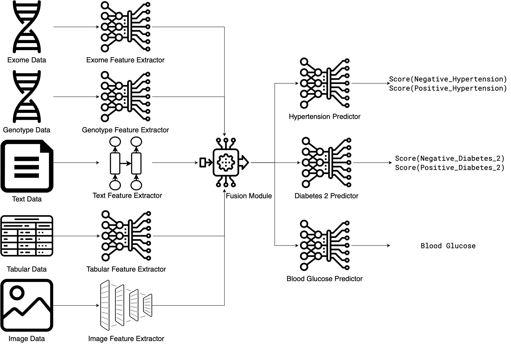

EIR
===

``EIR`` is a framework for
supervised modelling,
sequence generation and
array generation
on genotype, tabular, sequence, image, array, and binary input data.
It is designed to provide
a high-level, yet modular API
that reduces the amount of boilerplate code
and pre-processing required to train a model.

.. warning::
    This project is in alpha phase. Expect backwards incompatible changes and API changes.

|
Installation
------------

Installing EIR via pip
~~~~~~~~~~~~~~~~~~~~~~

.. code-block:: console

    $ pip install eir-dl

.. important::
    The latest version of EIR supports `Python 3.13 <https://www.python.org/downloads/>`_.
    Using an older version of Python will install an outdated version of EIR,
    which is likely to be incompatible with the current documentation
    and may contain bugs. Please make sure that you are installing EIR in a Python 3.13 environment.

Installing EIR via Container Engine
~~~~~~~~~~~~~~~~~~~~~~~~~~~~~~~~~~~

Here's an example with Docker:

.. code-block:: console

    $ docker build -t eir:latest https://raw.githubusercontent.com/arnor-sigurdsson/EIR/master/Dockerfile
    $ docker run -d --name eir_container eir:latest
    $ docker exec -it eir_container bash

Documentation
-------------

To get started, please read :ref:`01-genotype-tutorial`.

.. toctree::
    :maxdepth: 2

    tutorials/tutorial_index
    user_guides/user_guides_index
    api/api_index
    license
    acknowledgements

.. toctree::
   :hidden:
   :maxdepth: 1

   paper_tutorials/01_survival_genotypes