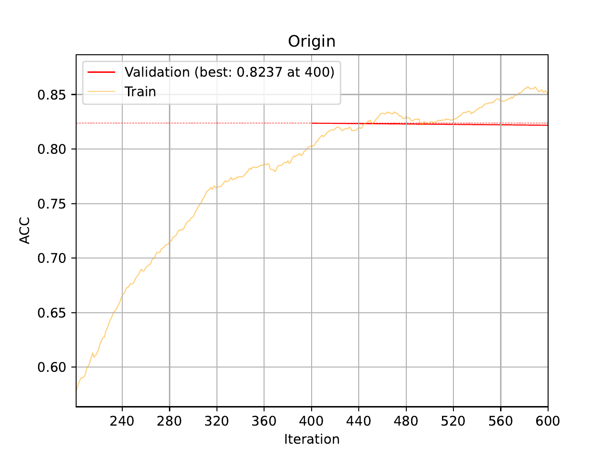
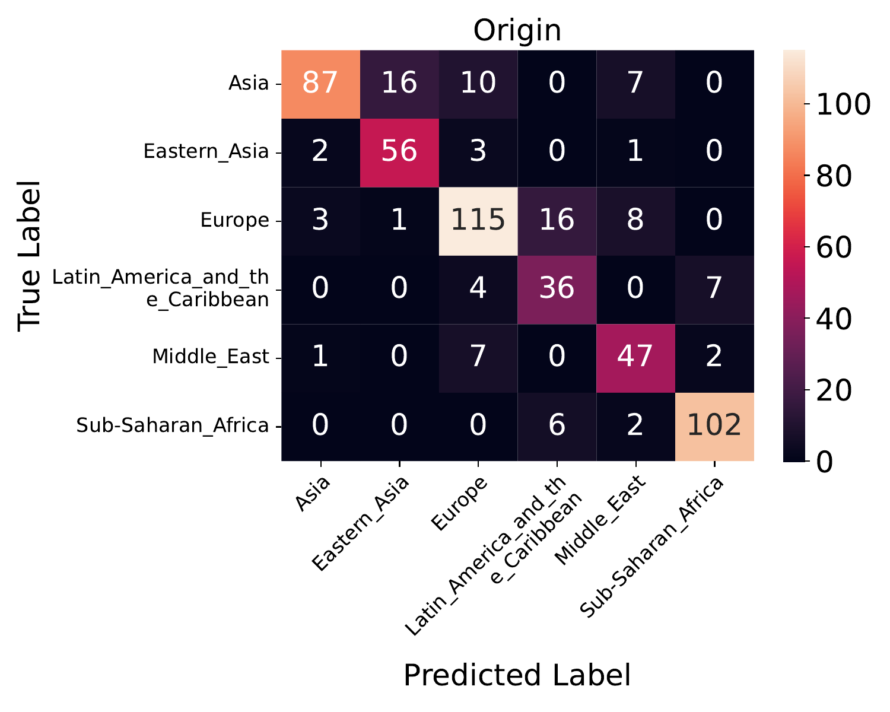
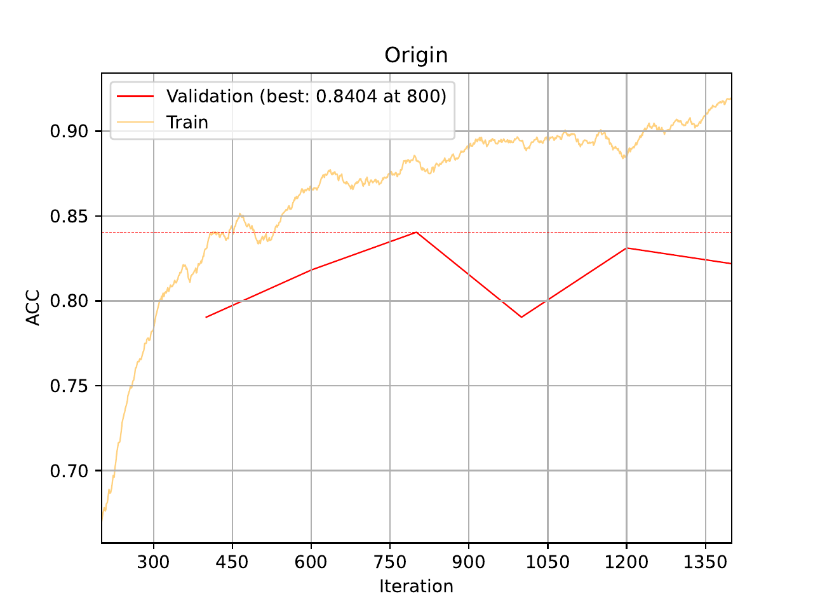
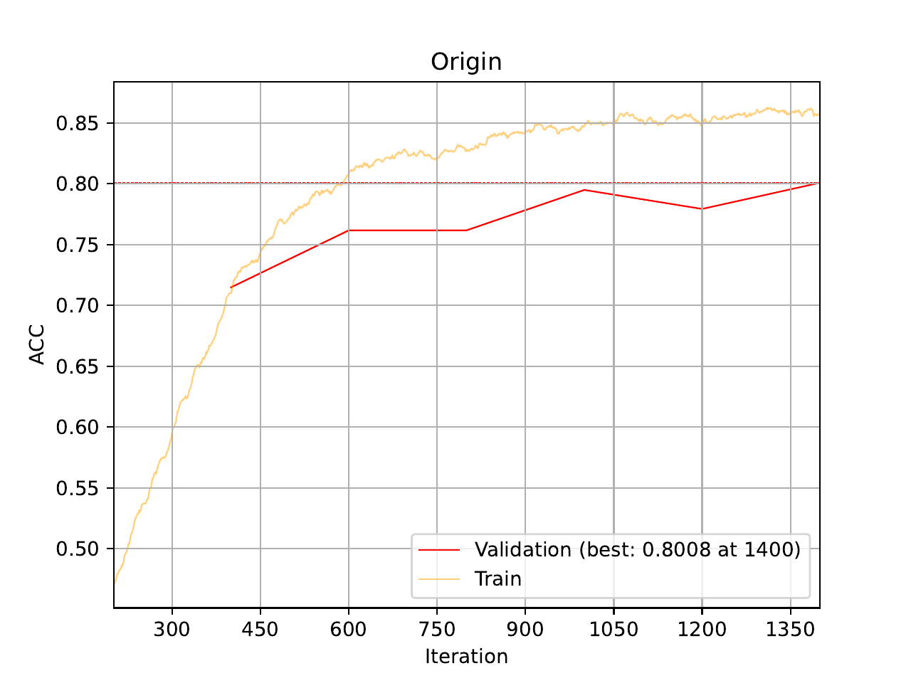

.. _01-basic-tutorial:

01 – Basic Tutorial
===================

A - Setup
^^^^^^^^^

While the :ref:`quickstart` shows
how to quickly train a model,
it obscures a lot of the
configuration and functionality
offered by the framework.

For this tutorial we will be using the `processed sample data`_,
which as the following structure:

.. code-block:: console

    processed_sample_data
    ├── arrays                      # Genotype data as NumPy arrays
    ├── data_final_gen.bim          # Variant information file accompanying the genotype arrays
    └── human_origins_labels.csv    # Contains the target labels (what we want to predict from the genotype data)

.. _processed sample data: https://drive.google.com/file/d/17vzG8AXVD684HqTD6RNtKjrK8tzHWeGx/view?usp=sharing

In order to configure the experiment we want to run,
we will use ``.yaml`` configurations.
Running ``eirtrain --help``,
we can see the configurations needed

.. code-block:: console

    usage: eirtrain [-h] [--preset {gln}] --global_configs GLOBAL_CONFIGS [GLOBAL_CONFIGS ...] --input_configs INPUT_CONFIGS [INPUT_CONFIGS ...] [--predictor_configs [PREDICTOR_CONFIGS [PREDICTOR_CONFIGS ...]]] --target_configs TARGET_CONFIGS [TARGET_CONFIGS ...]

    optional arguments:
      -h, --help            show this help message and exit
      --preset {gln}        Whether and which preset to use that is built into the framework.
      --global_configs GLOBAL_CONFIGS [GLOBAL_CONFIGS ...]
                            Global .yaml configurations for the experiment.
      --input_configs INPUT_CONFIGS [INPUT_CONFIGS ...]
                            Input feature extraction .yaml configurations. Each configuration represents one input.
      --predictor_configs [PREDICTOR_CONFIGS [PREDICTOR_CONFIGS ...]]
                            Predictor .yaml configurations.
      --target_configs TARGET_CONFIGS [TARGET_CONFIGS ...]
                            Target .yaml configurations.

In order to see what should be in these configuration files,
we can check the :ref:`api-reference` reference.

.. note::

    Instead of having to type out the configuration files below manually, you can
    download them from the ``docs/tutorials/tutorial_files/01_basic_tutorial`` directory
    in the `project repository <https://github.com/arnor-sigurdsson/EIR>`_

While the **global** configuration has a lot of options,
the only one we really need to fill in now is ``run_name``,
so we have the following ``tutorial_01_globals.yaml`` file:

.. code-block:: yaml

    run_name: tutorial_01_run

We also need to tell the framework where to load **inputs** from,
and some information about the input, for that we use an input ``.yaml`` configuration
called ``tutorial_01_inputs.yaml``:

.. code-block:: yaml

    input_info:
      input_source: processed_sample_data/arrays/
      input_name: genotype
      input_type: omics

    input_type_info:
      model_type: genome-local-net
      na_augment_perc: 0.4
      na_augment_prob: 1.0
      snp_file: processed_sample_data/data_final_gen.bim

    model_config:
      rb_do: 0.25
      channel_exp_base: 2
      layers:
        - 2
      kernel_width: 8

Above we can see that the input needs 3 fields: ``input_info``, ``input_type_info`` and
``model_config``.
The ``input_info`` contains basic information about the input.
The ``input_type_info`` contains information specific to the input type (in this case
`omics`.
Finally, the ``model_config`` contains configuration for the chosen model in
``input_type_info`` (in this case the GLN model). For more information about the
configurations, e.g. which parameters are relevant for the chosen models and what they
do, head over to the :ref:`api-reference` reference.

Finally, we need to specify what **targets** to predict during training. For that we
will use the ``tutorial_01_targets.yaml`` file with the following content:

.. code-block:: yaml

    label_file: processed_sample_data/human_origins_labels.csv
    target_cat_columns: Origin

With all this, we should have our project directory looking something like this:

.. code-block:: console

    ├── 01_basic_tutorial
    │   ├── tutorial_01_globals.yaml
    │   ├── tutorial_01_input.yaml
    │   └── tutorial_01_targets.yaml
    └── processed_sample_data
        ├── arrays
        ├── data_final_gen.bim
        └── human_origins_labels.csv

B - Training
^^^^^^^^^^^^

Training a GLN model
""""""""""""""""""""

Now that we have our configurations set up,
training is simply passing them to the framework, like so:

.. code-block:: console

    eirtrain \
    --global_configs 01_basic_tutorial/tutorial_01_globals.yaml \
    --input_configs 01_basic_tutorial/tutorial_01_input.yaml \
    --target_configs 01_basic_tutorial/tutorial_01_targets.yaml

This will generate a folder in the current directory called ``runs``,
and ``runs/tutorial_01_run`` (note that the inner run name comes from the value in
``global_config`` we set before).

.. tip::
    You might try running the command above again after it partially/completely
    finishes, and most likely you will encounter a ``FileExistsError``.
    This is to avoid accidentally overwriting previous experiments. When performing
    another run, we will have to delete/rename the experiment, or change it in the
    configuration (see below).

Examining the directory, we see the following structure:

.. code-block:: console

    ├── cl_args.json
    ├── model_info.txt
    ├── saved_models
    ├── results
    │   └── Origin  # Target column
    │       ├── samples
    │       │   ├── 200 # Validation results according to --sample_interval
    │       │   │   ├── activations # Activations, computed if --get_acts flag is used
    │       │   │   ├── confusion_matrix.png
    │       │   │   ├── mc_pr_curve.png
    │       │   │   ├── mc_roc_curve.png
    │       │   │   └── wrong_preds.csv
    │       │   ├── 400
    │       │   │   ├── ...
    │       │   ├── 600
    │       │   │   ├── ...
    │       ├── training_curve_ACC.png
    │       ├── training_curve_AP-MACRO.png
    │       ├── training_curve_LOSS.png
    │       ├── training_curve_MCC.png
    │       ├── training_curve_ROC-AUC-MACRO.png
    ├── training_curve_LOSS-AVERAGE.png
    ├── training_curve_PERF-AVERAGE.png

We can examine how our model did with respect to accuracy (let's assume our targets are
fairly balanced in this case) by checking the `training_curve_ACC.png` file:

Examining the actual predictions and how they matched the target labels,
we can look at the confusion matrix in one of the evaluation folders of
``results/Origin/samples``. When I ran this, I got the following at iteration 600:

In the training curve above,
we can see that our model barely got going before the run finished!
Let's try another experiment.
We can change the ``run_name`` value in ``01_basic_tutorial/tutorial_01_globals.yaml``,
but the framework also supports rudimentary injection of values from the command line.
Let's try that,
setting a new run name,
increasing the number of epochs and
changing the learning rate:

.. code-block:: console

    eirtrain \
    --global_configs 01_basic_tutorial/tutorial_01_globals.yaml \
    --input_configs 01_basic_tutorial/tutorial_01_input.yaml \
    --target_configs 01_basic_tutorial/tutorial_01_targets.yaml \
    --tutorial_01_globals.run_name="my_custom_run_lr=0.002_epochs=20" \
    --tutorial_01_globals.lr=0.002 \
    --tutorial_01_globals.n_epochs=20

.. note::
    The injected values are according to the configuration filenames.

Looking at the training curve from that run, we can see we did a bit better:

Training a linear model
"""""""""""""""""""""""

We can also try training a linear model with L1 regularisation (LASSO),
for that we can use the following input configuration (``tutorial_01b_input_identity``):

.. code-block:: yaml

    input_info:
      input_source: processed_sample_data/arrays/
      input_name: genotype
      input_type: omics

    input_type_info:
      model_type: identity
      na_augment_perc: 0.4
      na_augment_prob: 1.0
      snp_file: processed_sample_data/data_final_gen.bim

This model type will flatten the omics input and propagate it to the predictor. For our
linear model, we therefore use a linear predictor with L1 regularisation
(``tutorial_01b_predictor_linear``).

.. code-block:: yaml

    model_type: linear
    model_config:
      l1: 0.001

Now, we can train the model with the following command:

.. code-block:: console

    eirtrain \
    --global_configs 01_basic_tutorial/tutorial_01_globals.yaml \
    --input_configs 01_basic_tutorial/tutorial_01b_input_identity.yaml \
    --predictor_configs 01_basic_tutorial/tutorial_01b_predictor_linear.yaml  \
    --target_configs 01_basic_tutorial/tutorial_01_targets.yaml  \
    --tutorial_01_globals.run_name="tutorial_01_run_linear" \
    --tutorial_01_globals.n_epochs=20

.. note::
    You might notice that we we did not set a predictor configuration before, that is
    because it defaults to the default residual MLP predictor model if not specified.

We can see that the linear model performs pretty well also. It does show a little more
sign of overfitting as training performance is better than validation performance, so
perhaps more L1 regularization is needed.

C - Predicting on external samples
^^^^^^^^^^^^^^^^^^^^^^^^^^^^^^^^^^

To predict on external samples, we run ``eirpredict``.
As we can see when running ``eirpredict --help``, it looks quite
similar to ``eirtrain``:

.. code-block:: console

    usage: eirpredict [-h] [--preset {gln}] --global_configs GLOBAL_CONFIGS [GLOBAL_CONFIGS ...] --input_configs INPUT_CONFIGS [INPUT_CONFIGS ...] [--predictor_configs [PREDICTOR_CONFIGS [PREDICTOR_CONFIGS ...]]] --target_configs TARGET_CONFIGS [TARGET_CONFIGS ...]
                      --model_path MODEL_PATH [--evaluate] [--output_folder OUTPUT_FOLDER]

    optional arguments:
      -h, --help            show this help message and exit
      --preset {gln}        Whether and which preset to use that is built into the framework.
      --global_configs GLOBAL_CONFIGS [GLOBAL_CONFIGS ...]
                            Global .yaml configurations for the experiment.
      --input_configs INPUT_CONFIGS [INPUT_CONFIGS ...]
                            Input feature extraction .yaml configurations. Each configuration represents one input.
      --predictor_configs [PREDICTOR_CONFIGS [PREDICTOR_CONFIGS ...]]
                            Predictor .yaml configurations.
      --target_configs TARGET_CONFIGS [TARGET_CONFIGS ...]
                            Target .yaml configurations.
      --model_path MODEL_PATH
                            Path to model to use for predictions.
      --evaluate
      --output_folder OUTPUT_FOLDER
                            Where to save prediction results.

Generally we do not change much of the configs when predicting, with the exception of
the input configs and perhaps the global config
(e.g. we might not compute activations during training, but compute them on our test set
by activating ``get_acts`` in the global config when predicting). Specific to
``eirpredict``, we have to choose a saved model (``--model_path``), whether we want to
evaluate the performance on the test set (``--evaluate`` this means that the respective
labels must be present in the ``--target_configs``) and where to save the prediction
results (``--output_folder``).

For the sake of this tutorial, we use one of the saved models from our previous training
run and use it for inference using ``eirpredict`` module. Here, we will simply use it
to predict on the same data as before.

.. warning::
    We are only predicting on the same data we trained on in this tutorial to show
    how to use the ``eirpredict`` module. Always take care in separating what data you
    use for training and to evaluate generalization performance of your models!

Run the commands below, making sure you add the correct path of a saved model to the
``--model_path`` argument.

.. code-block:: console

    mkdir runs/eir_tutorial_prediction_output
    eirpredict \
    --global_configs 01_basic_tutorial/tutorial_01_globals.yaml \
    --input_configs 01_basic_tutorial/tutorial_01_input.yaml \
    --target_configs 01_basic_tutorial/tutorial_01_targets.yaml \
    --model_path runs/tutorial_01_run/saved_models/<chosen model> \
    --evaluate \
    --output_folder runs/eir_tutorial_prediction_output

D - Applying to your own data
^^^^^^^^^^^^^^^^^^^^^^^^^^^^^

Thank you for reading this far! Hopefully this tutorial introduced you well enough to
the framework so you can apply it to your own data. For that, you will have to process
it first (see: `plink pipelines`_). Then you will have to set the relevant paths for the
inputs (e.g. ``input_source``, ``snp_file``) and targets
(e.g. ``label_file``, ``target_cat_columns``).

.. _plink pipelines: https://github.com/arnor-sigurdsson/plink_pipelines