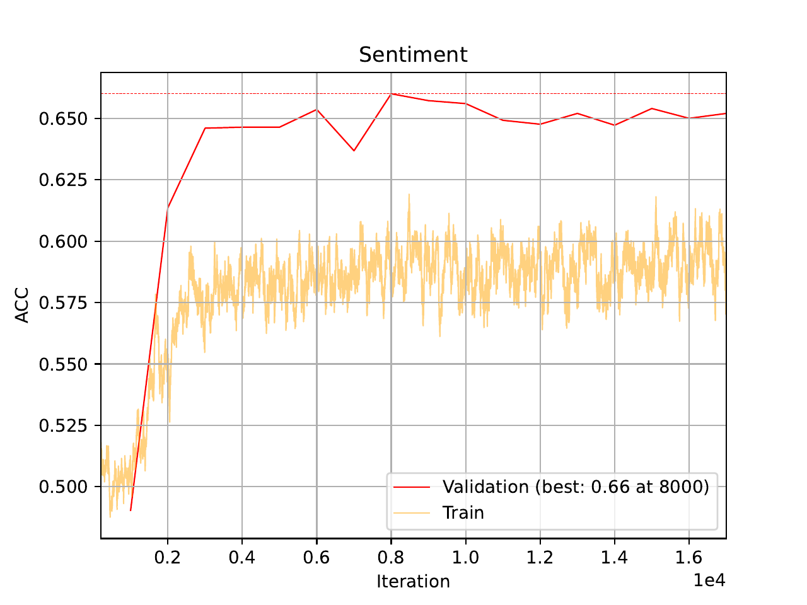

.. _06-raw-bytes-tutorial:

.. role:: raw-html(raw)
    :format: html

06 – Training on binary data
============================

Today, for this tutorial,
we will be training deep learning
models on raw binary data.
In general, it is a good approach
to use inductive bias and domain
expertise when training our models,
but sometimes we might not have a
good idea of how to present our data,
or we simply want to turn off our brains
for a bit and throw raw compute at our problem.
We will be using the familiar IMDB reviews dataset,
see `here <https://ai.stanford.edu/~ang/papers/acl11-WordVectorsSentimentAnalysis.pdf>`__
for more information about the data.
To download the data and configurations for this part of the tutorial,
`use this link. <https://drive.google.com/file/d/1u6bkIr9sECkU9z3Veutjn8cx6Mu3GP3Z>`__

A - Local Transformer
---------------------

After downloading the data, the folder structure should look like this:

.. literalinclude:: tutorial_files/06_raw_bytes_tutorial/commands/tutorial_folder.txt
    :language: console

We will use the
built-in local transformer model
in ``EIR`` for this tutorial.

If you have done the previous tutorials
you might be used to this, but the configurations
are here:

.. literalinclude:: tutorial_files/06_raw_bytes_tutorial/globals.yaml
    :language: yaml
    :caption:

.. literalinclude:: tutorial_files/06_raw_bytes_tutorial/input.yaml
    :language: yaml
    :caption:

.. literalinclude:: tutorial_files/06_raw_bytes_tutorial/output.yaml
    :language: yaml
    :caption:

.. note::
    The model we are training here is relatively
    deep, so you probably need a GPU to
    train it in a reasonable amount of time.
    If you do not have access to a GPU,
    try reducing the number of layers
    and the sequence length.

As usual, we can run the following command to train:

.. literalinclude:: tutorial_files/06_raw_bytes_tutorial/commands/SEQUENCE_BINARY_IMDB_1.txt
    :language: console

When training, I got the following training curves:

Not so great, but not a complete failure either!
When comparing with our
previous modelling on this task (see :ref:`03-sequence-tutorial`),
we definitely performed better when doing word level modelling
compared to running on the raw bytes like we are doing here.
It can well be we need to configure our model better,
or train it on more data, but for now we will say that
adapting the training to the task (in this case NLP) seems
to perform better than training on raw binary data!

.. tip::
    Here we are training on natural language data,
    but the approach here can in theory be applied to
    any type of file on a disk (e.g. images, videos,
    or other more obscure formats). As we saw above
    however, good results not guaranteed!