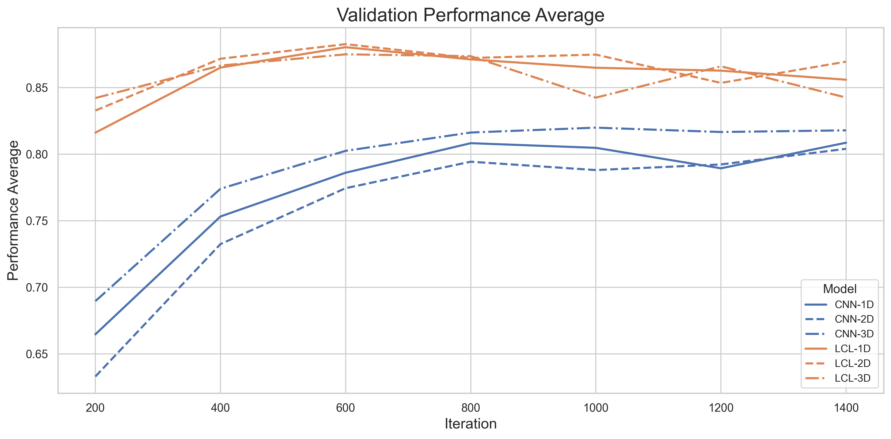

.. _08-array-tutorial:

.. role:: raw-html(raw)
    :format: html

08 – Training on arrays
=======================

In this tutorial, we will be looking at the built in support
for training models on structured arrays in ``EIR``. Here, structured
refers to the arrays all having the same shape, and arrays refers
to the fact that the data is stored in a numpy array. We will be using
the same data as we did in :ref:`01-genotype-tutorial`, but instead
treating them as general arrays instead of genotypes. Currently, the array
functionality in ``EIR`` is built to handle 1, 2 and 3 dimensional arrays.
As in the genotype tutorial, we will be using data processed from
the `Human Origins`_ dataset.
To download the data and configurations for this part of the tutorial,
`use this link. <https://drive.google.com/file/d/1p-RfWqPiYGcmQI7LM60fXkIRSS5AFXM8>`__

.. _Human Origins: https://www.nature.com/articles/nature13673

A - Data
--------

After downloading the data, the folder structure should look like this:

.. literalinclude:: tutorial_files/08_array_tutorial/commands/tutorial_folder.txt
    :language: console

Besides the configurations, there are 3 folders there storing the genotype arrays,
with each folder corresponding to a different dimensionality
(although all the versions are generated from the same base data).
The arrays in the 1D folder encodes the reference, heterozygous, alternative and missing
genotypes as 0, 1, 2 and 3 respectively. The 2D arrays encode the same information,
as a one-hot encoded array. Finally, the 3D arrays contain the same one-hot encoding
as the 2D case, but with a flipped copy of the array as the second channel. This is
all perhaps a bit redundant, but it's just for this tutorial.

B - Training
------------

Here are the configurations for the 1D case:

.. literalinclude:: tutorial_files/08_array_tutorial/globals.yaml
    :language: yaml
    :caption:

.. literalinclude:: tutorial_files/08_array_tutorial/input_1d_cnn.yaml
    :language: yaml
    :caption:

.. literalinclude:: tutorial_files/08_array_tutorial/outputs.yaml
    :language: yaml
    :caption:

We will be training both the CNN and LCL (locally-connected-layers) models,
here is an example configuration for the LCL model:

.. literalinclude:: tutorial_files/08_array_tutorial/input_1d_lcl.yaml
    :language: yaml
    :caption:

.. important::

    While there is a lot of similarity between training the LCL models here
    and the genotype models in :ref:`01-genotype-tutorial`, there are some
    important differences. The most important is how the LC layers are
    applied over the input dimensions. Considering the 2D case, where
    we have one-hot encoded arrays with shape ``(4, n_SNPs)``.
    In the genotype case, the ``kernel_width``
    parameter in the LC layer will be applied in colum-order,
    meaning a width of 8 will cover the first 2 SNPs.
    In the array case, the ``kernel_width``
    parameter is applied in row-order,
    meaning a width of 8 will cover the first row of the first 8 SNPs.

As usual, we can run the following command to train for the CNN and LCL cases:

.. literalinclude:: tutorial_files/08_array_tutorial/commands/CNN_1.txt
    :language: console

.. literalinclude:: tutorial_files/08_array_tutorial/commands/LCL_1.txt
    :language: console

After training, I got the following validation results:

So, here it seems that the LCL models are performing a bit better than the CNN models.
However, we are training for a relatively short time, and one might get better
results by e.g. increasing the number of filters in the CNN case.

If you made it this far, thanks for reading! I hope you found this tutorial useful.