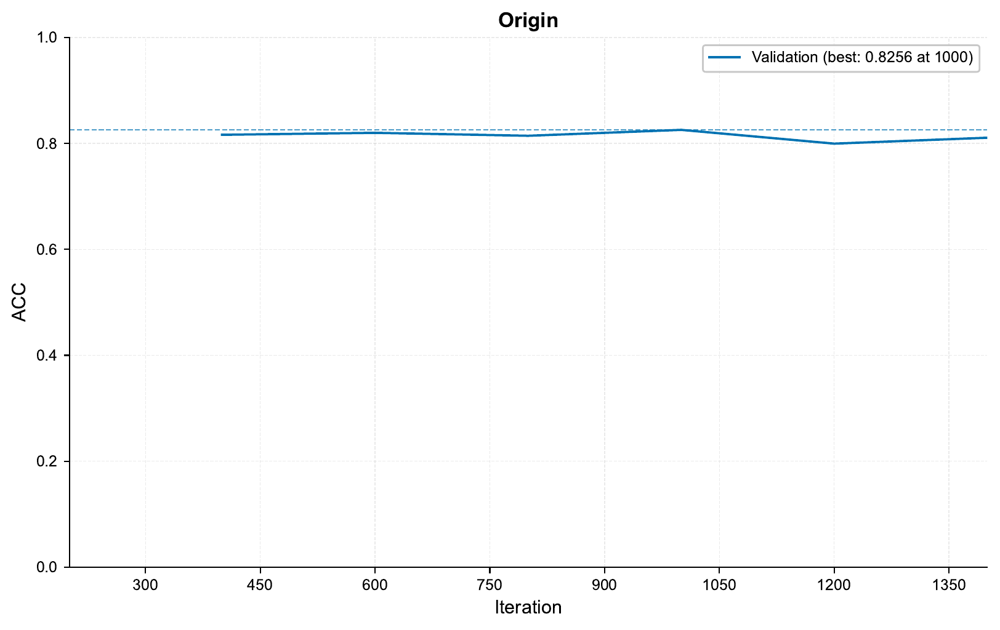

.. _01-genotype-tutorial:

01 – Genotype Tutorial: Ancestry Prediction
===========================================

A - Setup
^^^^^^^^^

In this tutorial,
we will be using
`genotype data <https://en.wikipedia.org/wiki/Genotyping>`__
to train deep learning models
for ancestry prediction.

.. note::
    This tutorial goes into some detail about how ``EIR`` works,
    and how to use it. If you are more interested in quickly training
    the deep learning models for genomic prediction, the `EIR-auto-GP`_
    project might be of use to you.

.. _EIR-auto-GP: https://github.com/arnor-sigurdsson/EIR-auto-GP

To start, please download `processed sample data`_
(or process your own `.bed`, `.bim`, `.fam` files
with e.g. `plink pipelines`_).
The sample data we are using here for predicting ancestry
is the public `Human Origins`_ dataset,
but the same approach can just as well be used for
e.g. disease predictions in other cohorts
(for example the `UK Biobank`_).

.. _processed sample data: https://drive.google.com/file/d/1MELauhv7zFwxM8nonnj3iu_SmS69MuNi
.. _plink pipelines: https://github.com/arnor-sigurdsson/plink_pipelines
.. _Human Origins: https://www.nature.com/articles/nature13673
.. _UK Biobank: https://www.nature.com/articles/s41586-018-0579-z

Examining the sample data, we can see the following structure:

.. code-block:: console

    processed_sample_data
    ├── arrays                      # Genotype data as NumPy arrays
    ├── data_final_gen.bim          # Variant information file accompanying the genotype arrays
    └── human_origins_labels.csv    # Contains the target labels (what we want to predict from the genotype data)

.. important::

    The label file ID column must be called "ID" (uppercase).

For this tutorial,
we are going to use the data above to models
to predict ancestry, of which there are 6 classes
(Asia, Eastern Asia, Europe, Latin America and the Caribbean, Middle East and Sub-Saharan Africa).
Before diving into the model training,
we first have to configure our experiments.

To configure the experiments we want to run,
we will use ``.yaml`` configurations.
Running ``eirtrain --help``,
we can see the configurations needed:

.. literalinclude:: ../tutorial_files/a_using_eir/01_basic_tutorial/commands/eirtrain_help.txt
    :language: console
    :lines: 2-

Above we can see that
there are four types of configurations we can use:
*global*, *inputs*, *fusion* and *outputs*.
To see more details about
what should be in these configuration files,
we can check the :ref:`api-reference` reference.

.. note::

    Instead of having to type out the configuration files below manually, you can
    download them from the ``docs/tutorials/tutorial_files/01_basic_tutorial`` directory
    in the `project repository <https://github.com/arnor-sigurdsson/EIR>`_

While the **global** configuration has a lot of options,
the only one we really need to fill in now is
``output_folder`` and evaluation interval (in batch iterations),
so we have the following ``tutorial_01_globals.yaml`` file:

.. literalinclude:: ../tutorial_files/a_using_eir/01_basic_tutorial/tutorial_01_globals.yaml
    :language: yaml
    :caption: tutorial_01_globals.yaml

We also need to tell the framework where to load **inputs** from,
and some information about the input, for that we use an input ``.yaml`` configuration
called ``tutorial_01_inputs.yaml``:

.. literalinclude:: ../tutorial_files/a_using_eir/01_basic_tutorial/tutorial_01_input.yaml
    :language: yaml
    :caption: tutorial_01_input.yaml

Above we can see that the input needs 3 fields: ``input_info``, ``input_type_info`` and
``model_config``.
The ``input_info`` contains basic information about the input.
The ``input_type_info`` contains information specific to the input type (in this case
`omics`).
Finally, the ``model_config`` contains configuration for
the model that should be
trained with the input data.
For more information about the
configurations, e.g. which parameters are relevant for the chosen models and what they
do, head over to the :ref:`api-reference` reference.

Finally, we need to specify what **outputs** to predict during training. For that we
will use the ``tutorial_01_outputs.yaml`` file with the following content:

.. literalinclude:: ../tutorial_files/a_using_eir/01_basic_tutorial/tutorial_01_outputs.yaml
    :language: yaml
    :caption: tutorial_01_outputs.yaml

.. note::
    You might notice that we have not written any fusion config so far.
    The fusion configuration controls how different modalities
    (i.e. input data types, for example genotype and clinical data)
    are combined using a neural network. While we indeed *can* configure the fusion,
    we will leave use the defaults for now. The default fusion model is a fully
    connected neural network.

With all this, we should have our project directory looking something like this:

.. literalinclude:: ../tutorial_files/a_using_eir/01_basic_tutorial/commands/tutorial_folder.txt
    :language: console

B - Training
^^^^^^^^^^^^

Training a GLN model
""""""""""""""""""""

Now that we have our configurations set up,
training is simply passing them to the framework, like so:

.. literalinclude:: ../tutorial_files/a_using_eir/01_basic_tutorial/commands/GLN_1.txt
    :language: console

This will generate a folder in the current directory called ``eir_tutorials``,
and ``eir_tutorials/tutorial_runs/a_using_eir/tutorial_01_run``
(note that the inner run name comes from the value in
``global_config`` we set before)
will contain the results from our experiment.

.. tip::
    You might try running the command above again after it partially/completely
    finishes, and most likely you will encounter a ``FileExistsError``.
    This is to avoid accidentally overwriting previous experiments. When performing
    another run, we will have to delete/rename the experiment, or change it in the
    configuration (see below).

Examining the directory, we see the following structure
(some files have been excluded here for brevity):

.. literalinclude:: ../tutorial_files/a_using_eir/01_basic_tutorial/commands/experiment_01_folder.txt
    :language: console

In the results folder for a given output,
the [200, 400, 600] folders
contain our validation results
according to our ``sample_interval`` configuration
in the global config.

We can examine how our model did with respect to accuracy (let's assume our targets are
fairly balanced in this case) by checking the `training_curve_ACC.png` file:

.. image:: ../tutorial_files/a_using_eir/01_basic_tutorial/figures/tutorial_01_training_curve_ACC_gln_1.png

Examining the actual predictions and how they matched the target labels,
we can look at the confusion matrix in one of the evaluation folders of
``results/Origin/samples``. When I ran this, I got the following at iteration 600:

In the training curve above,
we can see that our model barely got going before the run finished!
Let's try another experiment.
We can change the ``output_folder`` value
in ``01_basic_tutorial/tutorial_01_globals.yaml``,
but the framework also supports rudimentary injection of values from the command line.
Let's try that,
setting a new run name,
increasing the number of epochs and
changing the learning rate:

.. literalinclude:: ../tutorial_files/a_using_eir/01_basic_tutorial/commands/GLN_2.txt
    :language: console

.. note::
    The injected values are according to the configuration filenames.

Looking at the training curve from that run, we can see we did a bit better:

We also notice that there is a gap
between the training and evaluation performances,
indicating that the model is starting to
overfit on the training data.
There are a bunch of regularisation settings
we could try, such as increasing dropout in
the input, fusion and output modules.
Check the :ref:`api-reference` reference for a full overview.

C - Predicting on external samples
^^^^^^^^^^^^^^^^^^^^^^^^^^^^^^^^^^

Predicting on samples with known labels
"""""""""""""""""""""""""""""""""""""""

To predict on external samples, we run ``eirpredict``.
As we can see when running ``eirpredict --help``, it looks quite
similar to ``eirtrain``:

.. literalinclude:: ../tutorial_files/a_using_eir/01_basic_tutorial/commands/eirpredict_help.txt
    :language: console
    :lines: 2-

Generally we do not change much of the configs when predicting, with the exception of
the input configs (and then mainly setting the ``input_source``,
i.e. where to load our samples to predict/test on from) and perhaps the global config
(e.g. we might not compute attributions during training, but compute them on our test set
by activating ``compute_attributions`` in the global config when predicting). Specific to
``eirpredict``, we have to choose a saved model (``--model_path``), whether we want to
evaluate the performance on the test set (``--evaluate`` this means that the respective
labels must be present in the ``--output_configs``) and where to save the prediction
results (``--output_folder``).

For the sake of this tutorial, we use one of the saved models from our previous training
run and use it for inference using ``eirpredict`` module. Here, we will simply use it
to predict on the same data as before.

.. warning::
    We are only predicting on the same data we trained on in this tutorial to show
    how to use the ``eirpredict`` module. Always take care in separating what data you
    use for training and to evaluate generalization performance of your models!

Run the commands below, making sure you add the correct path of a saved model to the
``--model_path`` argument.

To test, we can run the following command
(note that you will have to add the path to your saved model for the ``--model_path``
parameter below).

.. literalinclude:: ../tutorial_files/a_using_eir/01_basic_tutorial/commands/GLN_1_PREDICT.txt
    :language: console

This will generate a file called
``calculated_metrics.json`` in the supplied ``output_folder`` as well
as a folder for each output (in this case called ``ancestry_output``
containing the actual predictions and plots. Of course the metrics are quite nonsensical
here, as we are predicting on the same data we trained on.

One of the files generated are the actual predictions,
found in the ``predictions.csv`` file:

.. raw:: html
   :file: ../tutorial_files/a_using_eir/01_basic_tutorial/csv_preview.html

The ``True Label Untransformed`` column contains the actual labels, as they were
in the raw data. The ``True Label`` column contains the labels after they have been
numerically encoded / normalized in ``EIR``.
The other columns represent the raw network outputs
for each of the classes.

Predicting on samples with unknown labels
"""""""""""""""""""""""""""""""""""""""""

Notice that when running the command above, we knew the labels of the samples we were
predicting on. In practice, we are often predicting on samples we have no clue
about the labels of. In this case, we can again use the ``eirpredict`` with slightly
modified arguments:

.. literalinclude:: ../tutorial_files/a_using_eir/01_basic_tutorial/commands/GLN_1_PREDICT_UNKNOWN.txt
    :language: console
    :emphasize-lines: 4,6

We can notice a couple of changes here compared to the previous command:

1. We have removed the ``--evaluate`` flag, as we do not have the labels for the samples
   we are predicting on.
2. We have a different output configuation file, ``tutorial_01_outputs_unknown.yaml``.
3. We have a different output folder, ``tutorial_01_unknown``.

If we take a look at the ``tutorial_01_outputs_unknown.yaml`` file, we can see that
it contains the following:

.. literalinclude:: ../tutorial_files/a_using_eir/01_basic_tutorial/tutorial_01_outputs_unknown.yaml
    :language: yaml
    :caption: tutorial_01_outputs_unknown.yaml
    :emphasize-lines: 3

Notice that everything is the same as before, but for ``output_source`` we have
``null`` instead of the `.csv` label file we had before.

Taking a look at the produced ``predictions.csv`` file, we can see that we only
have the actual predictions, and no true labels:

.. raw:: html
   :file: ../tutorial_files/a_using_eir/01_basic_tutorial/csv_preview_unknown.html

D - Applying to your own data (e.g. UK Biobank)
^^^^^^^^^^^^^^^^^^^^^^^^^^^^^^^^^^^^^^^^^^^^^^^

Thank you for reading this far! Hopefully this tutorial introduced you well enough to
the framework so you can apply it to your own data. For that, you will have to process
it first (see: `plink pipelines`_). Then you will have to set the relevant paths for the
inputs (e.g. ``input_source``, ``snp_file``) and outputs
(e.g. ``output_source``, ``target_cat_columns`` or ``target_con_columns``
if you have continuous targets).

However, when moving to large scale data such as the UK Biobank, the configurations we used
on the ancestry toy data in this tutorial will likely not be sufficient. For example,
the learning rate is likely too high. For this, we specifically designed the
`EIR-auto-GP`_ project, which focuses on allow you to quickly train deep learning models
for genomic prediction.

E - Serving
^^^^^^^^^^^

In this final section, we demonstrate serving our trained model
as a web service and interacting with it using HTTP requests.

Starting the Web Service
"""""""""""""""""""""""""

To serve the model, use the following command:

.. code-block:: shell

    eirserve --model-path [MODEL_PATH]

Replace `[MODEL_PATH]` with the actual path to your trained model.
This command initiates a web service that listens for incoming requests.

Here is an example of the command:

.. literalinclude:: ../tutorial_files/a_using_eir/01_basic_tutorial/commands/GLN_1_DEPLOY.txt
    :language: console

Sending Requests
""""""""""""""""

With the server running, we can now send requests.
The requests are prepared by loading numpy array data,
converting it to base64 encoded strings, and then constructing a JSON payload.

Here's an example Python function demonstrating this process:

.. literalinclude:: ../tutorial_files/a_using_eir/01_basic_tutorial/request_example/request_example_module.py
    :language: python
    :caption: request_example_module.py

When running this, we get the following output:

.. literalinclude:: ../tutorial_files/a_using_eir/01_basic_tutorial/request_example/request_example.json
    :language: json
    :caption: request_example.json

Analyzing Responses
"""""""""""""""""""

Here are some examples of responses from the server for a set of inputs:

.. literalinclude:: ../tutorial_files/a_using_eir/01_basic_tutorial/serve_results/predictions.json
    :language: json
    :caption: predictions.json