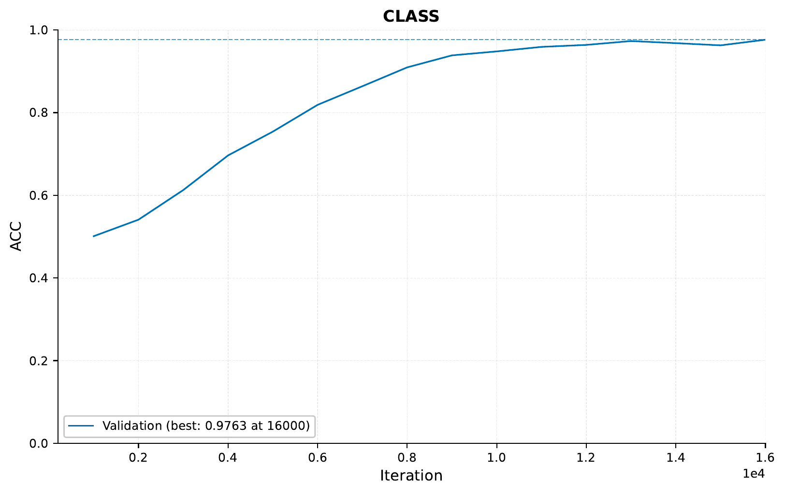
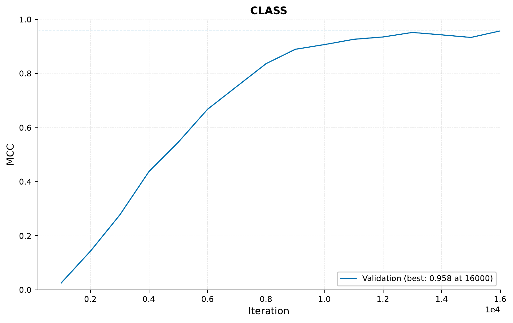

.. _02-tabular-tutorial:

02 – Tabular Tutorial: Nonlinear Poker Hands
============================================

A - Setup
^^^^^^^^^

In this tutorial,
we will be training a model
using only tabular data as input.
The task is to predict poker hands
from the suit an rank of cards.
See `here <https://archive.ics.uci.edu/ml/datasets/Poker+Hand>`_
for more information
about the dataset.

Note that this tutorial assumes that
you are already familiar with
the basic functionality
of the framework
(see :ref:`01-genotype-tutorial`).

To download the data for for this tutorial,
`use this link. <https://drive.google.com/file/d/1Ck1F_iYT3WdoAHjtPwR1peOqhwjmCqHl>`_

Having a quick look at the data,
we can see it consists of 10 categorical inputs columns
and 1 categorical output column (which has 10 classes).

.. code-block:: console

    $ head -n 3 poker_hands_data/poker_hands_train.csv

    ID,S1,C1,S2,C2,S3,C3,S4,C4,S5,C5,CLASS
    0,2,11,2,13,2,10,2,12,2,1,9
    1,3,12,3,11,3,13,3,10,3,1,9

To start with,
we can use the following configurations for
the global, input, target and predictor parts respectively:

.. literalinclude:: ../tutorial_files/a_using_eir/02_tabular_tutorial/02_poker_hands_globals.yaml
    :language: yaml
    :caption: 02_poker_hands_globals.yaml

.. note::

    You might notice the perhaps new ``manual_valid_ids_file`` argument
    in the global configuration. This is because
    the data is quite imbalanced, so we provide a pre-computed validation set to
    ensure that all classes are present in both the training and validation set.
    Be aware that currently the framework does not handle having a mismatch in which
    classes are present in the training and validation sets.

.. literalinclude:: ../tutorial_files/a_using_eir/02_tabular_tutorial/02_poker_hands_input.yaml
    :language: yaml
    :caption: 02_poker_hands_input.yaml

.. literalinclude:: ../tutorial_files/a_using_eir/02_tabular_tutorial/02_poker_hands_fusion.yaml
    :language: yaml
    :caption: 02_poker_hands_fusion.yaml

.. literalinclude:: ../tutorial_files/a_using_eir/02_tabular_tutorial/02_poker_hands_output.yaml
    :language: yaml
    :caption: 02_poker_hands_output.yaml

So, after setting up,
our folder structure should look
something like this:

.. literalinclude:: ../tutorial_files/a_using_eir/02_tabular_tutorial/commands/tutorial_folder.txt
    :language: console

B - Training
^^^^^^^^^^^^

Now we are ready to train our first model!
We can use the command below,
which feeds the configs we defined above
to the framework
(fully running this should take around 10 minutes,
so now is a good time to stretch your legs or grab a cup of coffee!):

.. literalinclude:: ../tutorial_files/a_using_eir/02_tabular_tutorial/commands/TABULAR_1.txt
    :language: console

We can examine how our model did with respect to accuracy
by checking the `training_curve_ACC.png` file:

However,
we do know that the data is very imbalanced,
so a better idea might be checking the MCC:

Both look fairly good, but how are we really doing? Let's check the confusion matrix
for our predictions at iteration 15000:

.. image:: ../tutorial_files/a_using_eir/02_tabular_tutorial/figures/02_poker_hands_confusion_matrix_tabular_1.png

So there it is – we are performing quite well for classes 0-3,
but (perhaps as expected), we perform very poorly on the rare classes.

In any case, let's have a look at how well we do on the test set!

C - Predicting on test set
^^^^^^^^^^^^^^^^^^^^^^^^^^

To test, we can run the following command
(note that you will have to add the path to your saved model for the ``--model_path``
parameter below).

.. literalinclude:: ../tutorial_files/a_using_eir/02_tabular_tutorial/commands/TABULAR_1_PREDICT.txt
    :language: console

This will create the following extra files
in the ``eir_tutorials/tutorial_runs/a_using_eir/tutorial_02_run``
directory

.. code-block:: console

    ├── CLASS
    │     ├── confusion_matrix.png
    │     ├── mc_pr_curve.png
    │     ├── mc_roc_curve.png
    │     └── predictions.csv
    ├── calculated_metrics.json

The ``calculated_metrics.json`` file
can be quite useful,
as it contains the performance of
our model on the test set.

.. literalinclude:: ../tutorial_files/a_using_eir/02_tabular_tutorial/tutorial_data/calculated_metrics_test.json
    :language: json
    :caption: calculated_metrics.json

This seems pretty good,
but we don't really have any baseline to compare it to.
Luckily, there is an great paper
titled `TabNet: Attentive Interpretable Tabular Learning <https://arxiv.org/abs/1908.07442>`_,
which is also using NNs on tabular data,
and they even use the Poker Hand dataset as well!

.. list-table:: TabNet paper performances for Poker Hand induction dataset.
   :widths: 25 25
   :header-rows: 1

   * - Model
     - Test accuracy (%)
   * - DT
     - 50.0
   * - MLP
     - 50.0
   * - Deep neural DT
     - 65.1
   * - XGBoost
     - 71.1
   * - LightGBM
     - 70.0
   * - CatBoost
     - 66.6
   * - TabNet
     - 99.2
   * - Rule-based
     - 100.0

So using our humble model before we saw an accuracy of around 99%. Of course, since the
dataset is highly imbalanced, it can be difficult to compare with the numbers in the
table above. For example it can be that TabNet is performing very well on the rare
classes, which will not have a large effect on the total test accuracy. However, our
performance is perhaps a nice baseline, especially since
TabNet is a much more complex model,
and we did not do extensive hyper-parameter tuning!

E - Serving
^^^^^^^^^^^

In this final section, we demonstrate serving our trained model
as a web service and interacting with it using HTTP requests.

Starting the Web Service
"""""""""""""""""""""""""

To serve the model, use the following command:

.. code-block:: shell

    eirserve --model-path [MODEL_PATH]

Replace `[MODEL_PATH]` with the actual path to your trained model.
This command initiates a web service that listens for incoming requests.

Here is an example of the command:

.. literalinclude:: ../tutorial_files/a_using_eir/02_tabular_tutorial/commands/TABULAR_DEPLOY.txt
    :language: console

Sending Requests
""""""""""""""""

With the server running, we can now send requests. For tabular data,
we send the payload directly as a Python dictionary.

Here's an example Python function demonstrating this process:

.. literalinclude:: ../tutorial_files/a_using_eir/02_tabular_tutorial/request_example/python_request_example_module.py
    :language: python
    :caption: request_example_module.py

When running this, we get the following output:

.. literalinclude:: ../tutorial_files/a_using_eir/02_tabular_tutorial/request_example/python_request_example.json
    :language: json
    :caption: request_example.json

We can also send the same request using the `curl` command:

.. literalinclude:: ../tutorial_files/a_using_eir/02_tabular_tutorial/request_example/bash_request_example_module.sh
    :language: console
    :caption: request_example_module.sh

When running this, we get the following output:

.. literalinclude:: ../tutorial_files/a_using_eir/02_tabular_tutorial/request_example/bash_request_example.json
    :language: json
    :caption: request_example.json

Analyzing Responses
"""""""""""""""""""

After sending requests to the served model, the responses can be analyzed.
These responses provide insights into the model's predictions based on the input data.

.. literalinclude:: ../tutorial_files/a_using_eir/02_tabular_tutorial/serve_results/predictions.json
    :language: json
    :caption: predictions.json

If you made it this far, I want to thank you for reading. I hope this tutorial was
useful / interesting to you!
