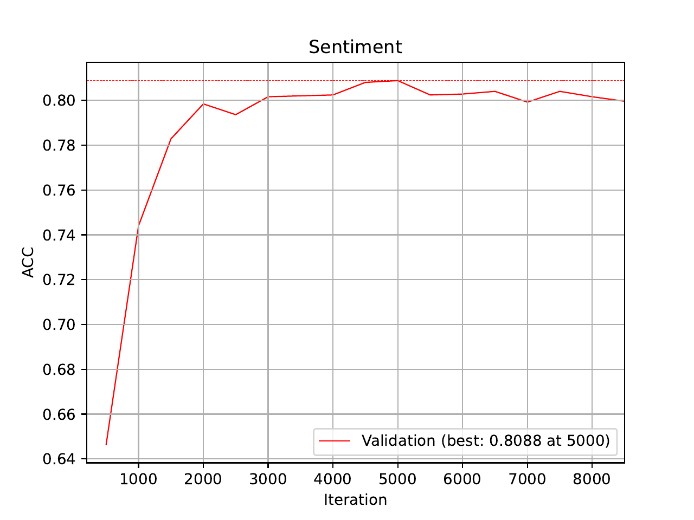
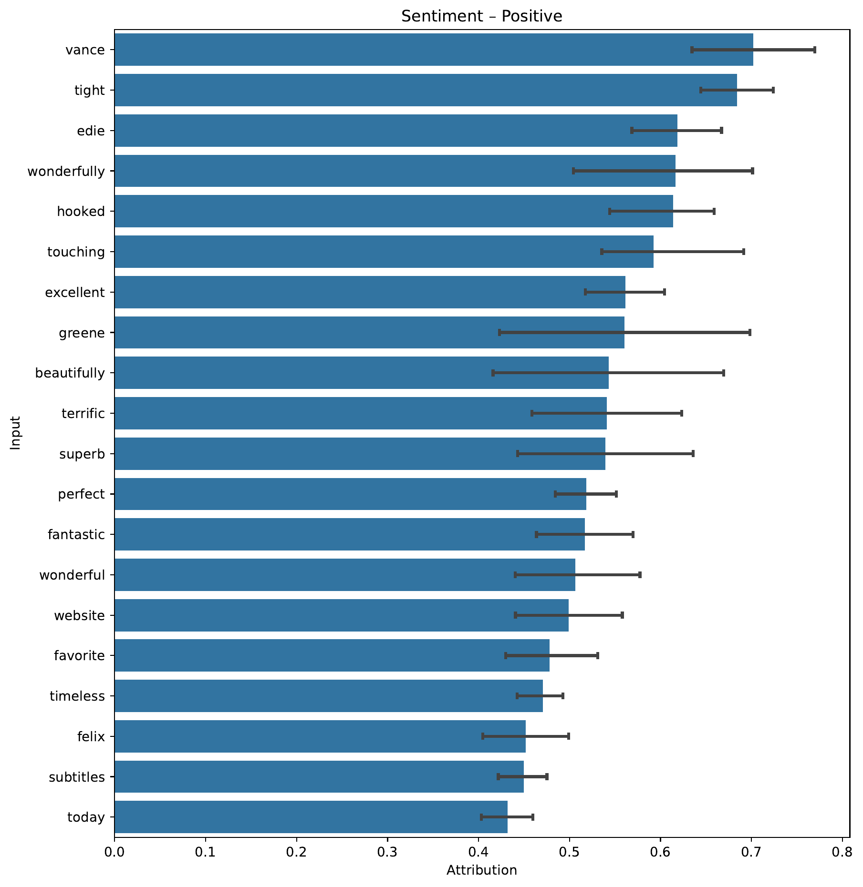
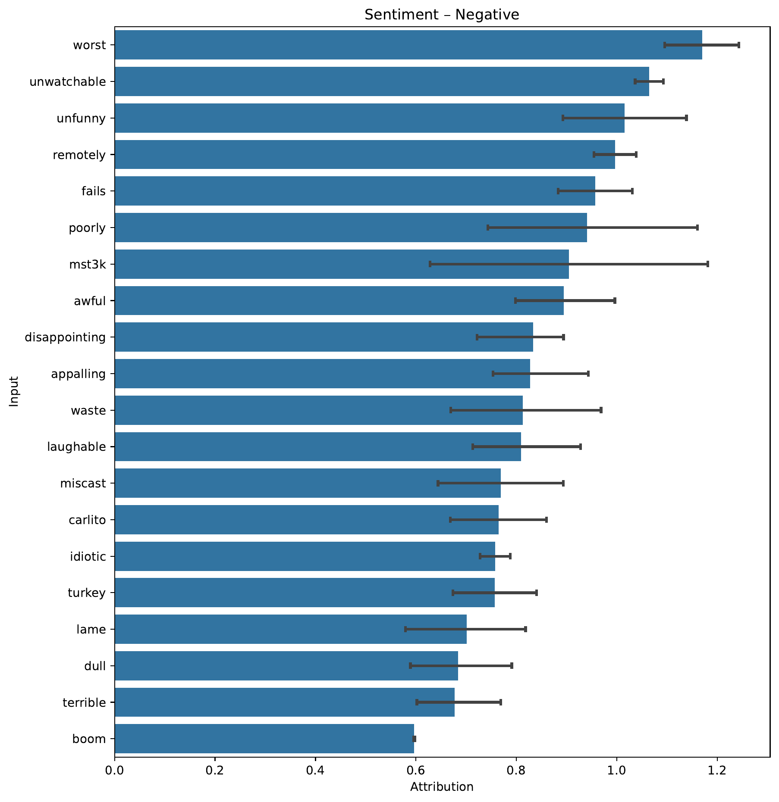
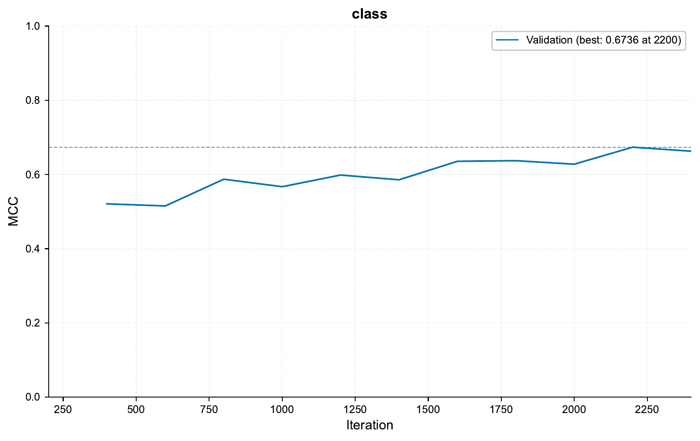
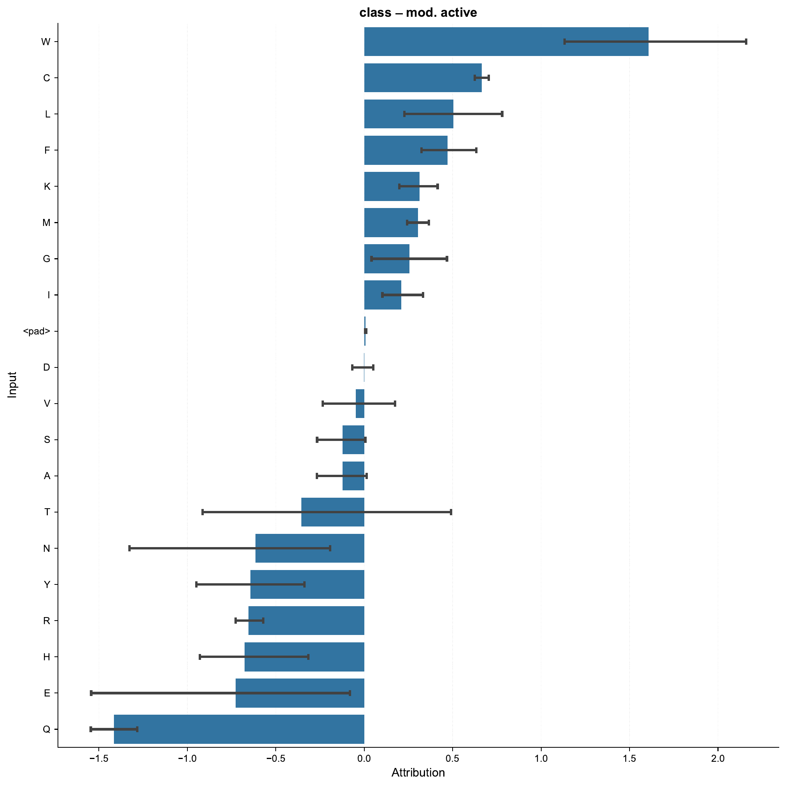

.. _03-sequence-tutorial:

.. role:: raw-html(raw)
    :format: html

03 – Sequence Tutorial: Movie Reviews and Peptides
==================================================

In this tutorial,
we will be training models
using discrete sequences as inputs.
Here, we will be doing two tasks.
Firstly, we train a model
to classify positive vs. negative
sentiment in the IMDB reviews dataset.
Secondly, we will train another model
to detect anticancer properties in peptides
using the anticancer peptides dataset.

Note that this tutorial assumes that
you are already familiar with
the basic functionality
of the framework
(see :ref:`01-genotype-tutorial`).

A - IMDB Reviews
----------------

A1 - IMDB Setup
^^^^^^^^^^^^^^^

For this first task,
we will do a relatively classic NLP task,
where we train a model to predict sentiment
from IMDB reviews, see `here <https://ai.stanford.edu/~ang/papers/acl11-WordVectorsSentimentAnalysis.pdf>`__
for more information about the data.
To download the data and configurations for this part of the tutorial,
`use this link. <https://drive.google.com/file/d/1u6bkIr9sECkU9z3Veutjn8cx6Mu3GP3Z>`__

Here we can see an example of one review from the dataset.

.. code-block:: console

    $ cat IMDB/IMDB_Reviews/3314_1.txt

    Reading through all these positive reviews I find myself baffled.
    How is it that so many enjoyed what I consider to be a woefully bad adaptation
    of my second favourite Jane Austen novel? There are many problems with the film,
    already mentioned in a few reviews; simply put it is a hammed-up, over-acted,
    chintzy mess from opening credits to butchered ending.  While many
    characters are mis-cast and neither Ewan McGregor nor Toni Collette puts in a
    performance that is worthy of them, the worst by far is Paltrow. \
    I have very much enjoyed her performance in some roles, but here she is
    abominable - she is self-conscious, nasal, slouching and entirely disconnected
    from her characters and those around her. An extremely disappointing effort -
    though even a perfect Emma could not have saved this film.

Whatever movie this review is from,
it seems that the person certainly did not enjoy it!
This is fairly obvious for us to see,
now the question is
if we train a model to do the same.

As in previous tutorials,
we will start by defining our configurations.

.. literalinclude:: ../tutorial_files/a_using_eir/03_sequence_tutorial/a_IMDB/03a_imdb_globals.yaml
    :language: yaml
    :caption: 03a_imdb_globals.yaml

.. note::

    You might notice that in the global configuration in this tutorial, we have a couple
    of new parameters going on. Namely the ``compute_attributions``, ``max_attributions_per_class`` and
    ``attributions_every_sample_factor``. These are settings related to computing attributions
    so we can interpret/explain how our inputs influence the model outputs. For more
    information, check out the :ref:`api-reference` reference.

.. literalinclude:: ../tutorial_files/a_using_eir/03_sequence_tutorial/a_IMDB/03a_imdb_input.yaml
    :language: yaml
    :caption: 03a_imdb_input.yaml

.. literalinclude:: ../tutorial_files/a_using_eir/03_sequence_tutorial/a_IMDB/03a_imdb_output.yaml
    :language: yaml
    :caption: 03a_imdb_output.yaml

.. tip::

    There are a lot of new configuration options going on here, head over to the
    :ref:`api-reference` reference for more details.

Now with the configurations set up, our folder structure should look like this:

.. literalinclude:: ../tutorial_files/a_using_eir/03_sequence_tutorial/a_IMDB/commands/tutorial_folder.txt
    :language: console
    :caption: Folder structure after setting up the configurations.

A2 - IMDB Training
^^^^^^^^^^^^^^^^^^

As before, we can train a model using ``eirtrain``:

.. literalinclude:: ../tutorial_files/a_using_eir/03_sequence_tutorial/a_IMDB/commands/SEQUENCE_IMDB_1.txt
    :language: console
    :caption: Training a model to predict sentiment from IMDB reviews.

This took around 20 minutes to run on my laptop,
so this is a good chance to take a nap
or do something else for a while!

Looking at the accuracy, I got the following training/validation results:

Perhaps not great, but not too bad either!
Especially since we are using a relatively short sequence length.

.. note::

    Here we are using a transformer based neural network for the training, however
    do not underestimate the power of classical, more established methods. In fact,
    simpler, non neural-network based methods have attained better accuracy that what
    we see above! If you have some time to kill, try playing with the hyper parameters
    a bit to see how they affect the performance.

A3 - IMDB Interpretation
^^^^^^^^^^^^^^^^^^^^^^^^

Now remember those new flags we used in the global configuration,
``compute_attributions`` and friends? Setting those will instruct the
framework to compute and analyze
how the inputs influence the model
towards a certain output. In this case,
the attributions can be found in the
``imdb_sentiment/results/Sentiment/samples/<every_2000_iterations>/attributions``
folders. Behind the scenes,
the framework uses `integrated gradients <https://arxiv.org/abs/1703.01365>`__,
implemented in the fantastic the `Captum <https://captum.ai/>`__ library,
to compute the attributions.

Firstly,
let's have a look at
the words that had the biggest influence
towards a Positive and Negative sentiment.

.. note::

    Which tokens are included in this plot and how they are sorted is based both on the
    average and 95% confidence interval of the attribution. The raw values
    are also stored, in case you want to do your own analysis.
    The CIs represent the 95% confidence interval
    after 1,000 bootstrap samples.

So fortunately,
it seems indeed that our model learned some relevant things!
When training on sequences,
the framework will also by default save attributions
towards the relevant label
for 10 single samples,
here is one such example, where we look at the attributions towards a positive sentiment.

.. raw:: html
   :file: ../tutorial_files/a_using_eir/03_sequence_tutorial/a_IMDB/figures/tutorial_03a_single_samples_example.html

:raw-html:` `

That concludes the NLP specific part of this tutorial,
next we will apply the same approach but for biological data!

B - Anticancer Peptides
-----------------------

B1 - Anticancer Peptides Setup
^^^^^^^^^^^^^^^^^^^^^^^^^^^^^^

Modelling on language like we did above is both fun and relatable,
but now we try something a bit more niche. For this second part of the tutorial,
we will use the framework to predict anti breast cancer properties of
peptides (a peptide is basically a short protein sequence).
See `here <https://pubmed.ncbi.nlm.nih.gov/30953170/>`_
for more information about the dataset. To download the data and configurations for this part of the tutorial,
`use this link. <https://drive.google.com/file/d/12vHW1V8hhIuasih_gWPn7xHmZZTAd22Q>`_

Again, let's take a quick look at one sample we are going to be modelling on:

Here we can see an example of one review from the dataset.

.. code-block:: console

    $ cat Anticancer_Peptides/breast_cancer_train/1.txt

    AAWKWAWAKKWAKAKKWAKAA

So immediately we can see that this is fairly different from our movie reviews,
let's see how it goes with the modelling part.
As always,
we start with the configurations.
You might notice a new option in the global configuration,
``weighted_sampling_columns``.
This setting controls
which target column to use for weighted sampling,
and the special keyword ``all``
will take an average across
all target columns.
In this case we have only one ("class"),
so it just accounts for that one.
This can be useful for this dataset
as it is quite imbalanced w.r.t. target labels,
as you will see momentarily.

.. literalinclude:: ../tutorial_files/a_using_eir/03_sequence_tutorial/b_Anticancer_peptides/03b_peptides_globals.yaml
    :language: yaml
    :caption: 03b_peptides_globals.yaml

.. note::

    You might notice that we use a large validation set here.
    This a similar situation as in :ref:`02-tabular-tutorial`, where we used a manual
    validation set to ensure that we have all classes present in the validation set.
    Here, we take the lazier approach and just make the validation set larger.
    Currently the framework does not handle having a mismatch in which classes are
    present in the training and validation sets.

Notice that the input configuration
is slightly different.
For example, as we are not dealing with natural language,
we do not split on whitespace anymore, but rather on "".

.. literalinclude:: ../tutorial_files/a_using_eir/03_sequence_tutorial/b_Anticancer_peptides/03b_peptides_input.yaml
    :language: yaml
    :caption: 03b_peptides_input.yaml

.. literalinclude:: ../tutorial_files/a_using_eir/03_sequence_tutorial/b_Anticancer_peptides/03b_peptides_output.yaml
    :language: yaml
    :caption: 03b_peptides_output.yaml

B1 - Anticancer Peptides Training
^^^^^^^^^^^^^^^^^^^^^^^^^^^^^^^^^

For the peptide data,
the folder structure should look something like this:

.. literalinclude:: ../tutorial_files/a_using_eir/03_sequence_tutorial/b_Anticancer_peptides/commands/tutorial_folder.txt
    :language: console

As before, we run:

.. literalinclude:: ../tutorial_files/a_using_eir/03_sequence_tutorial/b_Anticancer_peptides/commands/SEQUENCE_PEPTIDES_1.txt
    :language: console

As the data is imbalanced, we will look at the MCC training curve:

Checking the confusion matrix at iteration 2000, we see:

.. image:: ../tutorial_files/a_using_eir/03_sequence_tutorial/b_Anticancer_peptides/figures/03b_peptides_confusion_matrix_1.png
    :width: 800

Looking at the training curve,
we see that we are definitely overfitting quite a bit!
We could probably squeeze out a better performance
by playing with the hyperparameters a bit,
but for now we will keep going!

As before, let's have a look at the attributions. In this case
we will check attributions towards the moderately active class:

In this case, it seems that there is a high degree of uncertainty
in the attributions, as the confidence intervals are quite large.
This is likely due to the fact that the dataset is quite imbalanced,
and there are few samples of moderately active peptides in the validation set.

Looking at an example
of single moderately active sample
and how its inputs influence the model
towards a prediction of
the moderately active class, we see:

.. raw:: html
   :file: ../tutorial_files/a_using_eir/03_sequence_tutorial/b_Anticancer_peptides/figures/tutorial_03b_single_samples.html

:raw-html:` `

.. warning::
    Remember that this does not necessarily tell us anything about actual
    biological causality!

E - Serving
-----------

In this final section, we demonstrate serving our trained model
as a web service and interacting with it using HTTP requests.

Starting the Web Service
^^^^^^^^^^^^^^^^^^^^^^^^

To serve the model, use the following command:

.. code-block:: shell

    eirserve --model-path [MODEL_PATH]

Replace `[MODEL_PATH]` with the actual path to your trained model.
This command initiates a web service that listens for incoming requests.

Here is an example of the command:

.. literalinclude:: ../tutorial_files/a_using_eir/03_sequence_tutorial/commands/SEQUENCE_DEPLOY.txt
    :language: console

Sending Requests
^^^^^^^^^^^^^^^^

With the server running, we can now send requests. For sequence data like IMDb reviews,
we send the payload as a batched JSON object.

Here's an example Python function demonstrating this process:

.. literalinclude:: ../tutorial_files/a_using_eir/03_sequence_tutorial/request_example/python_request_example_module.py
    :language: python
    :caption: request_example_module.py

When running this, we get the following output:

.. literalinclude:: ../tutorial_files/a_using_eir/03_sequence_tutorial/request_example/python_request_example.json
    :language: json
    :caption: request_example.json

We can also send the same request using the `curl` command:

.. literalinclude:: ../tutorial_files/a_using_eir/03_sequence_tutorial/request_example/bash_request_example_module.sh
    :language: console
    :caption: request_example_module.sh

When running this, we get the following output:

.. literalinclude:: ../tutorial_files/a_using_eir/03_sequence_tutorial/request_example/bash_request_example.json
    :language: json
    :caption: request_example.json

Analyzing Responses
^^^^^^^^^^^^^^^^^^^

After sending requests to the served model, the responses can be analyzed.
These responses provide insights into the model's predictions based on the input data.

.. literalinclude:: ../tutorial_files/a_using_eir/03_sequence_tutorial/serve_results/predictions.json
    :language: json
    :caption: predictions.json

This concludes the sequence tutorial,
thank you for making it this far.
I hope you enjoyed it and it was useful to you.
Feel free to try this out on your own data,
I would love to hear about it!

