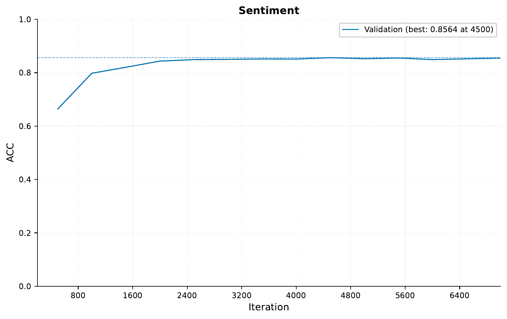
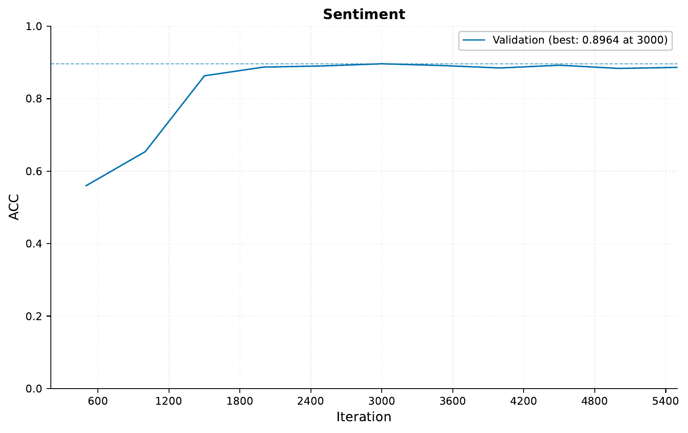
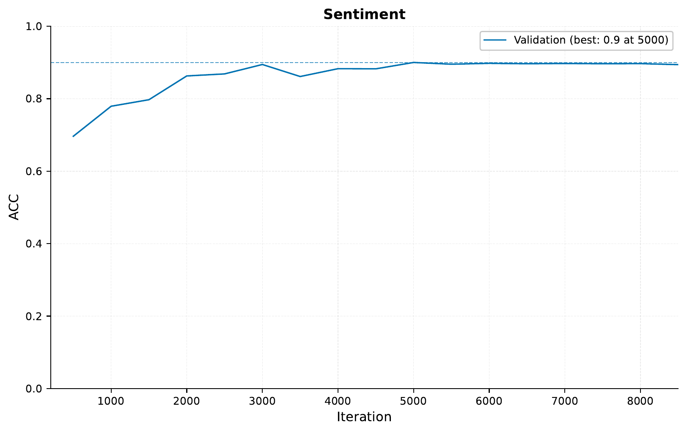
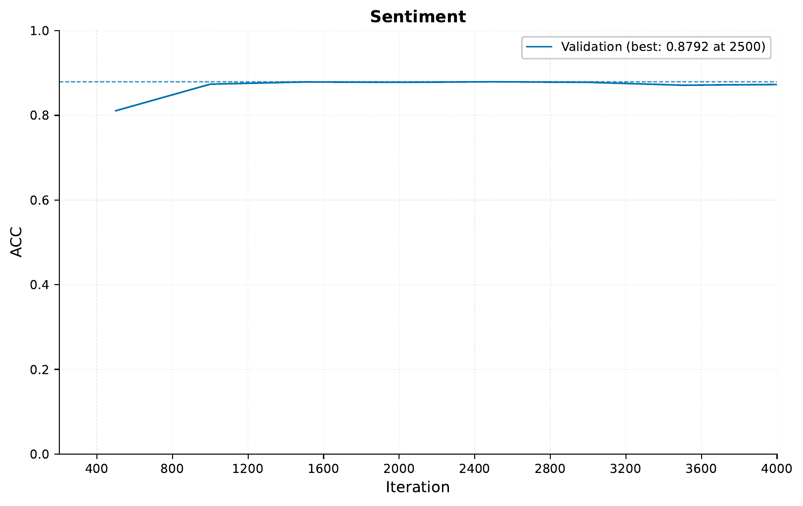
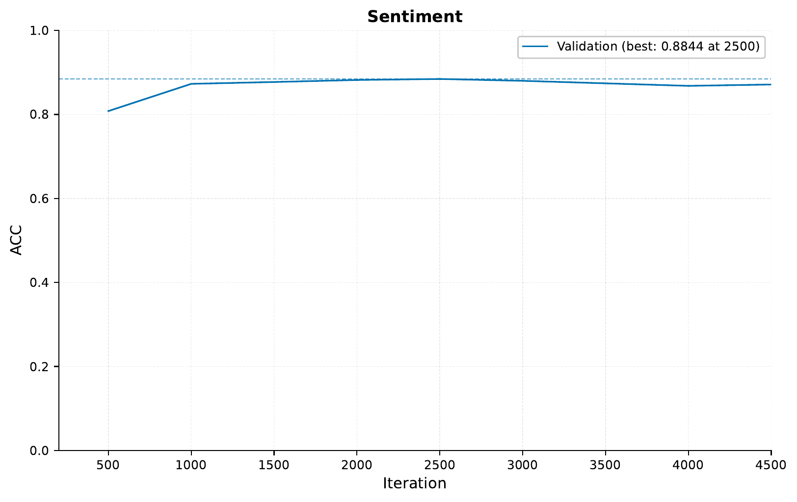

.. _04-pretrained-sequence-tutorial:

.. role:: raw-html(raw)
    :format: html

Established Architectures and Pretrained Models
===============================================

In this tutorial,
we will be seeing,
how we can use
local transformers,
state-of-the-art,
NLP architectures, and
pretrained NLP models with ``EIR``
in order to predict sentiment from text.
We will be using the IMDB reviews dataset,
see `here <https://ai.stanford.edu/~ang/papers/acl11-WordVectorsSentimentAnalysis.pdf>`__
for more information about the data.
To download the data and configurations for this part of the tutorial,
`use this link. <https://drive.google.com/file/d/1u6bkIr9sECkU9z3Veutjn8cx6Mu3GP3Z>`__

Note that this tutorial assumes that
you are already familiar with
the basic functionality
of the framework
(see :ref:`01-genotype-tutorial`).
If you have not already,
it can also be useful
to go over the sequence tutorial
(see :ref:`03-sequence-tutorial`).

A - Baseline
------------

After downloading the data,
the folder structure should look something like this
(note that at this point,
the ``yaml`` configuration files
are probably not present,
but we will make them during this tutorial,
alternatively you can download them
from the project repository):

.. literalinclude:: ../tutorial_files/a_using_eir/04_pretrained_sequence_tutorial/commands/tutorial_folder.txt
    :language: console

First we will use the
built-in transformer model
in ``EIR``,
just to establish a baseline.

As always, configurations first!

.. literalinclude:: ../tutorial_files/a_using_eir/04_pretrained_sequence_tutorial/04_imdb_globals.yaml
    :language: yaml
    :caption: 04_imdb_globals.yaml

.. note::
    Training these sequence models
    can take quite some time if
    one is using a laptop.
    If possible,
    try using a system with a GPU available!
    If not, set the device setting to 'cpu'.

.. note::

    You might notice that we have a new configuration in our global config,
    ``mixing_alpha``.
    The parameter controls the level of
    `Mixup, <https://arxiv.org/pdf/1710.09412.pdf>`__
    a really cool data augmentation
    which is included in the framework,
    and is automatically applied to all input modalities
    (genotype, tabular, sequence, images, binary data)
    when set in the global configuration.

.. literalinclude:: ../tutorial_files/a_using_eir/04_pretrained_sequence_tutorial/04_imdb_input.yaml
    :language: yaml
    :caption: 04_imdb_input.yaml

.. literalinclude:: ../tutorial_files/a_using_eir/04_pretrained_sequence_tutorial/04_imdb_output.yaml
    :language: yaml
    :caption: 04_imdb_output.yaml

As before, we do our training with the following command:

.. literalinclude:: ../tutorial_files/a_using_eir/04_pretrained_sequence_tutorial/commands/SEQUENCE_IMDB_1_TRANSFORMER.txt
    :language: console

Checking the accuracy, we see:

A little better than what
we saw in the :ref:`03-sequence-tutorial`,
which makes sense as here we are using
longer sequences and more data augmentation.
In any case, now we have a
nice little baseline to compare to!

B - Local Transformer
---------------------

Transformer models are notorious for
being quite expensive to train computationally,
both when it comes to memory and raw compute.
The main culprit is the quadratic
increase w.r.t. input length.
One relatively straightforward way to get around this
is not looking at the full sequence at once,
but rather in parts (kind of like a convolution).
This functionality is included by default
and can be controlled with the ``window_size`` parameter
of the ``input_type_info`` field when training sequence models.

Now, let's try training one such model, using a window size of 64 and
increasing the maximum sequence length to 512:

.. literalinclude:: ../tutorial_files/a_using_eir/04_pretrained_sequence_tutorial/04_imdb_input_windowed.yaml
    :language: yaml
    :caption: 04_imdb_input_windowed.yaml

To train, we just swap out the input configuration from the command above:

.. literalinclude:: ../tutorial_files/a_using_eir/04_pretrained_sequence_tutorial/commands/SEQUENCE_IMDB_2_LOCAL.txt
    :language: yaml

Training this model gave the following training curve:

Indeed, increasing the sequence length does seem to help,
and using a window size of 64 seems to work fairly well.

C - Established architecture: Longformer
----------------------------------------

Now, the windowed approach above is perhaps
a quick win to tackle the scaling problems
of transformers when it comes to input length.
In fact, this is such a notorious
problem that people have done a lot of work in finding
cool architectures and methods to get around it.
By taking advantage of the excellent work `Hugging Face <https://huggingface.co>`__
has done, we can use these established architectures
within ``EIR``
(big thanks to them by the way!).
The architecture we will be using
is called `Longformer, <https://arxiv.org/abs/2004.05150>`__
and as mentioned it tries to approximate full self-attention
in order to scale linearly w.r.t input size.

.. tip::
    Hugging Face has implemented a bunch of
    other pretrained models and architectures,
    check `this link <https://huggingface.co/transformers/#supported-frameworks>`__
    for an exhaustive list.

To use the Longformer model, we use the following configuration,
notice that in the model configuration
we are now passing in flags *specifically* to the LongFormer model:

.. literalinclude:: ../tutorial_files/a_using_eir/04_pretrained_sequence_tutorial/04_imdb_input_longformer.yaml
    :language: yaml
    :caption: 04_imdb_input_longformer.yaml

.. note::
    The established architectures can have a bunch of different configurations
    available. Head over to the Hugging Face docs to see which flags they accept
    and what they do. For example, the LongFormer docs can be found
    `here <https://huggingface.co/transformers/model_doc/longformer.html#longformerconfig>`_.

We train with the following command:

.. literalinclude:: ../tutorial_files/a_using_eir/04_pretrained_sequence_tutorial/commands/SEQUENCE_IMDB_3_LONGFORMER.txt
    :language: console

And get the following training curve:

Indeed, we see an improvement
on the validation set
when using the the Longformer model
compared to the first run.
There does not seem to be
a big difference
compared to our local transformer run,
Of course, we would have to evaluate on a
test set to get the final performance,
but this is looking pretty good!

D - Pretrained Model: Tiny BERT
-------------------------------

Now, we have seen how we can use
cool architectures to train our models.
However, we can take this one step further
and use a pretrained model as well,
taking advantage of the fact that
they have already been trained on a bunch of data.

In this case, we will use a
little BERT model called `Tiny BERT <https://arxiv.org/abs/1908.08962>`__.
The approach is almost the same
as we saw above with the Longformer, here is the configuration:

.. literalinclude:: ../tutorial_files/a_using_eir/04_pretrained_sequence_tutorial/04_imdb_input_tiny-bert.yaml
    :language: yaml
    :caption: 04_imdb_input_tiny-bert.yaml

Note that when using these pretrained models,
we are generally not configuring things like tokenizers and ``model_config``, as
we use the default tokenizers and configurations used to train the model. ``EIR`` will
do this automatically when you leave the fields blank like above. Also notice the flag,
``freeze_pretrained_model``, if set to ``False``, we will not train the weights of
the pretrained model but rather leave them as they are. This can greatly speed up
training, but can come a cost of performance as we are not fine tuning the this part
of our model for our task.

.. note::
    For the pretrained models, we again take advantage of the excellent work from
    Hugging Face. In this case, they have a `hub <https://huggingface.co/models>`_
    with a bunch of pretrained models,
    which we can use with ``EIR``.

This model is quite a bit larger
than the nones we have used so far
so here it helps to have a powerful computer.
We run this as always with:

.. literalinclude:: ../tutorial_files/a_using_eir/04_pretrained_sequence_tutorial/commands/SEQUENCE_IMDB_4_TINY_BERT.txt
    :language: console

The training curve looks like so:

The pre-trained model performs quite similarly to our other long context models.
However, notice how quickly it reached it top validation performance compared to the
other models. Therefore, even though we are using a much bigger model than before,
this kind of fine tuning can save us a lot of time!

.. note::
    Many of these pretrained architectures are trained on data that is automatically
    crawled from the web. Therefore in this case, there might be possibility they
    have seen our reviews before as part of their training! Of course we are not too
    concerned for the sake of this tutorial.

E - Combining Models
--------------------

So far we have seen how can can train
bunch of cool models by themselves,
but now we will be a bit cheeky and combined them into one big model.

.. warning::
    Make sure that the ``input_name``
    under the ``input_info`` field
    is unique for each input
    when doing combining models.

In this case,
we will freeze the weights of the
pretrained Tiny BERT part of our model.

.. literalinclude:: ../tutorial_files/a_using_eir/04_pretrained_sequence_tutorial/commands/SEQUENCE_IMDB_5_COMBINED.txt
    :language: console

And our performance:

So in this case, we do not see a
huge improvement when combining our models.
However when relevant, it can greatly boost performance especially in those cases
where the different input configurations refer to different modalities, i.e. do not
just act on the same input like we did above.

.. tip::
    Combining input configs is not only confined to sequence models or even the same
    modalities. For example, to train a model that uses genotype, sequence and tabular
    data, just pass the relevant configurations to the ``--input_configs`` flag!

F - Serving
-----------

In this final section, we demonstrate serving our trained model
as a web service and interacting with it using HTTP requests.

Starting the Web Service
"""""""""""""""""""""""""

To serve the model, use the following command:

.. code-block:: shell

    eirserve --model-path [MODEL_PATH]

Replace `[MODEL_PATH]` with the actual path to your trained model.
This command initiates a web service that listens for incoming requests.

Here is an example of the command:

.. literalinclude:: ../tutorial_files/a_using_eir/04_pretrained_sequence_tutorial/commands/COMBINED_SEQUENCE_DEPLOY.txt
    :language: console

Sending Requests
""""""""""""""""

With the server running,
we can now send requests.
For this model, we send different features extracted from the same input text
in a batched format.

Here's an example Python function demonstrating this process:

.. literalinclude:: ../tutorial_files/a_using_eir/04_pretrained_sequence_tutorial/request_example/python_request_example_module.py
    :language: python
    :caption: request_example_module.py

When running this, we get the following output:

.. literalinclude:: ../tutorial_files/a_using_eir/04_pretrained_sequence_tutorial/request_example/python_request_example.json
    :language: json
    :caption: request_example.json

We can also send the same request using the `curl` command:

.. literalinclude:: ../tutorial_files/a_using_eir/04_pretrained_sequence_tutorial/request_example/bash_request_example_module.sh
    :language: console
    :caption: request_example_module.sh

When running this, we get the following output:

.. literalinclude:: ../tutorial_files/a_using_eir/04_pretrained_sequence_tutorial/request_example/bash_request_example.json
    :language: json
    :caption: request_example.json

Analyzing Responses
"""""""""""""""""""

After sending requests to the served model, the responses can be analyzed.
These responses provide insights into the model's predictions based on the input data.

.. literalinclude:: ../tutorial_files/a_using_eir/04_pretrained_sequence_tutorial/serve_results/predictions.json
    :language: json
    :caption: predictions.json

If you made it this far, I want to thank you for reading!
