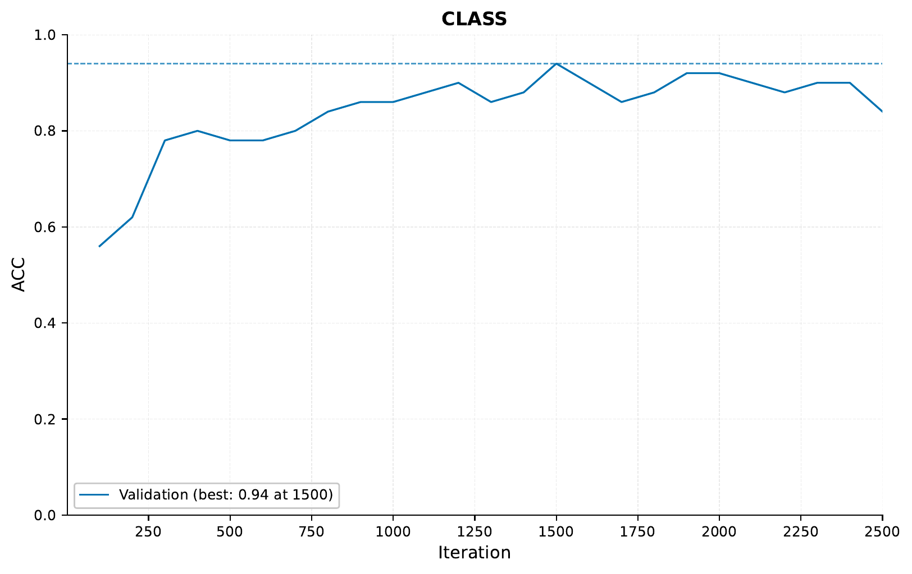
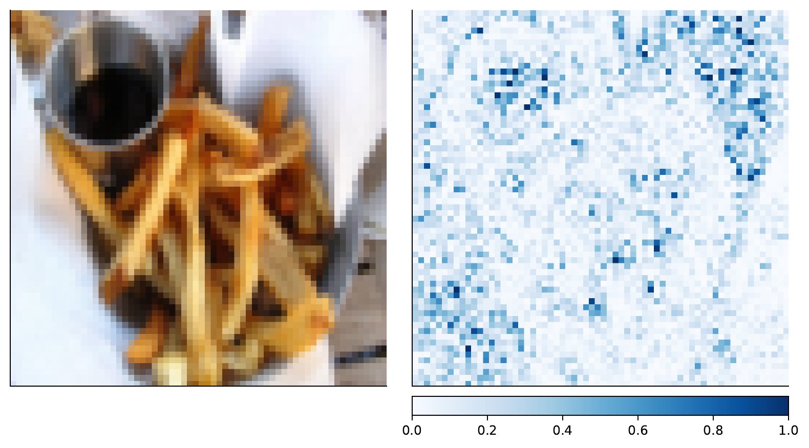
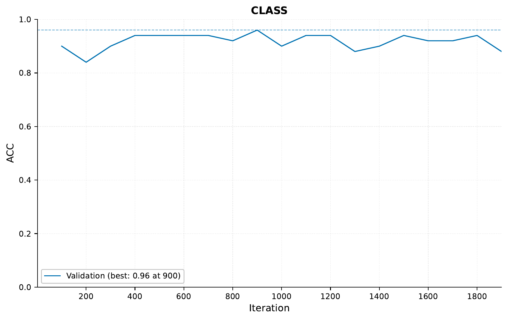
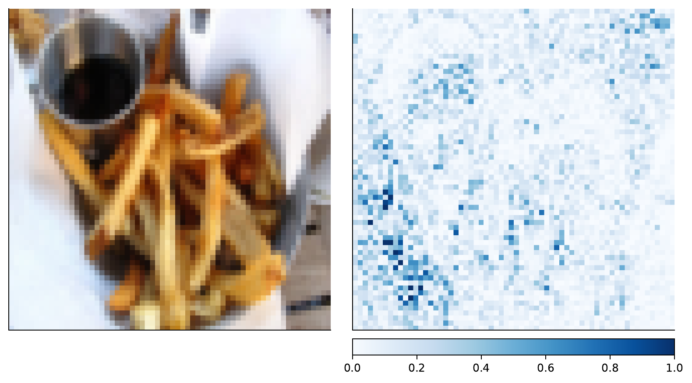
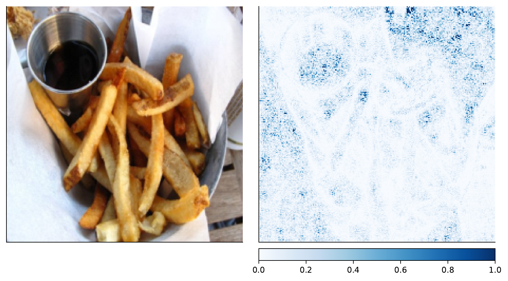

.. _05-image-tutorial:

.. role:: raw-html(raw)
    :format: html

Image Tutorial: Hot Dog or Not?
===============================

In this tutorial,
we will be using ``EIR``
to train deep learning models
for image classification.
Specifically, we will be
training our models in the
important task of classifying
whether an image contains
a `hot dog or not <https://www.youtube.com/watch?v=vIci3C4JkL0>`__
We will be using a subset of the Food-101 dataset,
originally introduced `here <https://link.springer.com/chapter/10.1007%2F978-3-319-10599-4_29>`__
To download the data and configurations for this part of the tutorial,
`use this link. <https://drive.google.com/file/d/1g5slDIwtXcksjKlJ5anAiVCZGCM9AAHI>`__

Note that this tutorial assumes that
you are already familiar with
the basic functionality
of the framework
(see :ref:`01-genotype-tutorial`).
If you have not already,
it can also be useful
to go over the sequence tutorial
(see :ref:`03-sequence-tutorial`).

A - Baseline
------------

.. literalinclude:: ../tutorial_files/a_using_eir/05_image_tutorial/commands/tutorial_folder.txt
    :language: console

Looking at the data
we are working with,
we can indeed see that
it contains images of hot dogs
and all kinds of other food:

|pic1| |pic2|

.. |pic1| image:: ../tutorial_files/a_using_eir/05_image_tutorial/figures/hot_dog.jpg
   :width: 45%

.. |pic2| image:: ../tutorial_files/a_using_eir/05_image_tutorial/figures/not_hot_dog.jpg
   :width: 45%

I did not know drinking coffee/cacao
with hot dogs was a thing.
Anyway, now we will
train a simple
residual network
from scratch to
get a little baseline.
The image models we
be using come from the excellent
`timm <https://pypi.org/project/timm/>`_ library,
which includes
those used in this tutorial and many more!

To the configuration!

.. literalinclude:: ../tutorial_files/a_using_eir/05_image_tutorial/globals.yaml
    :language: yaml
    :caption: globals.yaml

.. literalinclude:: ../tutorial_files/a_using_eir/05_image_tutorial/inputs.yaml
    :language: yaml
    :caption: inputs.yaml

.. literalinclude:: ../tutorial_files/a_using_eir/05_image_tutorial/output.yaml
    :language: yaml
    :caption: output.yaml

As usually, we do our training with the following command:

.. literalinclude:: ../tutorial_files/a_using_eir/05_image_tutorial/commands/IMAGE_1_RESNET.txt
    :language: console

.. note::
    Training these deep image models
    can take quite some time if
    one is using a laptop.
    If possible,
    try using a system with a GPU available!

Now for the results, we see the following:

That looks *kind of* ok, but far from great. Our validation performance is all over the place
(a contributing factor could be that our validation set here is very small),
and we don't get a better performance than around 76%. Certainly not good enough
for an actual app!

B - Pretrained Image Model
--------------------------

Now we will take advantage
of the fact that there exist
pretrained models that have
been trained on a bunch of data
(not just a few pictures of hot dogs and other food)
and see whether that helps our performance.

Now our input configuration looks like this:

.. literalinclude:: ../tutorial_files/a_using_eir/05_image_tutorial/inputs_resnet18.yaml
    :language: yaml
    :caption: inputs_resnet18.yaml

To train, we run:

.. literalinclude:: ../tutorial_files/a_using_eir/05_image_tutorial/commands/IMAGE_2_PRETRAINED_RESNET.txt
    :language: console

Looking at our performance, we see:

Definitely better!
One factor here could be that
we are training on different
image sizes than
the original model was trained on.
In any case, let's have a look at what our models
are focusing on
when deciding something is *not* a hot dog.
(perhaps you already noticed
we set the ``compute_attributions`` value to ``True``
in the global configuration):

That is not a hot dog alright, and our model seems to agree.

C - Combining pretrained image models
-------------------------------------

For the last part of this tutorial,
we will be combining two pretrained models.
We will keep the ResNet18 models as it is,
feeding it 64 pixel images.
We will also add a EfficientNet-B0
feature extractor, but feed it 224 pixel images.

The configuration for the EfficientNet part looks like this:

.. literalinclude:: ../tutorial_files/a_using_eir/05_image_tutorial/inputs_efficientnet_b0.yaml
    :language: yaml
    :caption: inputs_efficientnet_b0.yaml

Training as usual,
notice that we are now passing in both input configurations
to the ``--input_configs`` flag.

.. literalinclude:: ../tutorial_files/a_using_eir/05_image_tutorial/commands/IMAGE_3_PRETRAINED_EFFICIENTNET.txt
    :language: console

.. note::
    Here we are maybe
    getting ahead of ourselves a
    little and going straight into
    combining models.
    Perhaps only using EfficientNet
    performs even better.
    I will leave that task to you,
    dear reader.

The training and validation curves I got look like so
(I got a bit impatient and stopped the run early):

Definitely looks more stable,
and better performance than before.
As mentioned earlier, we should be careful
about trusting these results too much
as we have a tiny validation set, but
since we are doing a tutorial, we'll allow it!

For the last part of this tutorial,
let's have a look at what the our features extractors
focus on for an example image.

First the ResNet18 feature extractor:

And then the EfficientNet-B0 feature extractor:

While it's definitely more clear
to the human eye in the ResNet18 case,
both feature extractors seem to be focusing
on the french fries
when deciding that this is indeed,
not a hot dog.

D - Serving
-----------

In this final section, we demonstrate serving our trained image classification model
as a web service and interacting with it using HTTP requests.

Starting the Web Service
"""""""""""""""""""""""""

To serve the model, use the following command:

.. code-block:: shell

    eirserve --model-path [MODEL_PATH]

Replace `[MODEL_PATH]` with the actual path to your trained model.
This command initiates a web service that listens for incoming requests.

Here is an example of the command:

.. literalinclude:: ../tutorial_files/a_using_eir/05_image_tutorial/commands/IMAGE_DEPLOY.txt
    :language: console

Sending Requests
""""""""""""""""

With the server running, we can now send requests. For this model, we send different features extracted from the same input image in a batched format.

Here's an example Python function demonstrating this process:

.. literalinclude:: ../tutorial_files/a_using_eir/05_image_tutorial/request_example/python_request_example_module.py
    :language: python
    :caption: request_example_module.py

When running this, we get the following output:

.. literalinclude:: ../tutorial_files/a_using_eir/05_image_tutorial/request_example/python_request_example.json
    :language: json
    :caption: request_example.json

Analyzing Responses
"""""""""""""""""""

Before we going into the responses, let's view the images that were used for predictions:

.. figure:: ../tutorial_files/a_using_eir/05_image_tutorial/serve_results/1040579_0.jpg
   :alt: Image 1040579
   :align: center

1040579.jpg

108743.jpg

After sending requests to the served model, the responses can be analyzed.
These responses provide insights into the model's predictions based on the input images.

.. literalinclude:: ../tutorial_files/a_using_eir/05_image_tutorial/serve_results/predictions.json
    :language: json
    :caption: predictions.json

With that, we conclude this image tutorial. Thank you for reading!
