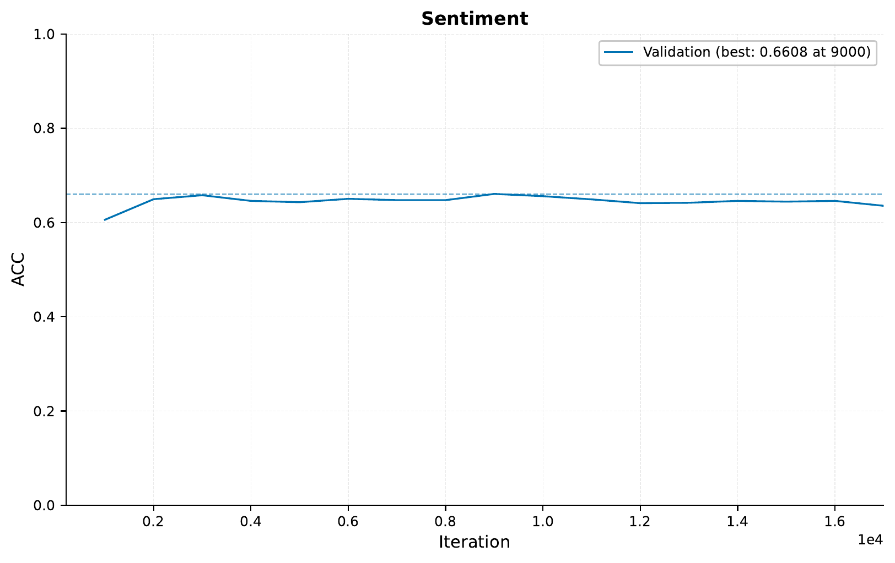
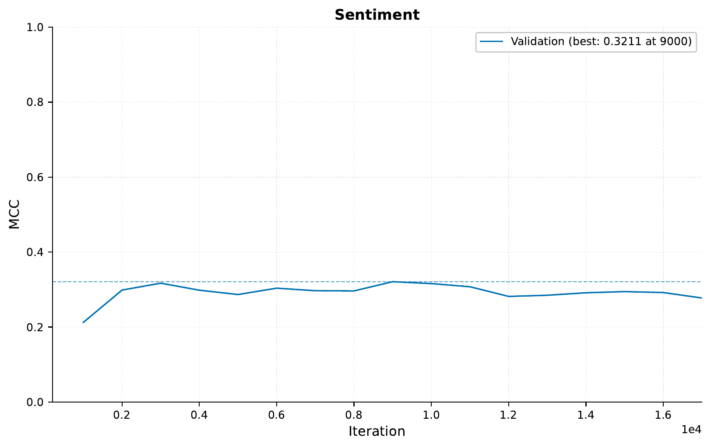

.. _06-raw-bytes-tutorial:

.. role:: raw-html(raw)
    :format: html

Training on binary data
=======================

Today, for this tutorial,
we will be training deep learning
models on raw binary data.
In general, it is a good approach
to use inductive bias and domain
expertise when training our models,
but sometimes we might not have a
good idea of how to present our data,
or we simply want to turn off our brains
for a bit and throw raw compute at our problem.
We will be using the familiar IMDB reviews dataset,
see `here <https://ai.stanford.edu/~ang/papers/acl11-WordVectorsSentimentAnalysis.pdf>`__
for more information about the data.
To download the data and configurations for this part of the tutorial,
`use this link. <https://drive.google.com/file/d/1u6bkIr9sECkU9z3Veutjn8cx6Mu3GP3Z>`__

A - Local Transformer
---------------------

After downloading the data, the folder structure should look like this:

.. literalinclude:: ../tutorial_files/a_using_eir/06_raw_bytes_tutorial/commands/tutorial_folder.txt
    :language: console

We will use the
built-in local transformer model
in ``EIR`` for this tutorial.

If you have done the previous tutorials
you might be used to this, but the configurations
are here:

.. literalinclude:: ../tutorial_files/a_using_eir/06_raw_bytes_tutorial/globals.yaml
    :language: yaml
    :caption: globals.yaml

.. literalinclude:: ../tutorial_files/a_using_eir/06_raw_bytes_tutorial/input.yaml
    :language: yaml
    :caption: input.yaml

.. literalinclude:: ../tutorial_files/a_using_eir/06_raw_bytes_tutorial/output.yaml
    :language: yaml
    :caption: output.yaml

.. note::
    The model we are training here is relatively
    deep, so you probably need a GPU to
    train it in a reasonable amount of time.
    If you do not have access to a GPU,
    try reducing the number of layers
    and the sequence length.

As usual, we can run the following command to train:

.. literalinclude:: ../tutorial_files/a_using_eir/06_raw_bytes_tutorial/commands/SEQUENCE_BINARY_IMDB_1.txt
    :language: console

When training, I got the following training curves:

Not so great, but not a complete failure either!
When comparing with our
previous modelling on this task (see :ref:`03-sequence-tutorial`),
we definitely performed better when doing word level modelling
compared to running on the raw bytes like we are doing here.
It can well be we need to configure our model better,
or train it on more data, but for now we will say that
adapting the training to the task (in this case NLP) seems
to perform better than training on raw binary data.

.. tip::
    Here we are training on natural language data,
    but the approach here can in theory be applied to
    any type of file on a disk (e.g. images, videos,
    or other more obscure formats). As we saw above
    however, good results not guaranteed!

B - Serving
-----------

In this section, we'll guide you through serving our t
rained IMDB Reviews Bytes Classification model as a web service and show you
how to interact with it using HTTP requests.

Starting the Web Service
"""""""""""""""""""""""""

To serve the model, execute the following command:

.. code-block:: shell

    eirserve --model-path [MODEL_PATH]

Replace `[MODEL_PATH]` with the actual path to your trained model. This command initiates a web service that listens for incoming HTTP requests.

Here is an example of the command used:

.. literalinclude:: ../tutorial_files/a_using_eir/06_raw_bytes_tutorial/commands/BINARY_DEPLOY.txt
    :language: console

Sending Requests
""""""""""""""""

With the server running, we can now send requests. For this model, we send raw byte data encoded in base64 in a batched format.

Here's an example Python function demonstrating this process:

.. literalinclude:: ../tutorial_files/a_using_eir/06_raw_bytes_tutorial/request_example/python_request_example_module.py
    :language: python
    :caption: request_example_module.py

When running this, we get the following output:

.. literalinclude:: ../tutorial_files/a_using_eir/06_raw_bytes_tutorial/request_example/python_request_example.json
    :language: json
    :caption: request_example.json

Analyzing Responses
"""""""""""""""""""

After sending requests to the served model, you will receive responses that provide insights into the model's predictions based on the input text data.

Let's take a look at some of the text data used for predictions:

.. literalinclude:: ../tutorial_files/a_using_eir/06_raw_bytes_tutorial/serve_results/10021_2_0.txt
   :language: text
   :caption: 10021_2.txt

.. literalinclude:: ../tutorial_files/a_using_eir/06_raw_bytes_tutorial/serve_results/10132_9_1.txt
   :language: text
   :caption: 10132_9.txt

Here are examples of the model's predictions:

.. literalinclude:: ../tutorial_files/a_using_eir/06_raw_bytes_tutorial/serve_results/predictions.json
    :language: json
    :caption: predictions.json

This concludes our tutorial, thank you for following along!
