.. _07-multimodal-tutorial:

.. role:: raw-html(raw)
    :format: html

07 – Multimodal Training: Combining Tabular, Text, and Image
============================================================

Here, we will be exploring
multi-modal training. That is,
training a model on multiple
different types of data. For
example, we can train a model
to predict some output based
on both text and images.
We will be using a subset of
a `dataset <https://www.kaggle.com/competitions/petfinder-adoption-prediction/>`__
from `PetFinder.my <https:/www.petfinder.my/>`__
a Malaysian website that
matches adopters with
homeless pets. The dataset
contains images of pets, as
well as some text-based
description of the pets, and
finally some tabular data.

So here, the task will be to
predict the speed at which a
pet will be adopted. This is formed
here as a classification task
with 4 different classes,
where the classes are
the number of days it took
for the pet to be adopted.

To download the data for this part of the tutorial,
`use this link. <https://drive.google.com/file/d/1DVS-t1ne-TMam8-6gkCz2YzKNjEHEIGr>`__

.. note::
    Here we have combined the 5 classes from the original dataset
    into 4 classes for this tutorial, as one of the classes was
    very small compared to the others. However, the original
    classes are still available in the main tabular file.

After downloading the data, the folder structure should look like this
(note that we will create the configuration files ourselves
in the tutorial as we go along):

.. literalinclude:: ../tutorial_files/a_using_eir/07_multimodal_tutorial/commands/tutorial_folder.txt
    :language: console

We are in for a relatively long tutorial, so I'll try to keep it
concise. Let's get started!

A - Tabular Data
----------------

First, we will start training only on the tabular data,
which is stored in a CSV file.
Note that here the tabular data has
been transposed, for visual purposes.

.. raw:: html
    :file: ../tutorial_files/a_using_eir/07_multimodal_tutorial/commands/tabular_preview.html

Here are the configurations files for the tabular data:

.. literalinclude:: ../tutorial_files/a_using_eir/07_multimodal_tutorial/07_globals.yaml
    :language: yaml
    :caption: 07_globals.yaml

.. literalinclude:: ../tutorial_files/a_using_eir/07_multimodal_tutorial/07_input_tabular.yaml
    :language: yaml
    :caption: 07_input_tabular.yaml

.. literalinclude:: ../tutorial_files/a_using_eir/07_multimodal_tutorial/07_fusion.yaml
    :language: yaml
    :caption: 07_fusion.yaml

.. literalinclude:: ../tutorial_files/a_using_eir/07_multimodal_tutorial/07_output.yaml
    :language: yaml
    :caption: 07_output.yaml

As usual, we can run the following command to train:

.. literalinclude:: ../tutorial_files/a_using_eir/07_multimodal_tutorial/commands/MULTIMODAL_1_TABULAR.txt
    :language: console

.. note::
    Here we are setting the ``--compute_attributions=true`` parameter,
    from the command line, to get the integrated gradients attributions of the
    model w.r.t. the tabular input data.

When training, I got the following training curve:

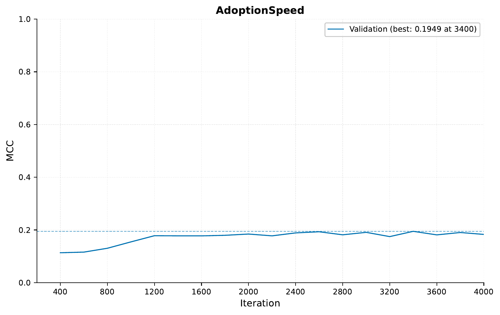

Now, since we set the ``--compute_attributions=true`` parameter,
we can have a look at the attributions (notice in the global
configuration, we set ``compute_attributions_ever_sample_factor=10``,
which means they are computed every
10 sampling iterations,
i.e. 200 * 10 = 2000 training iterations).
Specifically, we check the file under ``samples/4000/attributions/``
in the ``results`` folder. First, we can have a look at the
feature importance for the tabular data.

.. image:: ../tutorial_files/a_using_eir/07_multimodal_tutorial/figures/tutorial_07a_feature_importance_D.png

Here we can see that ``Breed1`` is the feature that most strongly influenced
the model's prediction. In the ``attributions`` folder, we can also
see how the inputs influence the model towards a specific class.
Here, we will look at how the ``Breed1`` input values influence the model
towards the class "D: 100+ Days", meaning the pet was adopted
after 100 days:

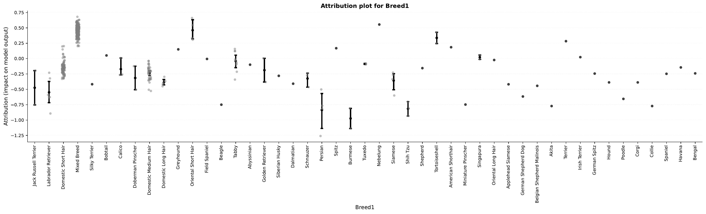

So from this it seems that, unfortunately, mixed breed pets
are less likely to be adopted
(that is, the value "Mixed Breed" pushes the model towards
making the "D: 100+ Days" prediction).
This does perhaps make intuitive sense,
but keep in mind that this is specifically analyzing the behavior
of the model, and not guaranteed to be true, causal relationships.
Additionally, this is something that could likely be discovered with simpler
methods, such as a logistic regression model. However, this is just
an example of how to use the integrated gradients attributions to analyze the deep-learning model.

B - Tabular + Text Data
-----------------------

Now, we will train the model on both tabular and text data.
The text data in question are descriptions of the cute pets,
which are stored in a CSV file.

.. note::
    When reading sequence data from a CSV file,
    the file must follow the specification
    of having two columns, one containing the
    sequence IDs ("ID"), and the other containing the
    sequence data ("Sequence"). Note that the names
    of these columns are strictly enforced.

First, let's take a look at an example from the text data:

.. literalinclude:: ../tutorial_files/a_using_eir/07_multimodal_tutorial/commands/description_preview.txt
    :language: console

So to train on both tabular and text data, we will need to
specify a configuration for the text data as well:

.. literalinclude:: ../tutorial_files/a_using_eir/07_multimodal_tutorial/07_input_description.yaml
    :language: yaml

Additionally, we will use a different fusion configuration:

.. literalinclude:: ../tutorial_files/a_using_eir/07_multimodal_tutorial/07_fusion_attention.yaml
    :language: yaml

So, by default, ``EIR`` will use a MLP based module to fuse representations
from different input modalities. Another option is to use an attention-based
fusion module, where we project the different representations
onto a common embedding dimension, and then use transformer layers
to fuse the different representations.

Then to train, we simply include the new input configuration file
under the ``--input_configs`` parameter, as well as the new fusion:

.. literalinclude:: ../tutorial_files/a_using_eir/07_multimodal_tutorial/commands/MULTIMODAL_2_TABULAR_DESCRIPTION.txt
    :language: console

Now, when training, we get the following training curve:

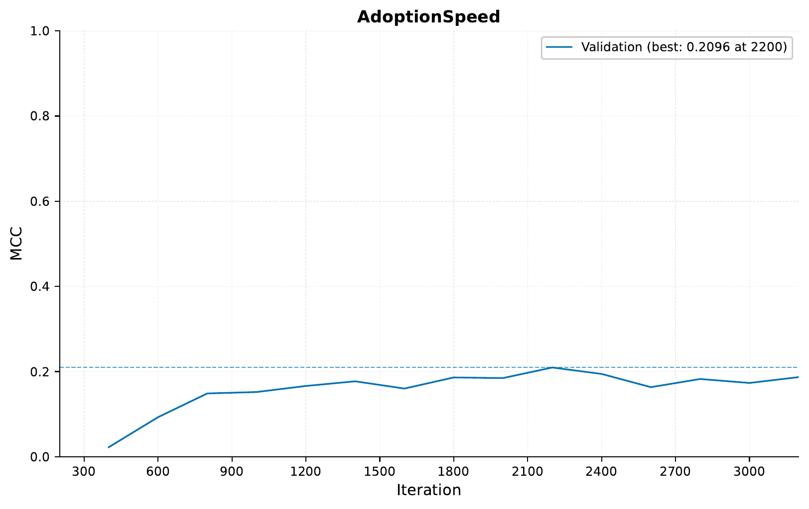

So here we can see that the model seems to perform slightly better
when trained on both tabular and text data. We also start to see
possible signs of overfitting, as the training curve starts to diverge
from the validation curve.

C - Tabular + Text + Image Data
-------------------------------

Now, we will train the model on all three types of data:
tabular, text, and image. The image data is stored in a
folder, where each image is stored in a separate file.

As before, let's have a quick look at an example image:

Configuration file for the image data:

.. literalinclude:: ../tutorial_files/a_using_eir/07_multimodal_tutorial/07_input_image.yaml
    :language: yaml

.. note::
    Here we are using a pre-trained ResNet-18 model
    to extract the image features. We are using the
    ``--pretrained_model`` parameter to specify the
    that we want to use pre-trained weights.
    We are also using the ``--freeze_pretrained_model`` parameter
    to freeze the weights of the pre-trained model,
    so that they are not updated during training.

And then we can train the model on all three types of data:

.. literalinclude:: ../tutorial_files/a_using_eir/07_multimodal_tutorial/commands/MULTIMODAL_3_TABULAR_DESCRIPTION_IMAGE.txt
    :language: console

.. note::
    Here we are setting the ``device`` parameter to ``cuda:0``,
    to train on the GPU. If you do not have a GPU, you can
    skip this parameter, or set it to ``cpu``. Note that
    training on the CPU will likely be much slower, especially
    now that we are training on images as well.

When training, we get the following training curve:

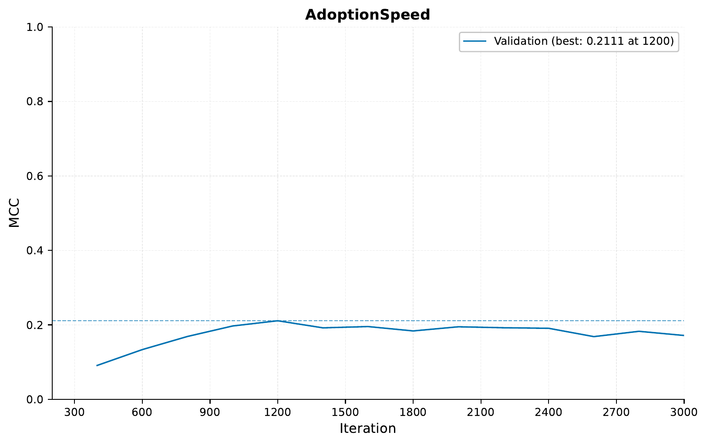

So in this case, including the image data does not seem to
improve the performance of the model further compared to the
model trained on the tabular and text data. However, it does
seem that the validation performance more quickly reaches
peak performance when including the image data. It might be interesting
to try training on the image data alone, to how much performance
we can get from that. Furthermore, one could try unfreezing the
pre-trained model, and see if that improves the performance. However,
this tutorial is getting long enough already, so we will leave that
as an exercise for those interested.

D - Serving
-----------

This section guides you through serving a multimodal
model that combines tabular data, text descriptions, and images.
We'll demonstrate how to interact with this served model using HTTP requests.

Starting the Web Service
"""""""""""""""""""""""""

To serve the multimodal model, use the following command:

.. code-block:: shell

    eirserve --model-path [MODEL_PATH]

Replace `[MODEL_PATH]` with the actual path to your trained multimodal model. This command starts a web service that listens for incoming HTTP requests.

Example of the serving command:

.. literalinclude:: ../tutorial_files/a_using_eir/07_multimodal_tutorial/commands/COMBINED_SEQUENCE_DEPLOY.txt
    :language: console

Sending Requests
""""""""""""""""

With the server running, we can now send requests. For this multimodal model, we send a combination of tabular data, description text, and an image encoded in base64 in a batched format.

Here's an example Python function demonstrating this process:

.. literalinclude:: ../tutorial_files/a_using_eir/07_multimodal_tutorial/request_example/python_request_example_module.py
    :language: python
    :caption: request_example_module.py

When running this, we get the following output:

.. literalinclude:: ../tutorial_files/a_using_eir/07_multimodal_tutorial/request_example/python_request_example.json
    :language: json
    :caption: request_example.json

Analyzing Responses
"""""""""""""""""""

After sending requests to the served model,
you will receive responses that provide a prediction
based on the combined data (tabular, description, and image).

Let's take a look at some example predictions made by the model:

.. literalinclude:: ../tutorial_files/a_using_eir/07_multimodal_tutorial/serve_results/predictions.json
    :language: json
    :caption: predictions.json

You can see that the inputs to the models are basically identical, except
that we are varying the age of the pet. The general trend is that the older
the pet, the longer it takes to be adopted, according to the model. This,
unfortunately, is perhaps not surprising and is particularly visible when
we increase the age to the extreme of 3000 months (250 years) – I mean, who
would not want to adopt a 250 year old sage cat? :)

While not visible in the JSON above, here is the image used:

86e1089a3.jpg

That is it for the main part of the tutorial. I hope you enjoyed it!
Below are a couple of appendixes with some additional experiments
that might be interesting.

Appendix A - Adding a pre-trained text feature extractor
--------------------------------------------------------

In this appendix, we will add a pre-trained text feature extractor
in addition to the one we already have. We will be using a pre-trained Tiny BERT
model (see (see :ref:`04-pretrained-sequence-tutorial` for more information). It
is not certain whether this will improve the performance of the model,
but the idea is more to showcase some functionalities of the framework.

Here is the configuration file for the pre-trained text feature extractor:

.. literalinclude:: ../tutorial_files/a_using_eir/07_multimodal_tutorial/07_apx-a_input_description_pretrained.yaml
    :language: yaml

The command:

.. literalinclude:: ../tutorial_files/a_using_eir/07_multimodal_tutorial/commands/MULTIMODAL_APX-1_TABULAR_DESCRIPTION_IMAGE_PRETRAINED.txt
    :language: console

The training curve:

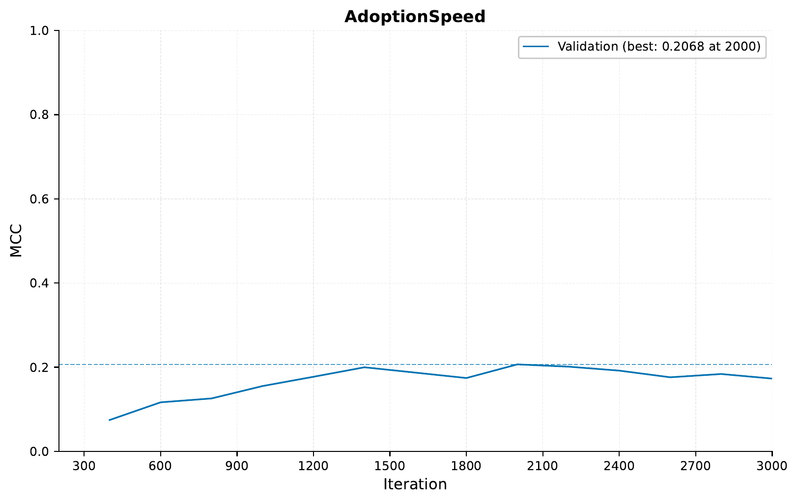

So it seems that the pre-trained text feature extractor does not
help, and likely we are even overfitting a bit more!

Appendix B - Multi-modal, multi-task learning
---------------------------------------------

In this part, we will train the model to not only predict the
adoption speed, but also the pet's age and number of pets in the
image. For this, we have to modify the tabular input and output
configurations:

.. literalinclude:: ../tutorial_files/a_using_eir/07_multimodal_tutorial/07_apx-b_mt_input_tabular.yaml
    :language: yaml

.. literalinclude:: ../tutorial_files/a_using_eir/07_multimodal_tutorial/07_apx-b_mt_output.yaml
    :language: yaml

Note that we have moved the features that we want to predict
from the input configuration to the output configuration.

The command:

.. literalinclude:: ../tutorial_files/a_using_eir/07_multimodal_tutorial/commands/MULTIMODAL_APX-2_TABULAR_DESCRIPTION_IMAGE_PRETRAINED_MT.txt
    :language: console

First we can have a look at the average performance:

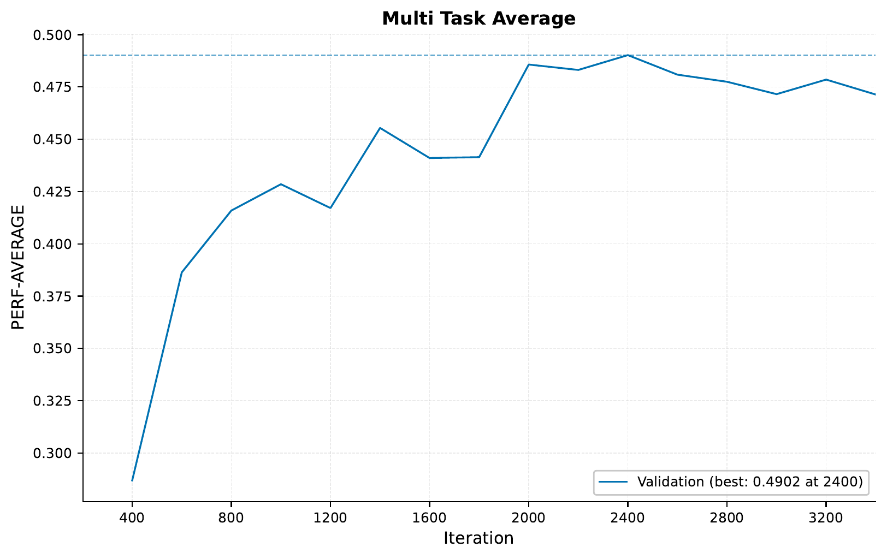

.. note::
    The average performance by default is the average of the
    MCC, ROC-AUC and average precision (AP) for categorical targets and
    1.0-LOSS, PCC, R2 for continuous targets.

So, since we are using different inputs and outputs in this task,
we cannot compare directly to the previous results. However, we can
see that the model seems to be able to learn to predict the
3 different targets fairly well.

The training curves for the adoption speed, age and quantity:

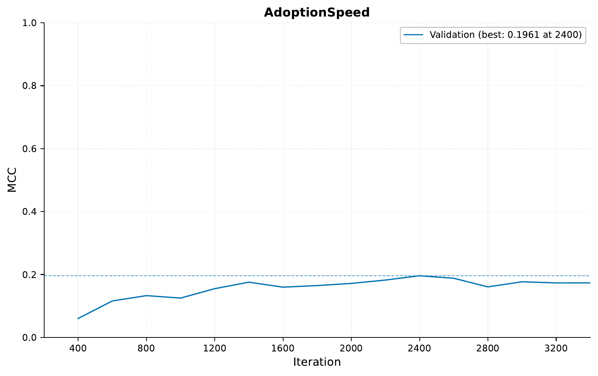

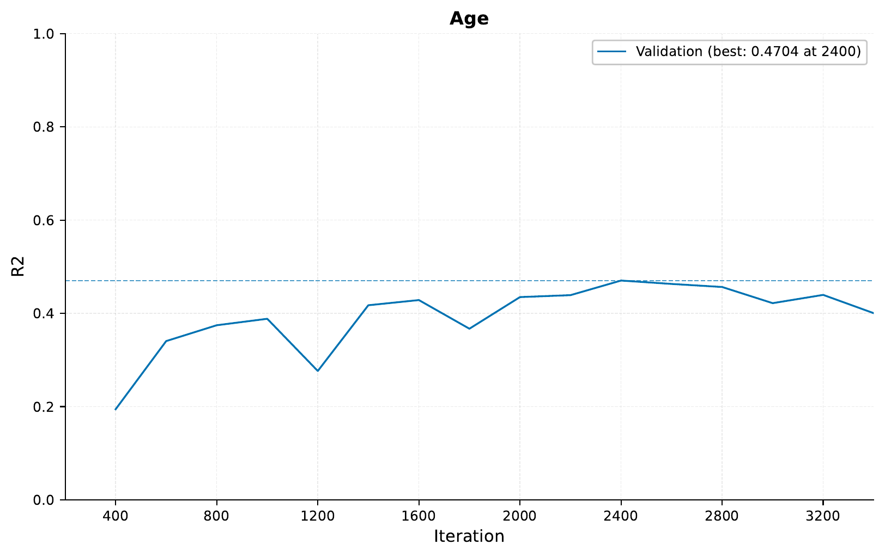

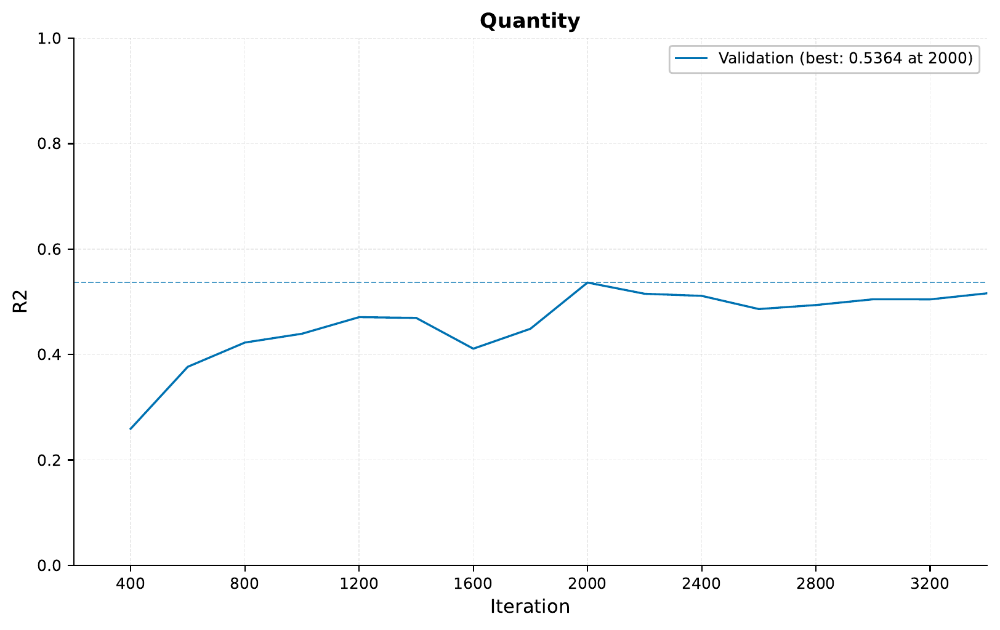

Finally, we can also look at the regression predictions
by checking the ``samples`` folder for the ``Age`` and ``Quantity``
targets. Here are a couple of examples:

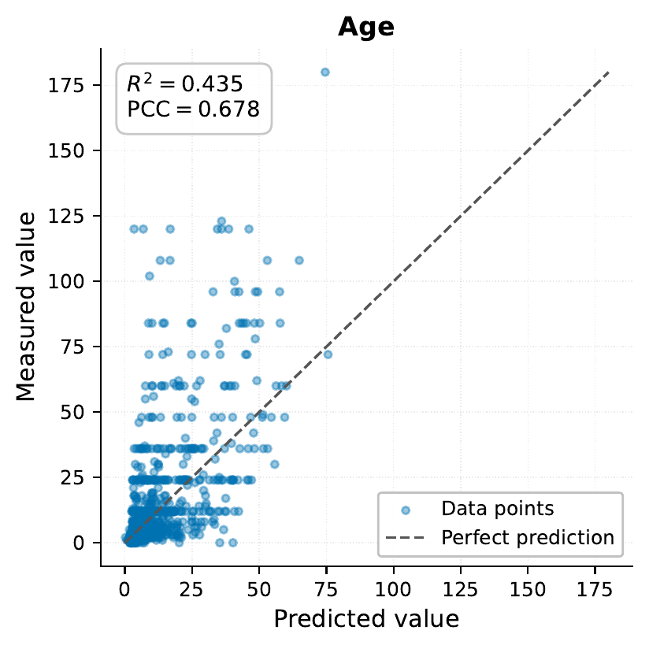

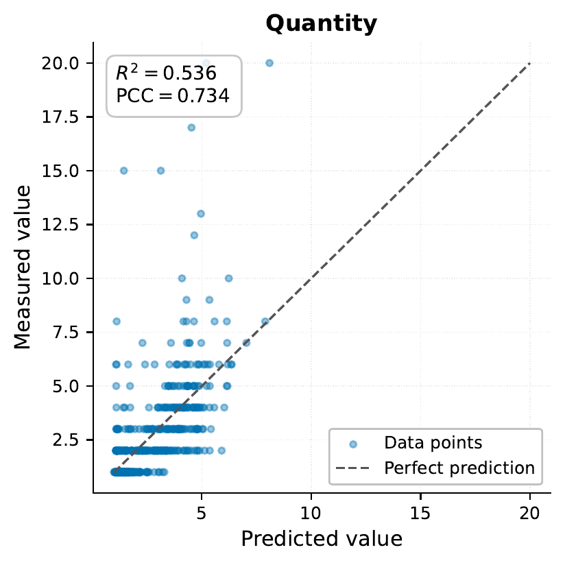

So in the case of quantity, it is expected that the model
gets some of the predictions wrong, since in our parsed
data we are only using randomly chosen one image, but the original
data includes multiple images (it can also be that it can learn some
of this from the descriptions).
However, the model seems to be able
to predict the quantity fairly well, and same for the age.
