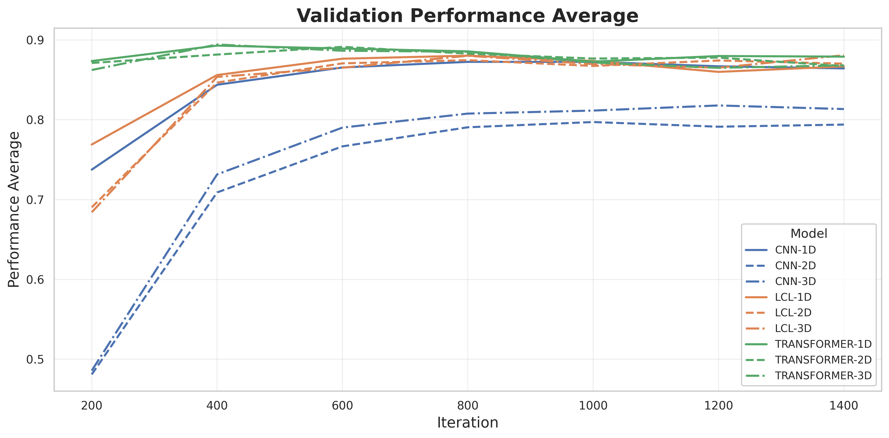

.. _08-array-tutorial:

.. role:: raw-html(raw)
    :format: html

08 – Training on arrays with CNN, LCL, and Transformer Models
=============================================================

In this tutorial, we will be looking at the built in support
for training models on structured arrays in ``EIR``. Here, structured
refers to the arrays all having the same shape, and arrays refers
to the fact that the data is stored in a numpy array. We will be using
the same data as we did in :ref:`01-genotype-tutorial`, but instead
treating them as general arrays instead of genotypes. Currently, the array
functionality in ``EIR`` is built to handle 1, 2 and 3 dimensional arrays.
As in the genotype tutorial, we will be using data processed from
the `Human Origins`_ dataset.
To download the data and configurations for this part of the tutorial,
`use this link. <https://drive.google.com/file/d/1p-RfWqPiYGcmQI7LM60fXkIRSS5AFXM8>`__

.. _Human Origins: https://www.nature.com/articles/nature13673

A - Data
--------

After downloading the data, the folder structure should look like this:

.. literalinclude:: ../tutorial_files/a_using_eir/08_array_tutorial/commands/tutorial_folder.txt
    :language: console

Besides the configurations, there are 3 folders there storing the genotype arrays,
with each folder corresponding to a different dimensionality
(although all the versions are generated from the same base data).
The arrays in the 1D folder encodes the reference, heterozygous, alternative and missing
genotypes as 0, 1, 2 and 3 respectively. The 2D arrays encode the same information,
as a one-hot encoded array. Finally, the 3D arrays contain the same one-hot encoding
as the 2D case, but with a flipped copy of the array as the second channel. This is
all perhaps a bit redundant, but it's just for this tutorial.

B - Training
------------

Here are the configurations for the 1D case:

.. literalinclude:: ../tutorial_files/a_using_eir/08_array_tutorial/globals.yaml
    :language: yaml
    :caption: globals.yaml

.. literalinclude:: ../tutorial_files/a_using_eir/08_array_tutorial/input_1d_cnn.yaml
    :language: yaml
    :caption: input_1d_cnn.yaml

.. literalinclude:: ../tutorial_files/a_using_eir/08_array_tutorial/outputs.yaml
    :language: yaml
    :caption: outputs.yaml

.. important::
    The CNN functionality for arrays is currently experimental,
    and might change in later versions of ``EIR``.

We will be training both the CNN, LCL (locally-connected-layers) and transformer models,
here is an example configuration for the LCL model:

.. literalinclude:: ../tutorial_files/a_using_eir/08_array_tutorial/input_1d_lcl.yaml
    :language: yaml
    :caption: input_1d_lcl.yaml

.. important::

    While there is a lot of similarity between training the LCL models here
    and the genotype models in :ref:`01-genotype-tutorial`, there are some
    important differences. The most important is how the LC layers are
    applied over the input dimensions. Considering the 2D case, where
    we have one-hot encoded arrays with shape ``(4, n_SNPs)``.
    In the genotype case, the ``kernel_width``
    parameter in the LC layer will be applied in colum-order,
    meaning a width of 8 will cover the first 2 SNPs.
    In the array case, the ``kernel_width``
    parameter is applied in row-order,
    meaning a width of 8 will cover the first row of the first 8 SNPs.

Here is an example configuration for the transformer model:

.. literalinclude:: ../tutorial_files/a_using_eir/08_array_tutorial/input_1d_transformer.yaml
    :language: yaml
    :caption: input_1d_transformer.yaml

.. important::
    For the transformer models, the ``patch_size`` parameter is used
    to determine the size of the patches that are fed into the transformer.
    The total number of input elements must be divisible by the patch size.
    The order follows the same convention as PyTorch, meaning CxHxW. For 1D and 2D
    inputs, use a size of 1 for the redundant dimensions when specifying the patch size.

As usual, we can run the following command to train for the CNN, LCL and Tranformer cases:

.. literalinclude:: ../tutorial_files/a_using_eir/08_array_tutorial/commands/CNN_1.txt
    :language: console

.. literalinclude:: ../tutorial_files/a_using_eir/08_array_tutorial/commands/LCL_1.txt
    :language: console

.. literalinclude:: ../tutorial_files/a_using_eir/08_array_tutorial/commands/Transformer_1.txt
    :language: console

For the 2D and 3D cases, here are the configurations:

.. literalinclude:: ../tutorial_files/a_using_eir/08_array_tutorial/input_2d_cnn.yaml
    :language: yaml
    :caption: input_2d_cnn.yaml

.. literalinclude:: ../tutorial_files/a_using_eir/08_array_tutorial/input_2d_lcl.yaml
    :language: yaml
    :caption: input_2d_lcl.yaml

.. literalinclude:: ../tutorial_files/a_using_eir/08_array_tutorial/input_2d_transformer.yaml
    :language: yaml
    :caption: input_2d_transformer.yaml

.. literalinclude:: ../tutorial_files/a_using_eir/08_array_tutorial/input_3d_cnn.yaml
    :language: yaml
    :caption: input_3d_cnn.yaml

.. literalinclude:: ../tutorial_files/a_using_eir/08_array_tutorial/input_3d_lcl.yaml
    :language: yaml
    :caption: input_3d_lcl.yaml

.. literalinclude:: ../tutorial_files/a_using_eir/08_array_tutorial/input_3d_transformer.yaml
    :language: yaml
    :caption: input_3d_transformer.yaml

.. note::
    For the CNN model, you might be wondering about the ``kernel_height``
    and ``first_kernel_expansion_height`` parameters. The ``kernel_height``
    parameter refers to the "base" kernel height that is used throughout
    the model. In the 2D case, we are working with 4xN arrays, and
    want the kernels in the first layer to be able to cover the entire
    height of the array. Successive kernels will then operate on a height
    of 1. Coming back to the parameters,
    the ``first_kernel_expansion_height=4`` is indicating that the first
    layer should have a kernel height of 4, and the ``kernel_height=1``
    is indicating that the successive layers should have a kernel height of 1.

After training, I got the following validation results:

So, here it seems that the transformer models and
LCL models are performing a bit better than the CNN models, with the transformers
being the best.
However, we are training for a relatively short time, and one might get better
results by e.g. increasing the number of filters in the CNN case.

C - Serving
-----------

In this final section, we demonstrate serving our trained model for 3D array data as a web service and interacting with it using HTTP requests.

Starting the Web Service
"""""""""""""""""""""""""

To serve the model, use the following command:

.. code-block:: shell

    eirserve --model-path [MODEL_PATH]

Replace `[MODEL_PATH]` with the actual path to your trained model.
This command initiates a web service that listens for incoming requests.

Here is an example of the command:

.. literalinclude:: ../tutorial_files/a_using_eir/08_array_tutorial/commands/ARRAY_DEPLOY.txt
    :language: console

Sending Requests
""""""""""""""""

With the server running, we can now send requests. For this model, we send 3D numpy arrays encoded in base64 in a batched format.

Here's an example Python function demonstrating this process:

.. literalinclude:: ../tutorial_files/a_using_eir/08_array_tutorial/request_example/python_request_example_module.py
    :language: python
    :caption: request_example_module.py

When running this, we get the following output:

.. literalinclude:: ../tutorial_files/a_using_eir/08_array_tutorial/request_example/python_request_example.json
    :language: json
    :caption: request_example.json

Analyzing Responses
"""""""""""""""""""

After sending requests to the served model, the responses might look something like this:

.. literalinclude:: ../tutorial_files/a_using_eir/08_array_tutorial/serve_results/predictions.json
    :language: json
    :caption: predictions.json

If you made it this far, thanks for reading! I hope you found this tutorial useful.