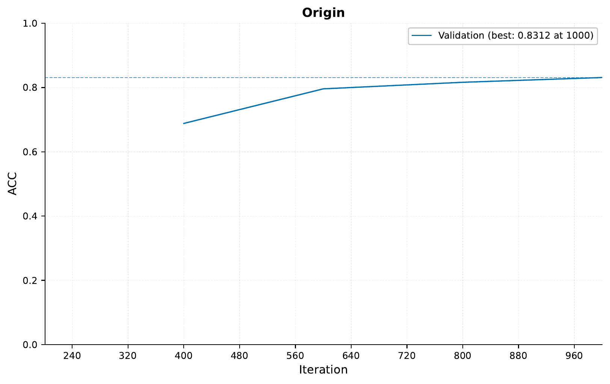
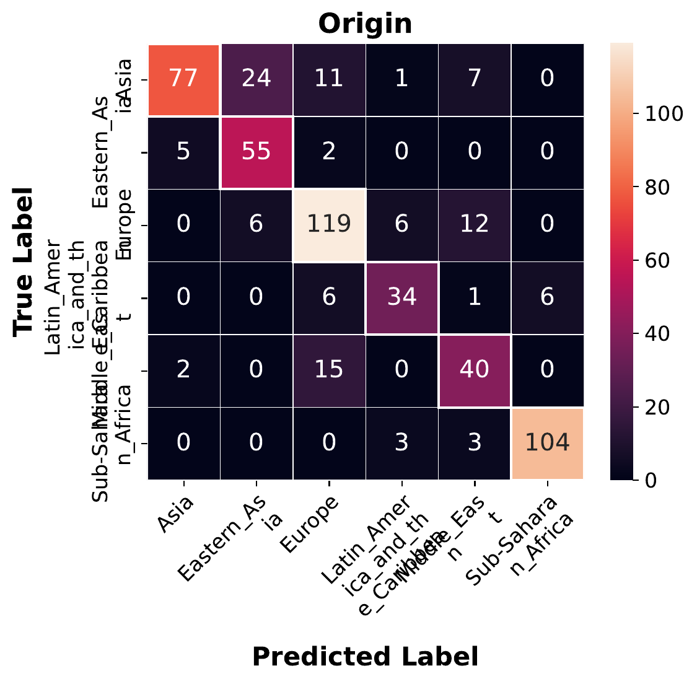

.. _01-customizing-fusion-tutorial:

Customizing EIR: Customized Fusion Tutorial
==================================================

A - Setup
^^^^^^^^^

In this tutorial,
we will be looking at
how to customize EIR.
Specifically, we will
be writing our own
fusion module through
the EIR Python API.

If you want to skip
straight to the code,
you can find it here: `D - Full Code`_.

B - Writing a custom fusion module
^^^^^^^^^^^^^^^^^^^^^^^^^^^^^^^^^^

Here, we will
write a custom fusion
module that uses an LSTM
to fuse the outputs of
the individual feature extractors
included in EIR.
This is a bit of a contrived example,
since, we are only using one input modality,
but hopefully it will serve as a good example
of how to write a custom fusion module.

First, we define our LSTM fusion module.
There are two specific things to note here:

1. We need to define a ``num_out_features`` attribute / property.
   This is used to determine the size of the output of the fusion module,
   which subsequent output modules use.
2. The ``forward`` method takes a dictionary of inputs,
   where the keys are the names of the input modalities
   and the values are the outputs of the corresponding feature extractors.
   The ``forward`` method should return a single tensor
   that is the output of the fusion module.

.. literalinclude:: ../../doc_modules/b_customizing_eir/a_customizing_fusion.py
    :pyobject: MyLSTMFusionModule

Having defined our fusion module, we now want to register and run our experiment
(which is using our custom fusion module) with EIR. For this demo, we will be
use a little function that replaces a couple of attributes in a default experiment,
but there are other ways to do this as well. Of note:

1. After defining our fusion module, we also set up the output modules by calling
   ``get_output_modules``. This is necessary because the output modules
   need to know the size of the output coming from the fusion module.
2. We are using the default ``MetaModel`` module included in EIR, which
   is a simple wrapper around the input, fusion and output modules. But you could
   also use a custom module here.

.. literalinclude:: ../../doc_modules/b_customizing_eir/a_customizing_fusion.py
    :pyobject: modify_experiment

Finally, we can run our experiment with our custom fusion module. Here we are reusing
a couple of functions from ``eir.train``.

.. literalinclude:: ../../doc_modules/b_customizing_eir/a_customizing_fusion.py
    :pyobject: main

C - Running the custom fusion module
^^^^^^^^^^^^^^^^^^^^^^^^^^^^^^^^^^^^

Having defined our custom fusion module and experiment above, we can now run our
experiment.

To start, please download `processed sample data`_,
The sample data we are using here for predicting ancestry
is the public `Human Origins`_ dataset, which we have
used in previous tutorials (see :ref:`01-genotype-tutorial`).

.. _processed sample data: https://drive.google.com/file/d/1MELauhv7zFwxM8nonnj3iu_SmS69MuNi
.. _Human Origins: https://www.nature.com/articles/nature13673

We also have our configuration files:

.. literalinclude:: ../tutorial_files/b_customizing_eir/01_customizing_fusion_tutorial/tutorial_01_globals.yaml
    :language: yaml

.. literalinclude:: ../tutorial_files/b_customizing_eir/01_customizing_fusion_tutorial/tutorial_01_input.yaml
    :language: yaml

.. literalinclude:: ../tutorial_files/b_customizing_eir/01_customizing_fusion_tutorial/tutorial_01_outputs.yaml
    :language: yaml

Now we can train, using our custom module but taking advantage of the rest of the
default EIR functionalities.

.. literalinclude:: ../tutorial_files/b_customizing_eir/01_customizing_fusion_tutorial/commands/CUSTOM_FUSION.txt
    :language: console

.. note::
    Note that now we are not using the ``eirtrain`` command,
    but instead we are using ``python`` to run our script.

Let's confirm that we used our now model by looking at the ``model_info.txt`` file:

.. literalinclude:: ../tutorial_files/b_customizing_eir/01_customizing_fusion_tutorial/commands/model_info.txt
    :language: console
    :emphasize-lines: 19-21

So, we can use that our experiment used our custom fusion module,
``MyLSTMFusionModule``.

Now let's have a look at how well our model did w.r.t. accuracy:

Not too bad! We can also look at the confusion matrix:

This marks the end of our tutorial on customizing the fusion module in EIR.
In the future, there might be more tutorials customizing other aspects of EIR
(e.g., the input modules, output modules, etc.),
but for now, hopefully this tutorial was helpful.

D - Full Code
^^^^^^^^^^^^^

.. literalinclude:: ../../doc_modules/b_customizing_eir/a_customizing_fusion.py
    :language: python

