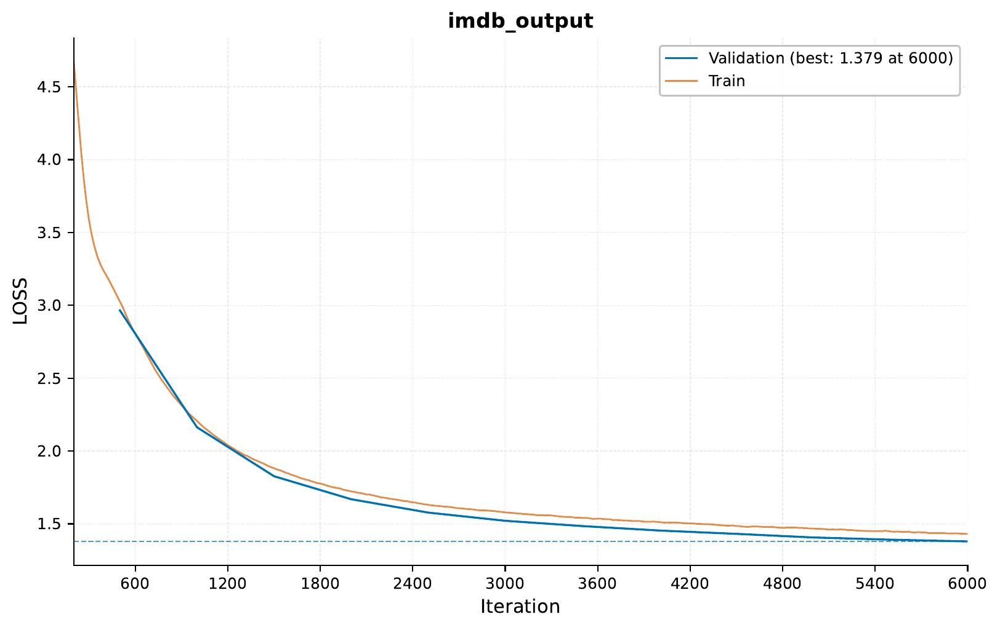

.. _c-sequence-output-sequence-generation-tutorial:

.. role:: raw-html(raw)
    :format: html

Sequence Generation: Generating Movie Reviews
=============================================

In this tutorial,
we will look into the built-in support in `EIR` for sequence generation tasks
(similar to what GPT does).
Sequences can represent various types of data such as
time series, sentences, genetic information, and more.
This technique allows us to generate new, meaningful sequences based on
patterns learned from the training data.

We will be using the same dataset
we used in the :ref:`03-sequence-tutorial`: the IMDB reviews dataset.
However, instead of classifying the reviews,
our goal this time will be to generate new movie reviews.

.. note::
    This tutorial assumes you are familiar with the basics of `EIR`,
    and have gone through
    the :ref:`01-genotype-tutorial` and the :ref:`03-sequence-tutorial`.
    Not required, but recommended.

A - Data
--------

As in the :ref:`03-sequence-tutorial`, we will be using the IMDB reviews dataset.
See `here <https://ai.stanford.edu/~ang/papers/acl11-WordVectorsSentimentAnalysis.pdf>`__
for more information about the data.
To download the data,
`use this link. <https://drive.google.com/file/d/1u6bkIr9sECkU9z3Veutjn8cx6Mu3GP3Z>`__

After downloading the data,
the folder structure should look like this
(we will look at the configs in a bit):

.. literalinclude:: ../tutorial_files/c_sequence_output/01_sequence_generation/commands/tutorial_folder.txt
    :language: console

B - Training
------------

Training is almost the same as when doing supervised learning,
with a couple of changes in our configurations. The biggest difference is
perhaps that when doing pure sequence generation tasks (i.e., there are no
auxiliary inputs), we do not need to specify an input configuration,
we only have a global, fusion and output config:

The global config is does not introduce any new parameters:

.. literalinclude:: ../tutorial_files/c_sequence_output/01_sequence_generation/globals.yaml
    :language: yaml
    :caption: globals.yaml

.. note::
    Above I am using the ``mps`` device for training, which is in some
    Macs. If you are using a different device, you can change it to ``cpu`` or e.g.,
    ``cuda:0``.

When we are doing only sequence generation (i.e., that is the only task),
the only supported fusion module is
"pass-through" currently,
this is because each sequence generation head performs its own fusion.
Therefore, customizing the fusion module with settings we have seen before
(e.g., setting the model type to "mlp-residual") would not have any effect.
However, if you are doing sequence generation as one of multiple tasks,
where at least one of the tasks is a supervised prediction, you can
customize the fusion module. However, it will only be used for the supervised
task, the sequence generation task will still use the "pass-through" fusion,
which is automatically added.

.. literalinclude:: ../tutorial_files/c_sequence_output/01_sequence_generation/fusion.yaml
    :language: yaml
    :caption: fusion.yaml

Now for the output, the structure is very similar to what we have seen before,
but with a couple of changes. The first difference is the ``output_type``, here
instead of ``tabular``, we set it to ``sequence``. The other difference is that
we now have a ``sampling_config``, specific to sequence generation. This allows
us to configure various parameters related to the sampling process during training,
where sequences are generated every ``sample_interval``.

Another thing of note is that here we are training a character-level model,
as ``split_on`` is set to ``""``.

.. literalinclude:: ../tutorial_files/c_sequence_output/01_sequence_generation/output.yaml
    :language: yaml
    :caption: output.yaml
    :emphasize-lines: 4, 12-19

After setting up the configs, training is similar to what we have seen before:

.. literalinclude:: ../tutorial_files/c_sequence_output/01_sequence_generation/commands/SEQUENCE_GENERATION_IMDB_1.txt
    :language: console

I got the following results:

However, the most interesting part is not the training curve, but the
generated sequences. If we look in the familiar ``samples`` folder,
we can see the generated sequences. At iteration 500, they are mostly
gibberish:

.. literalinclude:: ../tutorial_files/c_sequence_output/01_sequence_generation/figures/auto_generated_iter_500.txt
    :language: console
    :caption: Auto-generated sequence at iteration 500

.. literalinclude:: ../tutorial_files/c_sequence_output/01_sequence_generation/figures/manual_generated_iter_500.txt
    :language: console
    :caption: Manually sequence at iteration 500 with custom prompt

However, at iteration 6000, we can see that the model is starting to
generate more meaningful sequences:

.. literalinclude:: ../tutorial_files/c_sequence_output/01_sequence_generation/figures/auto_generated_iter_6000.txt
    :language: console
    :caption: Auto-generated sequence at iteration 6000

.. literalinclude:: ../tutorial_files/c_sequence_output/01_sequence_generation/figures/manual_generated_iter_6000.txt
    :language: console
    :caption: Manually sequence at iteration 6000 with custom prompt

C - Prediction: Creating new sequences with a trained model
-----------------------------------------------------------

Now that we have trained our model,
we can use it to generate new sequences.
Similarly to the process when we are doing supervised prediction,
we use the ``eirpredict`` command, with a couple of minor changes
now that we are doing sequence generation.

The first change can be seen in the output configuration. Here we have a file
called ``output_test.yaml``, which is similar to the ``output.yaml`` we used
for training, but notice the change in ``output_source``:

.. literalinclude:: ../tutorial_files/c_sequence_output/01_sequence_generation/output_test.yaml
    :language: yaml
    :caption: output_test.yaml
    :emphasize-lines: 2

Here we have ``null`` for the ``output_source``, which is because we do not have
any concrete inputs for the sequence generation task. Now, to control the
sequence generation prediction functionality, we are using the ``sampling_config``
in the configuration above, which allows to e.g. specify the generated sequence length,
now many sequences to generate from an empty prompt (``n_eval_inputs``) and
finally generate sequences from custom prompts (``manual_inputs``).

Now we execute our ``eirpredict`` command:

.. literalinclude:: ../tutorial_files/c_sequence_output/01_sequence_generation/commands/01_PREDICT_GENERATION.txt
    :language: console

This will save our results under the paths
specified in the ``output_folder`` parameter,
containing both the auto-generated and manually generated sequences.

Here is an example of an auto-generated sequence:

.. literalinclude:: ../tutorial_files/c_sequence_output/01_sequence_generation/tutorial_data/test_results/auto_0.txt
    :language: console
    :caption: Prediction auto-generated sequence 1

And here are the manually generated sequences with our custom prompts:

.. literalinclude:: ../tutorial_files/c_sequence_output/01_sequence_generation/tutorial_data/test_results/manual_0.txt
    :language: console
    :caption: Prediction manually generated sequence 1

.. literalinclude:: ../tutorial_files/c_sequence_output/01_sequence_generation/tutorial_data/test_results/manual_1.txt
    :language: console
    :caption: Prediction manually generated sequence 2

While our generated reviews are far from realistic, they do show that
the model is learning to generate sequences that are somewhat meaningful.

E - Sequence Generation with BPE Tokenization
---------------------------------------------
Now that we have seen how to do sequence generation with a character-level
model, let's see how we can do it with a token-level model. This time,
we will use the IMDB dataset,
but with an implementation of BPE (Byte Pair Encoding) tokenization.

BPE, as detailed in this `paper <https://arxiv.org/abs/1508.07909v5>`_,
is a sub-word tokenization method that progressively learns the
most common sequences of characters (or bytes)
to form an efficient set of tokens.

As we'll see, using BPE tokenization allows us to generate longer sequences than with the character model.

To use it, a couple of changes are needed in the output configuration:

.. literalinclude:: ../tutorial_files/c_sequence_output/01_sequence_generation/output_bpe.yaml
    :language: yaml
    :caption: output_bpe.yaml
    :emphasize-lines: 8-10

Since the tokenizer can operate on the raw text, we set ``split_on`` to ``null``,
and we can also control the maximum vocabulary size with
``adaptive_tokenizer_max_vocab_size`` parameter.

Here is the training curve I got for this model:

.. image:: ../tutorial_files/c_sequence_output/01_sequence_generation/figures/training_curve_LOSS_transformer_1_bpe.png
    :width: 100%
    :align: center

Here are the auto-generated and manually generated sequences at iteration 500:

.. literalinclude:: ../tutorial_files/c_sequence_output/01_sequence_generation/figures/auto_generated_iter_500_bpe.txt
    :language: console
    :caption: Auto-generated sequence at iteration 500

.. literalinclude:: ../tutorial_files/c_sequence_output/01_sequence_generation/figures/manual_generated_iter_500_bpe.txt
    :language: console
    :caption: Manually sequence at iteration 500 with custom prompt

And as before, at iteration 6000, we can see that the model is starting to
generate more meaningful sequences:

.. literalinclude:: ../tutorial_files/c_sequence_output/01_sequence_generation/figures/auto_generated_iter_6000_bpe.txt
    :language: console
    :caption: Auto-generated sequence at iteration 6000

.. literalinclude:: ../tutorial_files/c_sequence_output/01_sequence_generation/figures/manual_generated_iter_6000_bpe.txt
    :language: console
    :caption: Manually sequence at iteration 6000 with custom prompt

Hopefully this tutorial has given you a good overview of how to use
the sequence generation functionality in ``EIR``. Thank you for reading!

F - Serving
-----------

In this final section, we demonstrate serving our trained model for sequence generation as a web service and interacting with it using HTTP requests.

Starting the Web Service
"""""""""""""""""""""""""

To serve the model, use the following command:

.. code-block:: shell

    eirserve --model-path [MODEL_PATH]

Replace `[MODEL_PATH]` with the actual path to your trained model.
This command initiates a web service that listens for incoming requests.

Here is an example of the command:

.. literalinclude:: ../tutorial_files/c_sequence_output/01_sequence_generation/commands/SEQUENCE_GENERATION_DEPLOY.txt
    :language: console

Sending Requests
""""""""""""""""

With the server running, we can now send requests for generating sequences based on initial text prompts.

Here's an example Python function demonstrating this process:

.. literalinclude:: ../tutorial_files/c_sequence_output/01_sequence_generation/request_example/python_request_example_module.py
    :language: python
    :caption: request_example_module.py

When running this, we get the following output:

.. literalinclude:: ../tutorial_files/c_sequence_output/01_sequence_generation/request_example/python_request_example.json
    :language: json
    :caption: request_example.json

Additionally, you can send requests using bash:

.. literalinclude:: ../tutorial_files/c_sequence_output/01_sequence_generation/request_example/bash_request_example_module.sh
    :language: console
    :caption: request_example_module.sh

When running this, we get the following output:

.. literalinclude:: ../tutorial_files/c_sequence_output/01_sequence_generation/request_example/bash_request_example.json
    :language: json
    :caption: request_example.json

Analyzing Responses
"""""""""""""""""""

After sending requests to the served model, the responses can be analyzed.
These responses demonstrate the model's ability to generate text sequences based on the provided prompts.

.. literalinclude:: ../tutorial_files/c_sequence_output/01_sequence_generation/serve_results/predictions.json
    :language: json
    :caption: predictions.json

If you made it this far, I want to thank you for reading!
