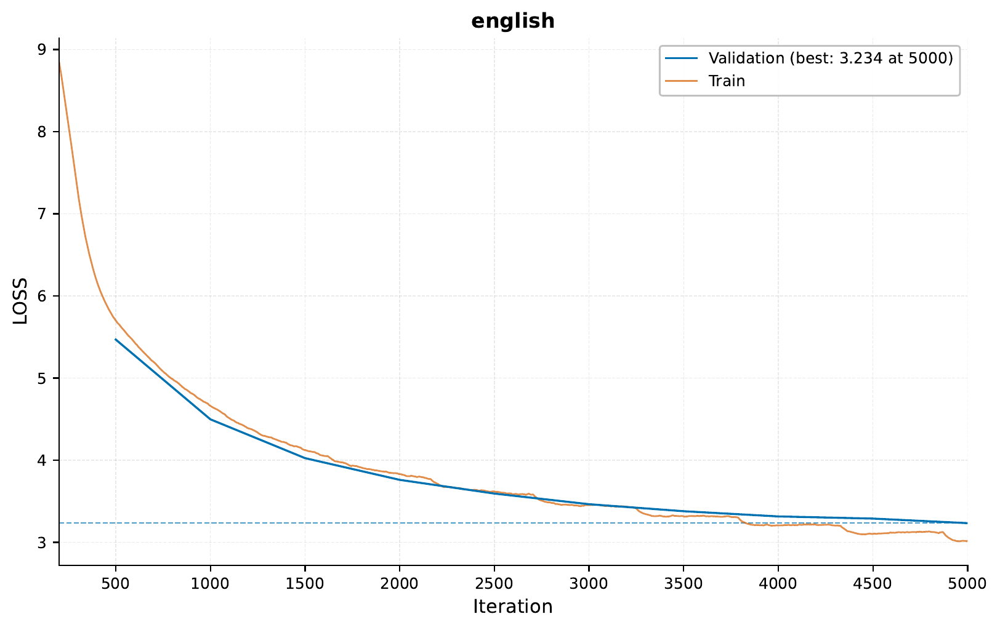
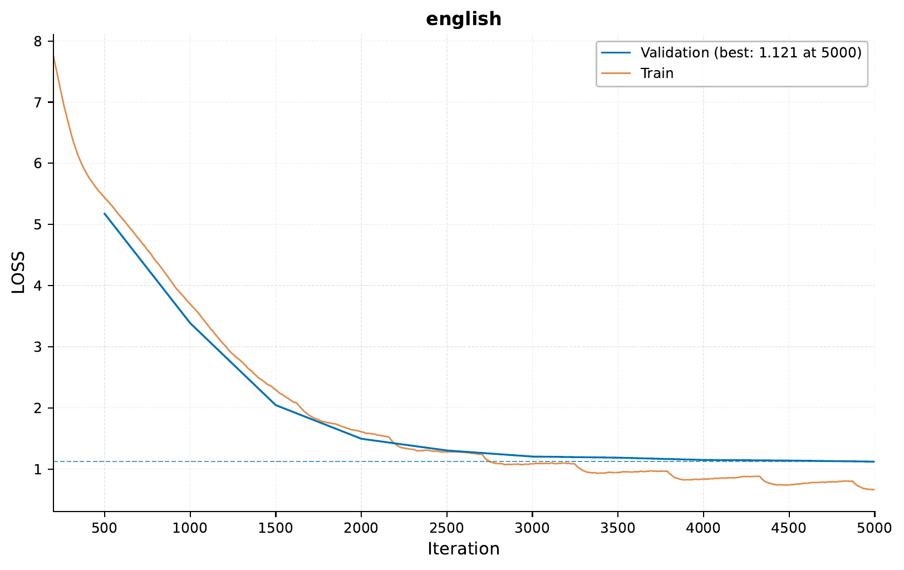

.. _c-sequence-seq-to-seq-tutorial:

.. role:: raw-html(raw)
    :format: html

Sequence to Sequence: Spanish to English Translation
====================================================

In this tutorial, we will use ``EIR`` for sequence-to-sequence tasks.
Sequence to Sequence (seq-to-seq) models are a type of models that transform an
input sequence into an output sequence,
a task relevant for numerous applications like machine translation,
summarization, and more.

For this tutorial,
our task will be translating Spanish sentences into English,
using a dataset from `Tatoeba <https://tatoeba.org/en>`_.

A - Data
--------

You can download the data
for this tutorial `here <https://drive.google.com/file/d/1MIARnMmzYNPEDU_f7cuPwaHp8BsXNy59">`_.

After downloading the data,
the folder structure should look like this
(we will look at the configs in a bit):

.. literalinclude:: ../tutorial_files/c_sequence_output/02_sequence_to_sequence/commands/tutorial_folder.txt
    :language: console

B - Training
------------

Training follows a similar approach
as we saw in the previous tutorial,
:ref:`c-sequence-output-sequence-generation-tutorial`.

First, we will train on only the English data,
without any Spanish data to establish a baseline.

For reference, here are the configurations:

.. literalinclude:: ../tutorial_files/c_sequence_output/02_sequence_to_sequence/globals.yaml
    :language: yaml
    :caption: globals.yaml

.. literalinclude:: ../tutorial_files/c_sequence_output/02_sequence_to_sequence/fusion.yaml
    :language: yaml
    :caption: fusion.yaml

.. literalinclude:: ../tutorial_files/c_sequence_output/02_sequence_to_sequence/output.yaml
    :language: yaml
    :caption: output.yaml

With these configurations,
we can train with the following command:

.. literalinclude:: ../tutorial_files/c_sequence_output/02_sequence_to_sequence/commands/SEQUENCE_TO_SEQUENCE_ENGLISH.txt
    :language: console

When running the command above,
I got the following training curve:

Here are a couple of example of the generated sentences using only English data:

.. literalinclude:: ../tutorial_files/c_sequence_output/02_sequence_to_sequence/figures/auto_generated_0_iter_5000_only_english.txt
    :language: console
    :caption: Generated English caption using only English data 1

.. literalinclude:: ../tutorial_files/c_sequence_output/02_sequence_to_sequence/figures/auto_generated_1_iter_5000_only_english.txt
    :language: console
    :caption: Generated English caption using only English data 2

While the captions above are make some sense,
a more interesting task is actually using the Spanish data as input,
and generate the respective English translation.
For this, we will include an input configuration
for the Spanish data:

.. literalinclude:: ../tutorial_files/c_sequence_output/02_sequence_to_sequence/input_spanish.yaml
    :language: yaml
    :caption: input_spanish.yaml

To train, we will use the following command:

.. literalinclude:: ../tutorial_files/c_sequence_output/02_sequence_to_sequence/commands/SEQUENCE_TO_SEQUENCE_SPANISH_ENGLISH.txt
    :language: console
    :emphasize-lines: 3

When running the command above,
I got the following training curve:

We can see that the training curve is better
than when we only used English data,
indicating that the model can utilize the Spanish data
to generate the English sentences.

Now, we can look at some of the generated sentences:

.. raw:: html
    :file: ../tutorial_files/c_sequence_output/02_sequence_to_sequence/figures/translations.html

While these are not perfect translations,
they are maybe not too bad considering a simple model trained
for around an hour on a laptop.

C - Serving
-----------

In this final section, we demonstrate serving our trained model for sequence-to-sequence translation as a web service and interacting with it using HTTP requests.

Starting the Web Service
"""""""""""""""""""""""""

To serve the model, use the following command:

.. code-block:: shell

    eirserve --model-path [MODEL_PATH]

Replace `[MODEL_PATH]` with the actual path to your trained model.
This command initiates a web service that listens for incoming requests.

Here is an example of the command:

.. literalinclude:: ../tutorial_files/c_sequence_output/02_sequence_to_sequence/commands/SEQUENCE_TO_SEQUENCE_DEPLOY.txt
    :language: console

Sending Requests
""""""""""""""""

With the server running, we can now send requests for translating text from Spanish to English.

Here's an example Python function demonstrating this process:

.. literalinclude:: ../tutorial_files/c_sequence_output/02_sequence_to_sequence/request_example/python_request_example_module.py
    :language: python
    :caption: request_example_module.py

When running this, we get the following output:

.. literalinclude:: ../tutorial_files/c_sequence_output/02_sequence_to_sequence/request_example/python_request_example.json
    :language: json
    :caption: request_example.json

Additionally, you can send requests using bash:

.. literalinclude:: ../tutorial_files/c_sequence_output/02_sequence_to_sequence/request_example/bash_request_example_module.sh
    :language: console
    :caption: request_example_module.sh

When running this, we get the following output:

.. literalinclude:: ../tutorial_files/c_sequence_output/02_sequence_to_sequence/request_example/bash_request_example.json
    :language: json
    :caption: request_example.json

Analyzing Responses
"""""""""""""""""""

After sending requests to the served model, the responses can be analyzed.
These responses provide insights into the model's ability to translate from Spanish to English.

.. literalinclude:: ../tutorial_files/c_sequence_output/02_sequence_to_sequence/serve_results/predictions.json
    :language: json
    :caption: predictions.json

Thanks for reading!