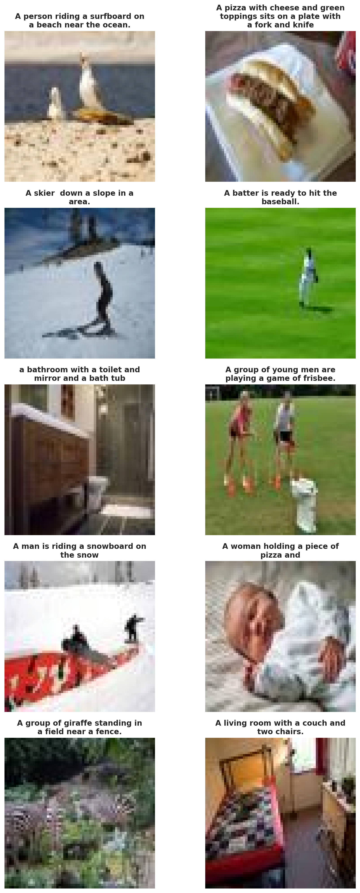

.. _c-sequence-img-to-seq-tutorial:

.. role:: raw-html(raw)
    :format: html

03 - Image to Sequence: Image Captioning
========================================

In this tutorial, we will utilize ``EIR`` for image-to-sequence tasks.
Image to Sequence (img-to-seq) models are a type of models that convert an
input image into a sequence of words. This could be useful for tasks like
image captioning, where the model generates a description of the contents of an image.

In this tutorial, we will be generating captions for images using the
`COCO 2017 dataset <https://cocodataset.org/#home>`__.

A - Data
--------

You can download the data
for this tutorial `here <https://drive.google.com/file/d/10zanaprFyX4RE0Mib1h5gYi7yO9DNTyy/view?usp=share_link>`__.

After downloading the data,
the folder structure should look like this
(we will look at the configs in a bit):

.. literalinclude:: ../tutorial_files/c_sequence_output/03_image_captioning/commands/tutorial_folder.txt
    :language: console

B - Training
------------

Training follows a similar approach
as we saw in the previous tutorial,
:ref:`c-sequence-output-sequence-generation-tutorial`.

For reference, here are the configurations:

.. literalinclude:: ../tutorial_files/c_sequence_output/03_image_captioning/globals.yaml
    :language: yaml
    :caption: globals.yaml

.. literalinclude:: ../tutorial_files/c_sequence_output/03_image_captioning/fusion.yaml
    :language: yaml
    :caption: fusion.yaml

.. literalinclude:: ../tutorial_files/c_sequence_output/03_image_captioning/inputs_resnet18.yaml
    :language: yaml
    :caption: inputs_resnet18.yaml

.. literalinclude:: ../tutorial_files/c_sequence_output/03_image_captioning/output.yaml
    :language: yaml
    :caption: output.yaml

Like previously, we will start by training a model
only on the text to establish as baseline:

.. literalinclude:: ../tutorial_files/c_sequence_output/03_image_captioning/commands/IMAGE_CAPTIONING_ONLY_TEXT.txt
    :language: console

When running the command above,
I got the following training curve:

Now, we will train a model that uses both the image and the text:

.. literalinclude:: ../tutorial_files/c_sequence_output/03_image_captioning/commands/IMAGE_CAPTIONING_IMAGE_TEXT.txt
    :language: console
    :emphasize-lines: 3

When running the command above,
I got the following training curve:

.. image:: ../tutorial_files/c_sequence_output/03_image_captioning/figures/training_curve_LOSS_transformer_1_image_text.png
    :width: 100%
    :align: center

The fact that the validation loss is lower
indicates that the model is likely able to
use the image to improve the quality of the captions.

After training, we can look at some of the generated captions:

While the captions seem to be somewhat related to the images,
they are far from perfect. As the validation loss
is still decreasing, we could train the model
for longer, try a larger model, use larger images,
or use a larger dataset.

D - Serving
-----------

In this final section, we demonstrate serving our trained image captioning model as a web service and interacting with it using HTTP requests.

Starting the Web Service
"""""""""""""""""""""""""

To serve the model, use the following command:

.. code-block:: shell

    eirserve --model-path [MODEL_PATH]

Replace `[MODEL_PATH]` with the actual path to your trained model.
This command initiates a web service that listens for incoming requests.

Here is an example of the command:

.. literalinclude:: ../tutorial_files/c_sequence_output/03_image_captioning/commands/IMAGE_TO_SEQUENCE_DEPLOY.txt
    :language: console

Sending Requests
""""""""""""""""

With the server running, we can now send image-based requests for caption generation. For this model, we send images and receive their captions.

Here's an example Python function demonstrating this process:

.. literalinclude:: ../tutorial_files/c_sequence_output/03_image_captioning/request_example/python_request_example_module.py
    :language: python
    :caption: request_example_module.py

When running this, we get the following output:

.. literalinclude:: ../tutorial_files/c_sequence_output/03_image_captioning/request_example/python_request_example.json
    :language: json
    :caption: request_example.json

Analyzing Responses
"""""""""""""""""""

Before analyzing the responses, let's view the images that were used for generating captions:

000000000009.jpg

000000000034.jpg

000000581929.jpg

After sending requests to the served model, the responses can be analyzed.
These responses provide insights into the model's capability to generate captions for the input images.

.. literalinclude:: ../tutorial_files/c_sequence_output/03_image_captioning/serve_results/predictions.json
    :language: json
    :caption: predictions.json

Thank you for reading!