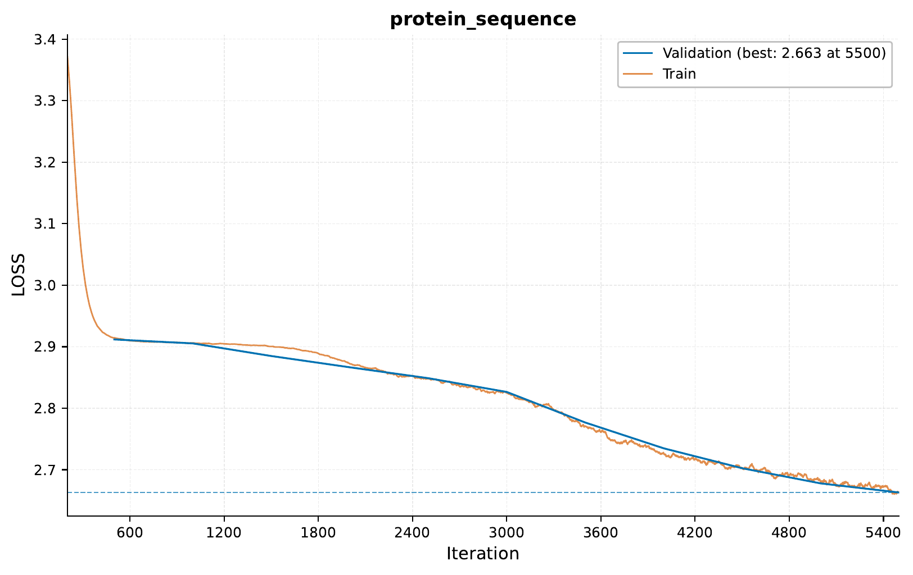
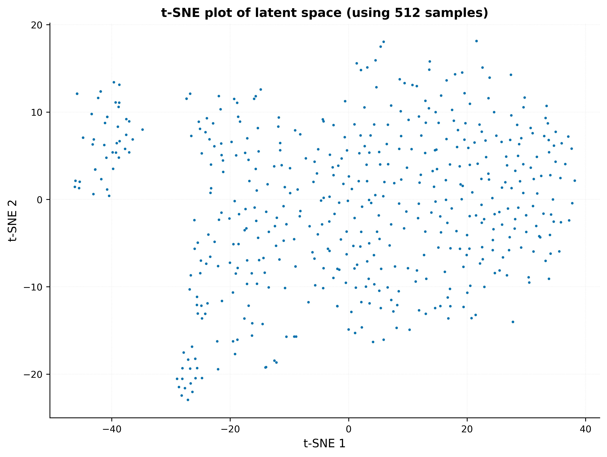
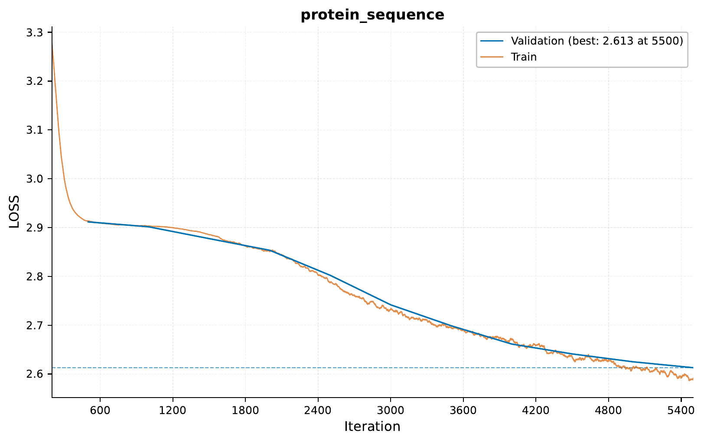
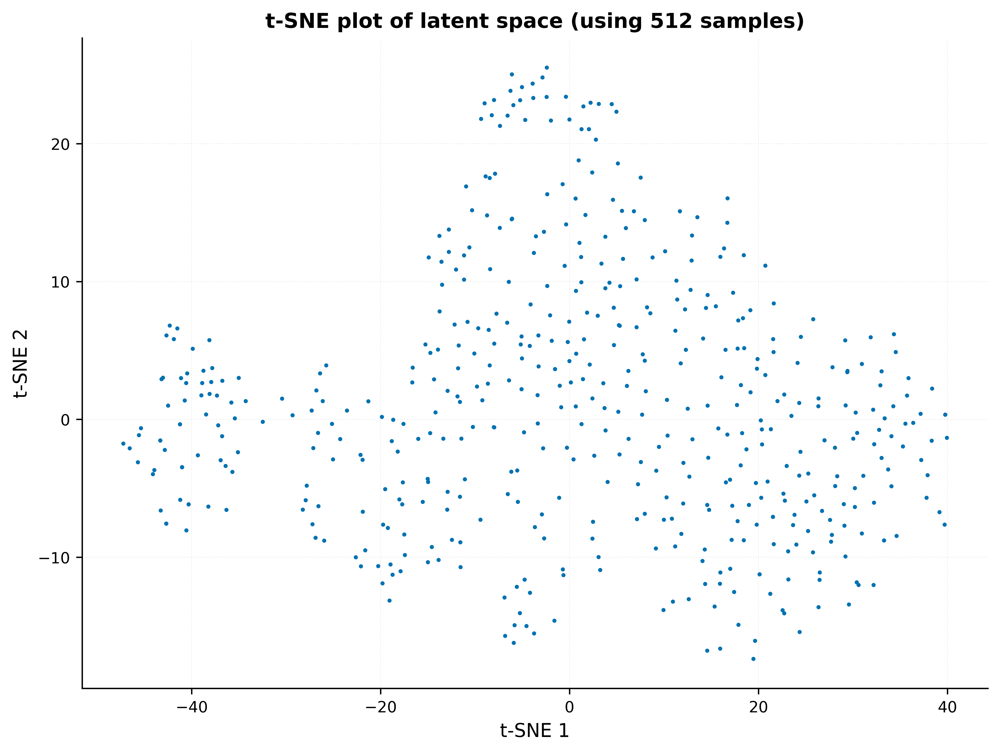

.. _c-sequence-tabular-to-seq-tutorial:

.. role:: raw-html(raw)
    :format: html

Tabular to Sequence: Protein Sequence Generation
================================================

In this tutorial, we'll employ ``EIR`` for sequence generation conditioned
on tabular data. Specifically, we will be generating protein sequences conditioned
on their classification.

A - Data
--------

The dataset for this tutorial
can be downloaded from
`here <https://drive.google.com/file/d/16FMSCOdPxGcCx8oJD5GU1AYIjacbJ2yZ>`__.

This dataset is processed from a Kaggle dataset
available `here <https://www.kaggle.com/datasets/shahir/protein-data-set/>`__.
The original data, in turn,
originates from the `RCSB Protein Data Bank <https://www.rcsb.org>`__.

After downloading the data, your folder structure should look something like this
(we will add the configuration files as we progress):

.. literalinclude:: ../tutorial_files/c_sequence_output/04_protein_sequence_generation/commands/tutorial_folder.txt
    :language: console

B - Unconditional Protein Sequence Generation
---------------------------------------------

Training will be similar to what we did in a previous tutorial,
:ref:`c-sequence-output-sequence-generation-tutorial`. First, we will
start by establishing a baseline by training a model on the protein sequences only:

Below are the relevant configurations:

.. literalinclude:: ../tutorial_files/c_sequence_output/04_protein_sequence_generation/globals.yaml
    :language: yaml
    :caption: globals.yaml

.. literalinclude:: ../tutorial_files/c_sequence_output/04_protein_sequence_generation/fusion.yaml
    :language: yaml
    :caption: fusion.yaml

.. literalinclude:: ../tutorial_files/c_sequence_output/04_protein_sequence_generation/output.yaml
    :language: yaml
    :caption: output.yaml

Training the model:

.. literalinclude:: ../tutorial_files/c_sequence_output/04_protein_sequence_generation/commands/01_PROTEIN_GENERATION_ONLY_TEXT.txt
    :language: console

Executing the command above resulted in the following training curve:

You might have noticed the ``latent_sampling`` parameter in the global configuration,
which allows us to extract a representation from a specified the model.
In a addition to saving the validation set representations,
we also get a couple of visualizations. For example, here is a t-SNE plot
of the validation set representations at iteration 5000:

C - Conditional Protein Sequence Generation
-------------------------------------------

Next, we'll train a model incorporating both tabular data,
which contains the protein type classification and the protein sequences.

For this, we add the input configuration containing the tabular data:

.. literalinclude:: ../tutorial_files/c_sequence_output/04_protein_sequence_generation/inputs_tabular.yaml
    :language: yaml
    :caption: input.yaml

Additionally, we can update our output configuration to generate sequences based on
manually specified tabular input values:

.. literalinclude:: ../tutorial_files/c_sequence_output/04_protein_sequence_generation/output_conditioned.yaml
    :language: yaml
    :caption: output.yaml

.. note::
    While not shown here, you can view the generated sequences in the
    ``samples/<iteration>/manual`` folder during/after training.

Training the conditional model:

.. literalinclude:: ../tutorial_files/c_sequence_output/04_protein_sequence_generation/commands/02_PROTEIN_GENERATION_TABULAR.txt
    :language: console

When executing the above command, the following training curve was obtained:

The (albeit slightly) lowered validation loss
suggests the model effectively uses tabular data to improve sequence quality.

Similarly to before, we can visualize the validation set representations
at iteration 5000, now for the conditional model:

The separation does seem to be slightly better than before, which could
be due to the model given the additional information from the tabular data.

D - Generating New Sequences of a Specific Protein Type
-------------------------------------------------------

Finally, we will take a quick look at how we can use a trained model
to generate new sequences of a specific protein type. For this, we will
use configuration files similar to the ones used for training,
but now pointing to the test set data:

.. literalinclude:: ../tutorial_files/c_sequence_output/04_protein_sequence_generation/inputs_tabular_test.yaml
    :language: yaml
    :caption: input.yaml

.. literalinclude:: ../tutorial_files/c_sequence_output/04_protein_sequence_generation/output_conditioned_test.yaml
    :language: yaml
    :caption: output.yaml

Now, we can use the ``eirpredict`` command as follows:

.. literalinclude:: ../tutorial_files/c_sequence_output/04_protein_sequence_generation/commands/03_PREDICT_GENERATION.txt
    :language: console

This will save the results in the specified ``--output_folder``. While we do evaluate
the loss, it's perhaps more interesting to look at the generated sequences as well as
the latent sampling, available in the ``results`` and ``latents`` folders, respectively.

F - Serving
-----------

In this final section, we demonstrate serving our trained model for protein sequence generation with tabular inputs as a web service and interacting with it using HTTP requests.

Starting the Web Service
"""""""""""""""""""""""""

To serve the model, use the following command:

.. code-block:: shell

    eirserve --model-path [MODEL_PATH]

Replace `[MODEL_PATH]` with the actual path to your trained model.
This command initiates a web service that listens for incoming requests.

Here is an example of the command:

.. literalinclude:: ../tutorial_files/c_sequence_output/04_protein_sequence_generation/commands/TABULAR_DEPLOY.txt
    :language: console

Sending Requests
""""""""""""""""

With the server running, we can now send requests that include tabular data to generate protein sequences.

Here's an example Python function demonstrating this process:

.. literalinclude:: ../tutorial_files/c_sequence_output/04_protein_sequence_generation/request_example/python_request_example_module.py
    :language: python
    :caption: request_example_module.py

When running this, we get the following output:

.. literalinclude:: ../tutorial_files/c_sequence_output/04_protein_sequence_generation/request_example/python_request_example.json
    :language: json
    :caption: request_example.json

Additionally, you can send requests using bash:

.. literalinclude:: ../tutorial_files/c_sequence_output/04_protein_sequence_generation/request_example/bash_request_example_module.sh
    :language: console
    :caption: request_example_module.sh

When running this, we get the following output:

.. literalinclude:: ../tutorial_files/c_sequence_output/04_protein_sequence_generation/request_example/bash_request_example.json
    :language: json
    :caption: request_example.json

Analyzing Responses
"""""""""""""""""""

After sending requests to the served model, the responses can be analyzed.
These responses provide insights into the model's ability to generate protein sequences based on the tabular input.

.. literalinclude:: ../tutorial_files/c_sequence_output/04_protein_sequence_generation/serve_results/predictions.json
    :language: json
    :caption: predictions.json

If you made it this far, I want to thank you for reading!

Thank you for reading!
