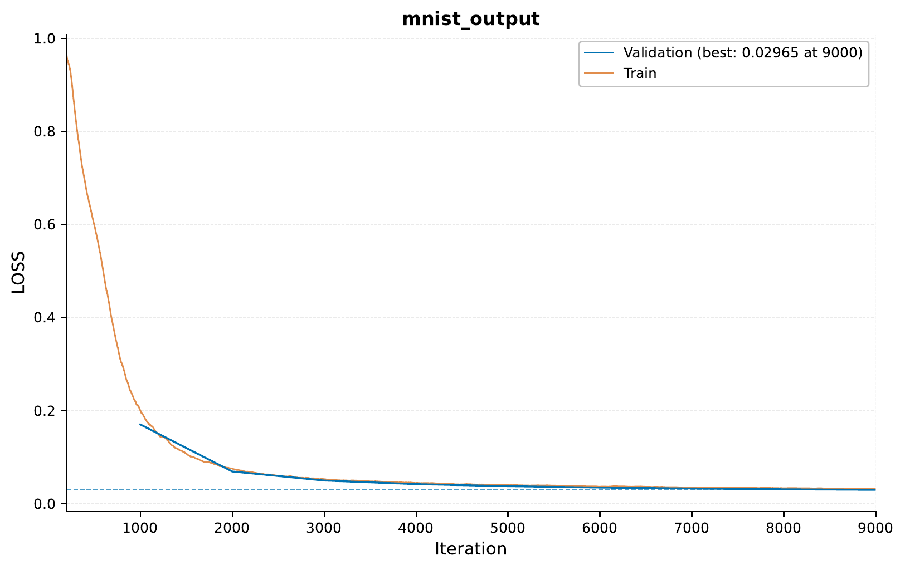
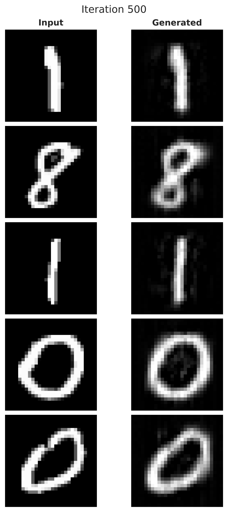
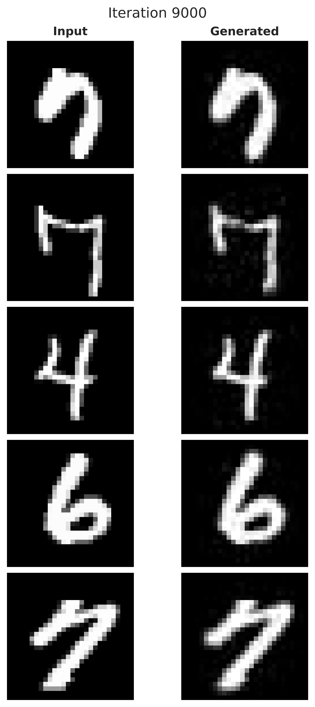
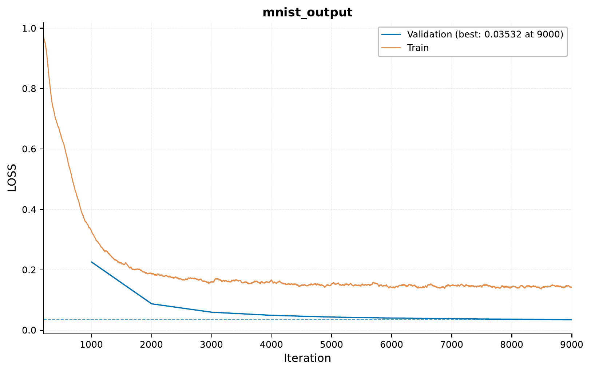
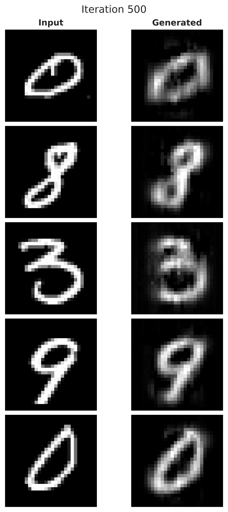
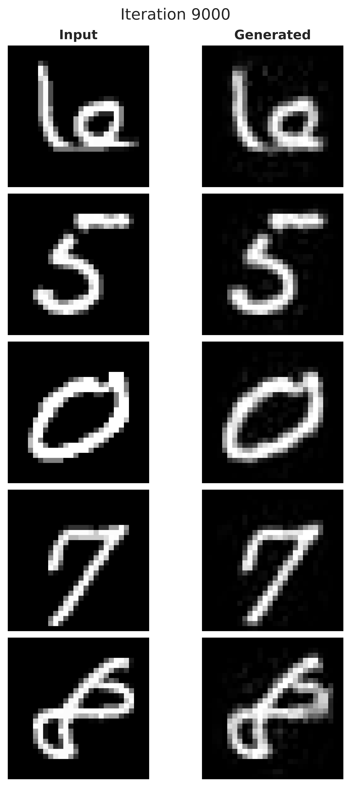

.. _c-array-output-mnist-generation-tutorial:

.. role:: raw-html(raw)
    :format: html

01 – Array Output: Building a Simple Autoencoder for MNIST Digit Generation
===========================================================================

In this tutorial,
we will explore the capabilities of `EIR` for array output tasks,
specifically focusing on MNIST digit generation using a simple autoencoder.
Arrays can represent various types of data,
including images, time series, and more.
This technique allows us to generate new,
meaningful arrays based on
patterns learned from the training data.

.. note::
    This tutorial assumes you are familiar with the basics of `EIR`,
    and have gone through previous tutorials.
    Not required, but recommended.

A - Data
--------

Here, we will be using the well known MNIST dataset.
The dataset here consists of preprocessed NumPy arrays
containing the MNIST handwritten digit images.

After downloading the data,
the folder structure should look like this:

.. literalinclude:: ../tutorial_files/d_array_output/01_array_mnist_generation/commands/tutorial_folder.txt
    :language: console

B - Training A Simple Autoencoder
---------------------------------

Training an autoencoder for MNIST digit generation with `EIR`
involves the familiar configuration files
and follows a process similar to supervised learning.
We'll discuss the key configurations and visualize the training process,
including the training curve and generated images at different iterations.

The global config provides standard parameters for training:

.. literalinclude:: ../tutorial_files/d_array_output/01_array_mnist_generation/globals.yaml
    :language: yaml
    :caption: globals.yaml

.. note::
    One new thing you might notice here is the ``latent_sampling`` configuration
    in the global configuration, which let's you extract and visualize the latent space
    of chosen layers during training (computed on the validation set).

The input configuration specifies the structure of the MNIST array input:

.. literalinclude:: ../tutorial_files/d_array_output/01_array_mnist_generation/input_mnist_array.yaml
    :language: yaml
    :caption: input_mnist_array.yaml

The output configuration defines the structure and settings for the generated images:

.. literalinclude:: ../tutorial_files/d_array_output/01_array_mnist_generation/output.yaml
    :language: yaml
    :caption: output.yaml

With the configurations in place, we can run the following command to start the training process:

.. literalinclude:: ../tutorial_files/d_array_output/01_array_mnist_generation/commands/ARRAY_GENERATION_MNIST_1.txt
    :language: console

I got the following results:

Since we had that latent space sampling configuration in the global config,
the latents are saved and a couple of visualizations are generated, here is one
with the t-SNE visualization of the latents at iteration 9000:

.. image:: ../tutorial_files/d_array_output/01_array_mnist_generation/figures/0_autoencoder/latents_visualization.png
    :width: 100%
    :align: center

Here we have colored the latent space by the digit label,
and we can see which labels are close to each other in the latent space. For example,
it seems that 4, 7 and 9 are close to each other.

Now, when we are generating arrays, ``EIR`` will
save some of the generated arrays (as well as the corresponding inputs)
during training under the ``results/samples/<iteration>`` folders
(the sampling is configurable by the sampling configuration
in the output config). We can load these numpy arrays and visualize them.

Here is a comparison of generated images at iteration 500:

And at iteration 9500, we can observe the improvements in generation:

C - Augmenting Our Autoencoder With More Data
---------------------------------------------

In this section, we will explore how to augment our
MNIST digit-generating autoencoder with additional data.
Specifically, we will add the MNIST labels to the autoencoder,
which will allow us to conditionally generate images of specific digits.

The global config remains the same as in the previous section:

.. literalinclude:: ../tutorial_files/d_array_output/01_array_mnist_generation/globals.yaml
    :language: yaml
    :caption: globals.yaml

The input configuration now includes additional files to represent the augmented data:

.. literalinclude:: ../tutorial_files/d_array_output/01_array_mnist_generation/input_mnist_array_with_label.yaml
    :language: yaml
    :caption: input_mnist_array_with_label.yaml

.. note::
    Here we see another new option, ``modality_dropout_rate``, this will randomly
    drop out modalities during training, which can be useful for training
    models that can handle missing modalities.

.. literalinclude:: ../tutorial_files/d_array_output/01_array_mnist_generation/input_mnist_label.yaml
    :language: yaml
    :caption: input_mnist_label.yaml

The output configuration has also been modified to accommodate the augmented data:

.. literalinclude:: ../tutorial_files/d_array_output/01_array_mnist_generation/output_with_label.yaml
    :language: yaml
    :caption: output_with_label.yaml

.. note::
    Notice here we are using some manual inputs in the sampling configuration,
    which will allow us to generate images of specific digits.

We can run the following command to start training the augmented autoencoder:

.. literalinclude:: ../tutorial_files/d_array_output/01_array_mnist_generation/commands/ARRAY_GENERATION_MNIST_2.txt
    :language: console

I got the following results:

Here is a visualization of the latent space:

.. image:: ../tutorial_files/d_array_output/01_array_mnist_generation/figures/1_autoencoder_augmented/latents_visualization.png
    :width: 100%
    :align: center

Here is a comparison of generated images at iteration 500 and 9500:

Now, since we added those manual inputs earlier, they are also saved in the ``sample``
folders (under ``manual``), and we can visualize them:

.. image:: ../tutorial_files/d_array_output/01_array_mnist_generation/figures/1_autoencoder_augmented/combined_plot.png
    :width: 75%
    :align: center

So indeed we can see, in the absence of the actual image to encode,
the model uses the class label to generate the respective digit. While not immediately
obvious, the generated images of the same class are not completely identical
(although they are extremely similar),
due to some stochasticity injected into the model.

If you made it this far, thank you for reading!
I hope this tutorial was
interesting and useful to you!