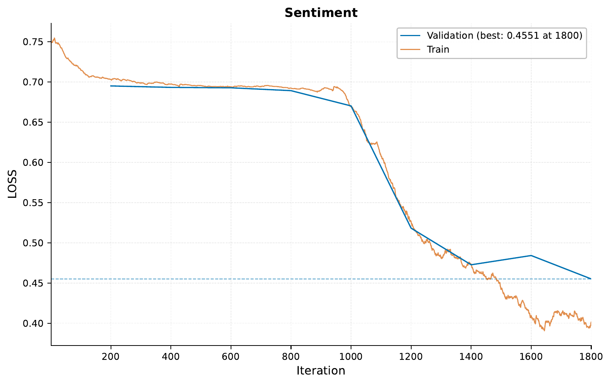
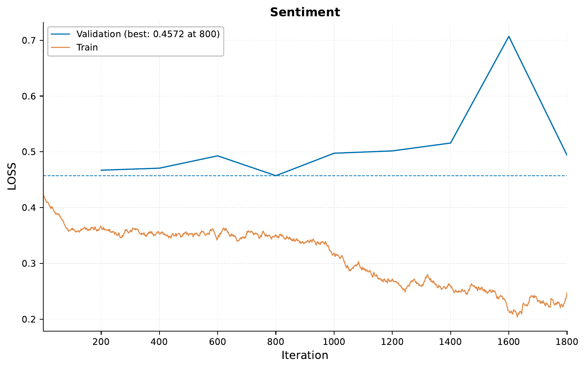
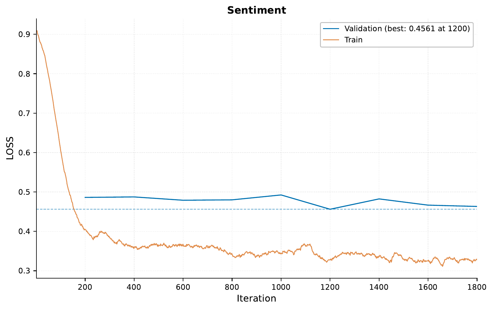

.. _e-pretrained-checkpoint-tutorial:

.. role:: raw-html(raw)
    :format: html

Pretraining, Checkpointing and Continued Training
=================================================

In this tutorial,
we will be looking at how to use EIR to create pretrained models,
and successively use them for continued training on the same data,
as well as partially loading matching layers when changing the model architecture.

.. note::
    This tutorial assumes you are familiar with the basics of EIR,
    and have gone through previous tutorials.
    Not required, but recommended.

A - Data
--------

We will be using the same dataset
we used in the :ref:`03-sequence-tutorial`: the IMDB reviews dataset,
and we will be repeating the same task as before, i.e., sentiment classification.

See `here <https://ai.stanford.edu/~ang/papers/acl11-WordVectorsSentimentAnalysis.pdf>`__
for more information about the data.
To download the data,
`use this link. <https://drive.google.com/file/d/1u6bkIr9sECkU9z3Veutjn8cx6Mu3GP3Z>`__

After downloading the data,
the folder structure should look like this:

.. literalinclude:: ../tutorial_files/e_pretraining/01_checkpointing/commands/tutorial_folder.txt
    :language: console

B - Training a Model From Scratch
---------------------------------

Training follows the same approach as we have seen on other tutorials,
starting with the configurations.

The global config sets the universal parameters for training:

.. literalinclude:: ../tutorial_files/e_pretraining/01_checkpointing/imdb_globals.yaml
    :language: yaml
    :caption: imdb_globals.yaml

The input config outlines the IMDB dataset's specific structure:

.. literalinclude:: ../tutorial_files/e_pretraining/01_checkpointing/imdb_input.yaml
    :language: yaml
    :caption: imdb_input.yaml

For the output configurations:

.. literalinclude:: ../tutorial_files/e_pretraining/01_checkpointing/imdb_output.yaml
    :language: yaml
    :caption: imdb_output.yaml

Here is the command for training:

.. literalinclude:: ../tutorial_files/e_pretraining/01_checkpointing/commands/1_CHECKPOINT_PRETRAIN_IMDB_FROM_SCRATCH.txt
    :language: console

Training Results:

So, these training results are nothing too much out of the ordinary,
with the training and validation loss both decreasing as training goes on.

C - Continuing Training from a Checkpoint
-----------------------------------------

Often, you might want to resume training from a previously saved checkpoint.
This can be especially useful for reasons such as
fine-tuning the model on a different dataset,
or resuming a long-running training process after interruption.
For this, we can use the ``pretrained_checkpoint`` argument in the global config.

Here is how we can do that:

.. literalinclude:: ../tutorial_files/e_pretraining/01_checkpointing/commands/2_CHECKPOINTING_IMDB_FROM_PRETRAINED_GLOBAL.txt
    :language: console

.. important::
    The argument points towards a
    saved model file from a previous experiment,
    and the loading process relies on some saved data from the previous experiment.
    Therefore, it will likely not work if you try to load a checkpoint that
    has been moved from the relative path it was saved in.

Training Results After Continued Training:

From the training curve,
it's evident how the model essentially picks up from where it left off as
the training loss is already quite low from the start,
compared to the previous training from scratch.

D - Partial Loading of Matching Layers
---------------------------------------

There are scenarios where you might change the
architecture of your model but still
want to use the pretrained weights for the layers that match.
This can be achieved by setting the ``strict_pretrained_loading``
argument to ``False`` in the global config.

Below, we will change the dimension of the fully connected layers in the fusion
module, but keep the rest of the model the same.

.. literalinclude:: ../tutorial_files/e_pretraining/01_checkpointing/commands/3_CHECKPOINTING_IMDB_FROM_PRETRAINED_GLOBAL_NON_STRICT.txt
    :language: console

Results After Partial Loading and Continued Training:

Notice how the training loss starts at a similar value as when training from
scratch, but then more quickly decreases to a lower value, indicating that
the model can still benefit from the pretrained weights in the unchanged layers.

Thank you for reading!

