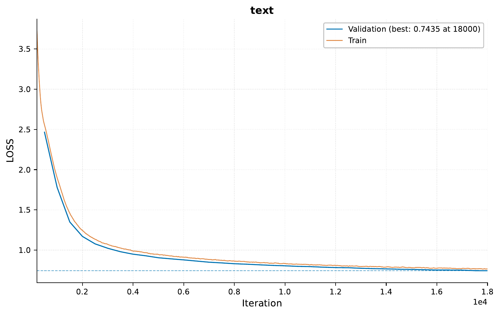
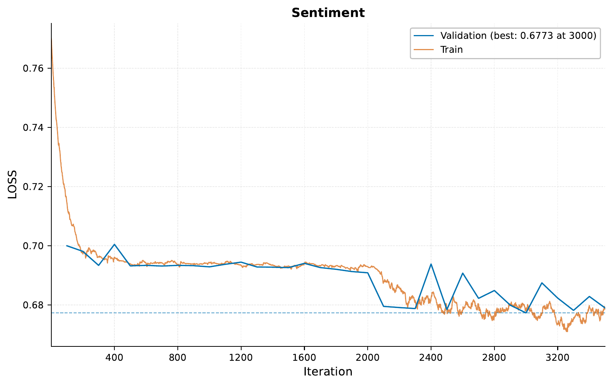
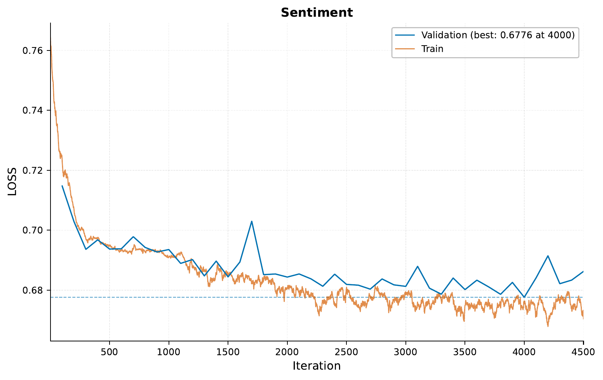
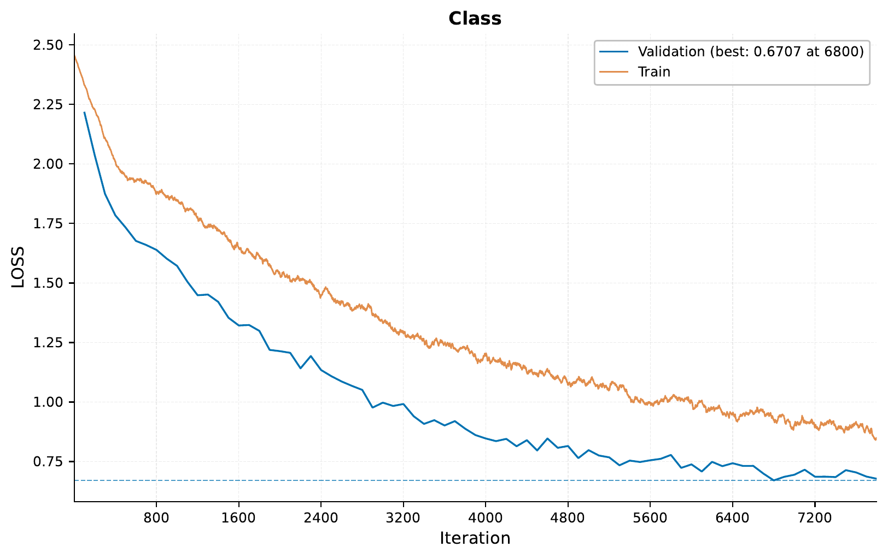
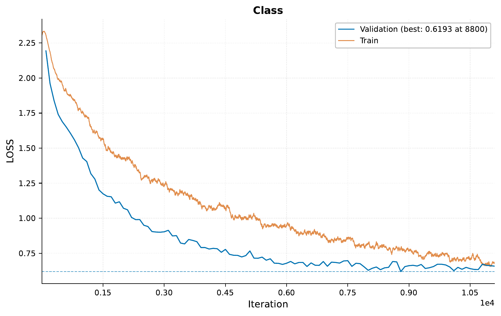

.. _e-mini-foundation-tutorial:

.. role:: raw-html(raw)
    :format: html

02 - Creating and Using a Mini Foundation Model
===============================================

In this tutorial, we will explore how to create custom foundation models using ``EIR``.
Here we use the term "foundation model" as a fancy way of saying we pretrain a model
for one task, and then use it or parts of it as a building block for other tasks.

We'll be working with three different datasets
—IMDB reviews, COCO 2017 images, and CIFAR-10 images.

The overall goal is as follows:

1.  Train a mini-foundation model for image captioning, which includes an
    image and text encoder (feature extractors), and a text decoder (output module).
2.  Use the text encoder part from the mini-foundation model to train a
    sentiment analysis model on IMDB reviews.
3.  Use the image encoder part from the mini-foundation model to train an
    image classification model on CIFAR-10.

A - Data
--------

For this tutorial, we will use datasets from three different domains:

1. Text Data: IMDB Reviews
   - More information can be found `here <https://ai.stanford.edu/~ang/papers/acl11-WordVectorsSentimentAnalysis.pdf>`__.

2. Image Data: COCO 2017
   - Used mainly for image-to-text tasks like image captioning. More details can be found at the `COCO 2017 dataset <https://cocodataset.org/#home>`__.

3. Image Data: CIFAR-10
   - A dataset of 60,000 32x32 color images in 10 different classes. Useful for object recognition tasks. Learn more `here <https://www.cs.toronto.edu/~kriz/cifar.html>`__.

You can download all datasets for this tutorial
from the following
`link <https://drive.google.com/file/d/1WyTNS5RZ4o26F9wN66ahfdVqO4GauAvv>`__.

After downloading the data, your folder structure should be
organized similarly to the following (the config files we will create
as we go along the tutorial):

.. literalinclude:: ../tutorial_files/e_pretraining/02_mini_foundation/commands/tutorial_folder.txt
    :language: console

Notice how in the downloaded data, we actually include a ``02_mini_foundation``
experiment. This is so that you do not have to train the entire model from scratch,
and also shows how one can share pre-trained models with others.

B - Training a Mini Foundation Model
------------------------------------

.. important::
    As mentioned above, you can download the pre-trained model for this tutorial
    and skip this section. However, if you want to train the model yourself,
    you can follow the steps below.

Here, we will show the training of a model for image captioning, similar to what we did
in :ref:`c-sequence-img-to-seq-tutorial`, where the model uses both an image
and text input to generate a caption for the image.

The global configuration establishes the foundational settings for training:

.. literalinclude:: ../tutorial_files/e_pretraining/02_mini_foundation/globals.yaml
    :language: yaml
    :caption: globals.yaml

.. literalinclude:: ../tutorial_files/e_pretraining/02_mini_foundation/inputs_sequence.yaml
    :language: yaml
    :caption: inputs_sequence.yaml

.. note::
   The ``vocab_file`` parameter allows you to provide a pre-defined vocabulary for training.
   This is optional - if not provided, the framework will automatically generate a vocabulary
   from your training data. Using a custom vocabulary file can be beneficial in two main cases:

   1. When you want to manually specify or limit the vocabulary used in your model
   2. When you want to improve efficiency by pre-computing the vocabulary rather than
      generating it during training

   The file can be provided in one of two JSON formats:

   - A simple dictionary mapping tokens to their IDs (e.g., ``{"the": 0, "cat": 1, "sat": 2}``)
   - A saved Hugging Face BPE tokenizer vocabulary file (created via ``hf_tokenizer.save()``) -
     this option is only compatible with the ``bpe`` tokenizer type

.. literalinclude:: ../tutorial_files/e_pretraining/02_mini_foundation/inputs_image_array_cnn.yaml
    :language: yaml
    :caption: inputs_image_array_cnn.yaml

.. literalinclude:: ../tutorial_files/e_pretraining/02_mini_foundation/fusion.yaml
    :language: yaml
    :caption: fusion.yaml

.. literalinclude:: ../tutorial_files/e_pretraining/02_mini_foundation/output_sequence.yaml
    :language: yaml
    :caption: outputs.yaml

To train, we use the following command:

.. literalinclude:: ../tutorial_files/e_pretraining/02_mini_foundation/commands/0_MINI_FOUNDATION_PRETRAIN.txt
    :language: console

Here we can see the training curve for the mini foundation model:

Now, given that we have either downloaded or trained the mini foundation model,
we can use it to train other models.

C - Establishing an IMDB Baseline
---------------------------------

Before using the mini foundation model,
let's first establish a baseline by training a model from scratch
to perform sentiment analysis on IMDB reviews.

Here are the configurations:

.. literalinclude:: ../tutorial_files/e_pretraining/02_mini_foundation/imdb/imdb_globals.yaml
    :language: yaml
    :caption: imdb_globals.yaml

.. literalinclude:: ../tutorial_files/e_pretraining/02_mini_foundation/imdb/imdb_input.yaml
    :language: yaml
    :caption: imdb_input.yaml

.. literalinclude:: ../tutorial_files/e_pretraining/02_mini_foundation/imdb/imdb_output.yaml
    :language: yaml
    :caption: imdb_output.yaml

To kick off the training for IMDB from scratch, run the following command:

.. literalinclude:: ../tutorial_files/e_pretraining/02_mini_foundation/commands/1_MINI_FOUNDATION_PRETRAIN_IMDB_FROM_SCRATCH.txt
    :language: console

The performance can be evaluated through these generated plots:

This serves as our baseline,
which we'll aim to improve in the next section
by using the mini foundation model.

D - Using the Mini Foundation Model for IMDB
--------------------------------------------

In this section, we'll use the pre-trained mini foundation model
as a starting point for training our IMDB sentiment analysis model.
Specifically, we will only load the text encoder part of the mini foundation model
while other parts of the IMDB model will be trained from scratch.

While the configuration files remain the same, there is a slight change
in the training command:

.. literalinclude:: ../tutorial_files/e_pretraining/02_mini_foundation/commands/2_MINI_FOUNDATION_PRETRAIN_IMDB_FROM_PRETRAINED.txt
    :language: console

Let's examine the performance improvements, if any:

In this specific case, the training and validation losses are very marginally
lower compared to the baseline.
This indicates that the mini foundation model didn't
contribute significantly to enhancing the model's performance
for IMDB sentiment analysis. One reason could be that the text data each model
is trained on is very different, with the mini foundation model being trained
on somewhat robotic image captions, while the IMDB model is trained on
various movie reviews.

.. note::
    You might notice that the the pre-trained model was trained for more
    iterations, this was due to early stopping being activated
    earlier in the model trained from scratch, which might simply
    be due to randomness. Hence, the fact that the pre-trained model
    performs slightly better might be due to the fact that it was trained
    for more iterations, not necessarily because of the pre-training.

While the performance improvements are not significant in the text case,
we will not give up on our mini foundation model just yet. Let's see
how well the image encoder part of the mini foundation model performs
when used for image classification.

E - Establishing a CIFAR10 Baseline
------------------------------------

Just like for the IMDB case, we will first establish a baseline.

Here are the configurations for the CIFAR10 baseline:

.. literalinclude:: ../tutorial_files/e_pretraining/02_mini_foundation/cifar/cifar_globals.yaml
    :language: yaml
    :caption: cifar_globals.yaml

.. literalinclude:: ../tutorial_files/e_pretraining/02_mini_foundation/cifar/cifar_input.yaml
    :language: yaml
    :caption: cifar_input.yaml

.. literalinclude:: ../tutorial_files/e_pretraining/02_mini_foundation/cifar/cifar_output.yaml
    :language: yaml
    :caption: cifar_output.yaml

To initiate the training for CIFAR10 from scratch, execute the following command:

.. literalinclude:: ../tutorial_files/e_pretraining/02_mini_foundation/commands/3_MINI_FOUNDATION_PRETRAIN_CIFAR_FROM_SCRATCH.txt
    :language: console

Training curve:

This will serve as our baseline for CIFAR10,
which we will compare against the model that uses the image encoder from the mini
foundation model in the next section.

F - Using the Mini Foundation Model for CIFAR10
-----------------------------------------------

In this section, we'll use the pre-trained mini foundation model
for CIFAR10 image classification.
Specifically, we'll load only the image encoder
from the mini foundation model,
while the rest of the CIFAR10 model will be trained from scratch.

Again, the configuration files for this step are the same as in the baseline,
with one change in the training command:

.. literalinclude:: ../tutorial_files/e_pretraining/02_mini_foundation/commands/4_MINI_FOUNDATION_PRETRAIN_CIFAR_FROM_PRETRAINED.txt
    :language: console

Now, let's review the impact on performance:

In contrast to the text-based IMDB model,
the CIFAR10 model shows improvements in both the speed of convergence (e.g.,
the loss at iteration 1500 is lower for the pre-trained model than the model
trained from scratch)
and the final performance when initialized with the image encoder
from the mini foundation model.

These results suggest that the image encoder from the mini foundation
model can be transferred to image classification, indicating that
one can successfully train and, in a modular fashion, transfer
parts of a model to other tasks.

Thank you very much for reading this tutorial!