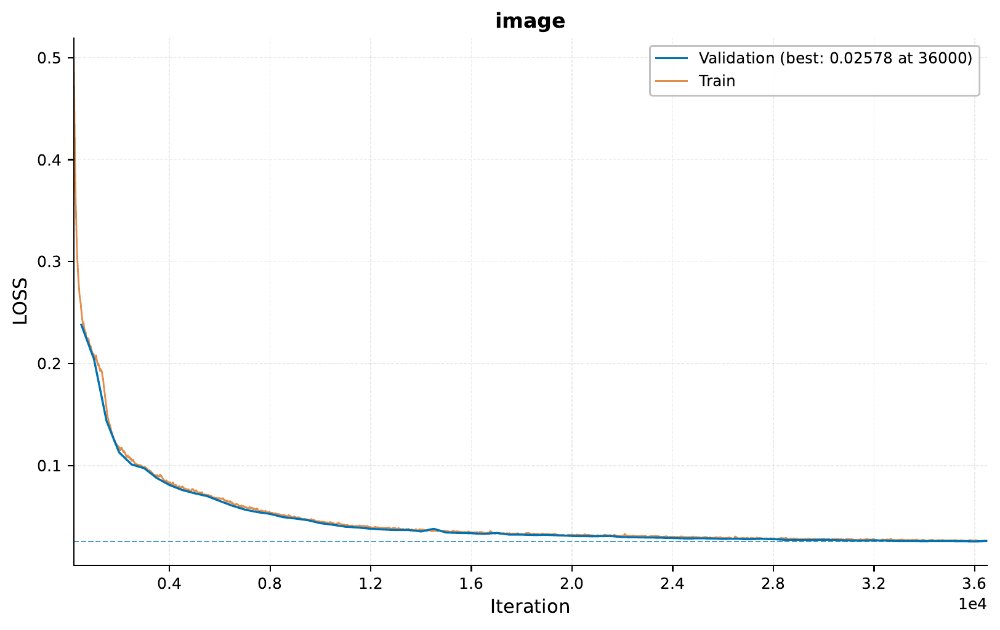

.. _c-image-output-coco-generation-tutorial:

.. role:: raw-html(raw)
    :format: html

01 – Image Output: Building a Simple Autoencoder for COCO Image Generation
===========================================================================

In this tutorial, we will explore the capabilities of `EIR` for image output tasks,
specifically focusing on COCO image generation using a simple denoising autoencoder.

.. note::
    This tutorial assumes you are familiar with the basics of `EIR` and
    have gone through previous tutorials. Not required, but recommended.

A - Data
--------

Here, we will be using the well-known COCO dataset.
It is used mainly for image-to-text tasks like image captioning.
More details can be found at the `COCO 2017 dataset <https://cocodataset.org/#home>`__.
To download the data, `use this link. <FILL>`__

After downloading the data, the folder structure should look like this:

.. literalinclude:: ../tutorial_files/f_image_output/01_image_foundation/commands/tutorial_folder.txt
    :language: console

B - Training A Simple Autoencoder
---------------------------------

Training an autoencoder for COCO image generation with `EIR` involves the familiar configuration files and follows a process similar to supervised learning. We'll discuss the key configurations and visualize the training process, including the training curve and generated images at different iterations.

The global config provides standard parameters for training:

.. literalinclude:: ../tutorial_files/f_image_output/01_image_foundation/globals.yaml
    :language: yaml
    :caption: globals.yaml

The input configuration specifies the structure of the COCO image input:

.. literalinclude:: ../tutorial_files/f_image_output/01_image_foundation/inputs_image_cnn.yaml
    :language: yaml
    :caption: inputs_image_cnn.yaml

The output configuration defines the structure and settings for the generated images:

.. literalinclude:: ../tutorial_files/f_image_output/01_image_foundation/output_image.yaml
    :language: yaml
    :caption: output_image.yaml

With the configurations in place, we can run the following command to start the training process:

.. literalinclude:: ../tutorial_files/f_image_output/01_image_foundation/commands/0_IMAGE_FOUNDATION_PRETRAIN.txt
    :language: console

I got the following results:

Now, when we are generating images, ``EIR`` will save some of the generated images
(as well as the corresponding inputs) during training under the ``results/samples/<iteration>`` folders (the sampling is configurable by the sampling configuration in the output config). We can load these images and visualize them.

Here is a comparison of generated images at iteration 1000:

.. image:: ../tutorial_files/f_image_output/01_image_foundation/figures/0_autoencoder/examples/auto_generated_iter_1000_0.png
    :width: 50%
    :align: center
    :alt: Generated image at iteration 1000

.. raw:: html

      

And at iteration 20000, we can observe the improvements in generation:

.. image:: ../tutorial_files/f_image_output/01_image_foundation/figures/0_autoencoder/examples/auto_inputs_iter_20000_0.png
    :width: 50%
    :align: center
    :alt: Input image at iteration 20000

.. image:: ../tutorial_files/f_image_output/01_image_foundation/figures/0_autoencoder/examples/auto_generated_iter_20000_0.png
    :width: 50%
    :align: center
    :alt: Generated image at iteration 20000

C - Serving
-----------

In this final section, we demonstrate serving our trained model for COCO image generation as a web service and interacting with it using HTTP requests.

Starting the Web Service
"""""""""""""""""""""""""

To serve the model, use the following command:

.. code-block:: shell

    eirserve --model-path [MODEL_PATH]

Replace `[MODEL_PATH]` with the actual path to your trained model. This command initiates a web service that listens for incoming requests.

Here is an example of the command:

.. literalinclude:: ../tutorial_files/f_image_output/01_image_foundation/commands/ARRAY_GENERATION_DEPLOY.txt
    :language: console

Sending Requests
""""""""""""""""

With the server running, we can now send requests with COCO images. The images are encoded in base64 before sending.

Here's an example Python function demonstrating this process:

.. code-block:: python

    import requests
    from PIL import Image
    import base64
    from io import BytesIO

    def encode_image_to_base64(file_path: str) -> str:
        with open(file_path, "rb") as image_file:
            image_bytes = image_file.read()
            return base64.b64encode(image_bytes).decode('utf-8')

    def send_request(url: str, payload: dict):
        response = requests.post(url, json=payload)
        return response.json()

    payload = {
        "image": encode_image_to_base64("path/to/image.png")
    }

    response = send_request('http://localhost:8000/predict', payload)
    print(response)

Retrieving Image Information
"""""""""""""""""""""""""""""

You can get information about the image type and shape by sending a GET request to the `/info` endpoint:

.. code-block:: bash

    curl -X 'GET' \
      'http://localhost:8000/info' \
      -H 'accept: application/json'

This request will return details about the expected image input and output formats,
such as type, shape, and data type.

Decoding and Processing the Response
""""""""""""""""""""""""""""""""""""

After receiving a response, you can decode the base64 encoded image,
reshape it, and cast it to the appropriate dtype using the information
obtained from the ``/info`` endpoint:

.. code-block:: python

    import base64
    from PIL import Image
    from io import BytesIO
    import numpy as np
    import matplotlib.pyplot as plt

    def decode_image_from_base64(base64_str: str, image_shape: tuple) -> np.ndarray:
        image_bytes = base64.b64decode(base64_str)
        image_np = np.frombuffer(image_bytes, dtype=np.float32).reshape(image_shape)
        return image_np

    def display_image(image_np: np.ndarray) -> None:
        image_np = (image_np - image_np.min()) / (image_np.max() - image_np.min())
        image_np = (image_np * 255).astype(np.uint8)
        image = Image.fromarray(image_np, mode="RGB")
        plt.imshow(image)
        plt.axis('off')
        plt.show()

    response = {'result': {'image': 'sUE4P15nOT+KUzg/H ......'}}
    base64_image = response['result']['image']
    image_shape = (64, 64, 3)
    image_np = decode_image_from_base64(base64_str=base64_image, image_shape=image_shape)
    display_image(image_np=image_np)

Analyzing Responses
"""""""""""""""""""

After sending requests to the served model, the responses can be analyzed.

.. literalinclude:: ../tutorial_files/f_image_output/01_image_foundation/serve_results/predictions.json
    :language: json
    :caption: predictions.json

For example, we can take a look at the image input as well as the generated output
from the model:

.. image:: ../tutorial_files/f_image_output/01_image_foundation/serve_results/image_0.png
    :width: 33%
    :align: center

.. image:: ../tutorial_files/f_image_output/01_image_foundation/serve_results/image_output_0.png
    :width: 33%
    :align: center

.. raw:: html

      

Now, the model was trained where noise (e.g. cropping, rotation, etc.) was added to
the image and asked to generate the original image. Here is an example of passing
an image with noise and the model trying to generate the original image:

.. raw:: html

      

Notice in the second example above, while far from perfect, the model does attempt to
remove the black borders from the input image. Better results would likely be achieved
by training the model for longer, with more data, and with a larger model.

If you made it this far, thank you for reading!
I hope this tutorial was
interesting and useful to you!