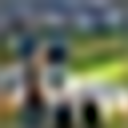

.. _c-image-output-coco-generation-tutorial:

.. role:: raw-html(raw)
    :format: html

Building a Simple Image Autoencoder
===================================

In this tutorial, we will explore the `EIR` for image output tasks,
specifically focusing simple autoencoder.

.. note::
    This tutorial assumes you are familiar with the basics of `EIR` and
    have gone through previous tutorials. Not required, but recommended.

A - Data
--------

Here, we will be using the well-known COCO dataset.
It is used mainly for image-to-text tasks like image captioning.
More details can be found at the `COCO 2017 dataset <https://cocodataset.org/#home>`__.
To download the data,
`use this link. <https://drive.google.com/file/d/1T7mIRM6QIXFGHOfMgMbDp7WeTpGfwsgz>`__

After downloading the data, the folder structure should look like this:

.. literalinclude:: ../tutorial_files/f_image_output/01_image_foundation/commands/tutorial_folder.txt
    :language: console

B - Training A Simple Autoencoder
---------------------------------

Training an autoencoder for COCO image generation with `EIR` involves the familiar configuration files and follows a process similar to supervised learning. We'll discuss the key configurations and visualize the training process, including the training curve and generated images at different iterations.

The global config provides standard parameters for training:

.. literalinclude:: ../tutorial_files/f_image_output/01_image_foundation/globals.yaml
    :language: yaml
    :caption: globals.yaml

The input configuration specifies the structure of the COCO image input:

.. literalinclude:: ../tutorial_files/f_image_output/01_image_foundation/inputs_image_cnn.yaml
    :language: yaml
    :caption: inputs_image_cnn.yaml

There are some new arguments being used here in the image input, specifically for
controlling how much the images, originally with size 128x128. For example,

- ``allow_first_conv_size_reduction``: We allow the first convolution to reduce the spatial size of the input. Setting this to `False` will ensure that the first convolution does not reduce the spatial size of the input.
- ``first_stride_expansion_width``: The stride expansion width for the first convolution. We have a base stride of 1, so setting this to 4 means the first convolution will have a stride of 4.
- ``first_kernel_expansion_width``: Setting this to 1.3 means we expand the base kernel size of 3 to 4.
- ``down_sample_every_n_blocks``: Every 2 residual blocks, we downsample the spatial size of the input by a factor of 2.

So, taken together, we see that we have a kernel size of 4
with stride 4 in the first layer,
reducing the size from 128x128 to 32x32.
Then, every 1 residual blocks,
we downsample the spatial size by a factor of 2.
Since we have 1 blocks, we reduce to 16x16, then finally to 8x8, with 128 channels.
See the :ref:`api-reference` for more details on the arguments.

The output configuration defines the structure and settings for the generated images:

.. literalinclude:: ../tutorial_files/f_image_output/01_image_foundation/output_image.yaml
    :language: yaml
    :caption: output_image.yaml

With the configurations in place, we can run the following command to start the training process:

.. literalinclude:: ../tutorial_files/f_image_output/01_image_foundation/commands/0_IMAGE_FOUNDATION_PRETRAIN.txt
    :language: console

I got the following results:

.. image:: ../tutorial_files/f_image_output/01_image_foundation/figures/training_curve_LOSS_0_pretrain.png
    :width: 100%
    :align: center

Now, when we are generating images, ``EIR`` will save some of the generated images
(as well as the corresponding inputs) during training under the ``results/samples/<iteration>`` folders (the sampling is configurable by the sampling configuration in the output config). We can load these images and visualize them.

Here is a comparison of generated images at iteration 1000:

.. image:: ../tutorial_files/f_image_output/01_image_foundation/figures/0_autoencoder/examples/auto_inputs_iter_1000_0.png
    :width: 50%
    :align: center
    :alt: Input image at iteration 1000

.. raw:: html

      

And at iteration 35000, we can observe the improvements in generation:

C - Serving
-----------

In this final section, we try serving our trained model for COCO image generation as a web service and interacting with it using HTTP requests.

Starting the Web Service
"""""""""""""""""""""""""

To serve the model, use the following command:

.. code-block:: shell

    eirserve --model-path [MODEL_PATH]

Replace `[MODEL_PATH]` with the actual path to your trained model. This command initiates a web service that listens for incoming requests.

Here is an example of the command:

.. literalinclude:: ../tutorial_files/f_image_output/01_image_foundation/commands/ARRAY_GENERATION_DEPLOY.txt
    :language: console

Sending Requests
""""""""""""""""

With the server running, we can now send requests with COCO images. The images are encoded in base64 before sending.

Here's an example Python function demonstrating this process:

.. literalinclude:: ../tutorial_files/f_image_output/01_image_foundation/request_example/python_request_example_module.py
    :language: python
    :caption: request_example_module.py

When running this, we get the following output:

.. literalinclude:: ../tutorial_files/f_image_output/01_image_foundation/request_example/python_request_example.json
    :language: json
    :caption: request_example.json

Retrieving Image Information
"""""""""""""""""""""""""""""

You can get information about the image type and shape by sending a GET request to the `/info` endpoint:

.. code-block:: bash

    curl -X 'GET' \
      'http://localhost:8000/info' \
      -H 'accept: application/json'

This request will return details about the expected image input and output formats,
such as type, shape, and data type.

Decoding and Processing the Response
""""""""""""""""""""""""""""""""""""

After receiving a response, you can decode the base64 encoded image,
reshape it, and cast it to the appropriate dtype using the information
obtained from the ``/info`` endpoint:

.. code-block:: python

    import base64
    from PIL import Image
    from io import BytesIO
    import numpy as np
    import matplotlib.pyplot as plt

    def decode_image_from_base64(base64_str: str, image_shape: tuple) -> np.ndarray:
        image_bytes = base64.b64decode(base64_str)
        image_np = np.frombuffer(image_bytes, dtype=np.float32).reshape(image_shape)
        return image_np

    def display_image(image_np: np.ndarray) -> None:
        image_np = np.transpose(array_np, (1, 2, 0))
        image_np = np.clip(image_np, 0, 1)
        image_np = (image_np * 255).astype(np.uint8)

        image = Image.fromarray(image_np, mode="RGB")
        plt.imshow(image)
        plt.axis('off')
        plt.show()

    response = {'result': {'image': 'sUE4P15nOT+KUzg/H ......'}}
    base64_image = response['result']['image']
    image_shape = (128, 128, 3)
    image_np = decode_image_from_base64(base64_str=base64_image, image_shape=image_shape)
    display_image(image_np=image_np)

.. note::
    There is a slight difference in how we convert the model outputs compared to
    the :ref:`c-array-output-mnist-generation-tutorial` tutorial. This is because
    when using the `image` modality, the images are by default normalized to the
    range [0, 1]. So here, we clip them to ensure they are within this range (as
    the un-normalized model output might be slightly outside this range).
    Whereas in the other tutorial, the images encoded as arrays are
    originally in the range [0, 255]. Therefore, we here ensure the [0, 1] range
    and then convert it back to the [0, 255] range for visualization.

Analyzing Responses
"""""""""""""""""""

After sending requests to the served model, the responses can be analyzed.

.. literalinclude:: ../tutorial_files/f_image_output/01_image_foundation/serve_results/predictions.json
    :language: json
    :caption: predictions.json

For example, we can take a look at the image input as well as the generated output
from the model:

.. raw:: html

      

If you made it this far, thank you for reading!
I hope this tutorial was
interesting and useful to you!