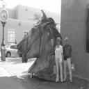
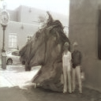
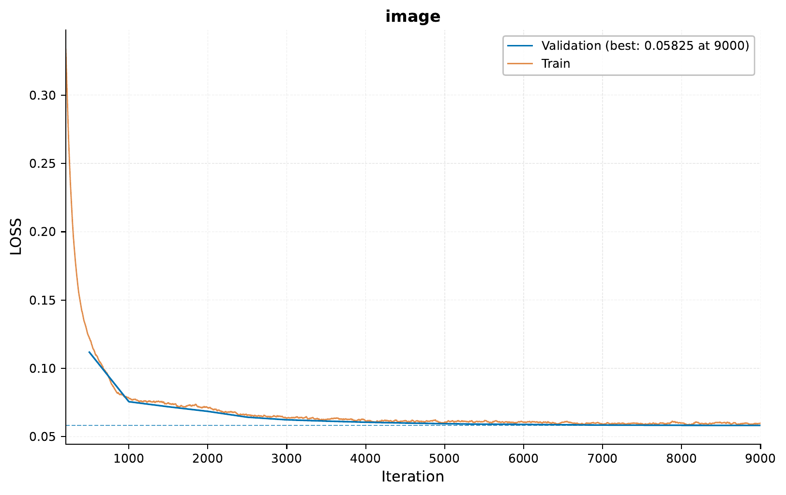
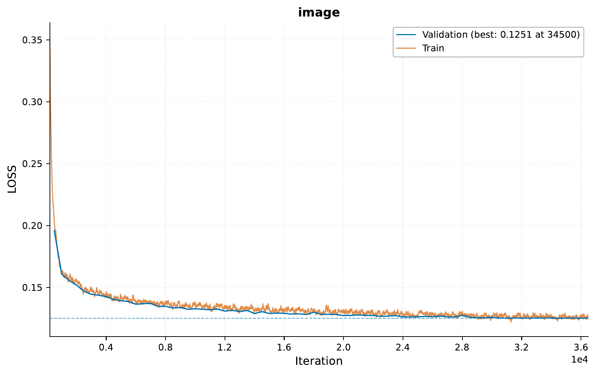
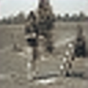
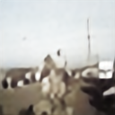

.. _c-image-output-colorization-and-super-resolution-tutorial:

.. role:: raw-html(raw)
    :format: html

02 – Colorization and Super-Resolution
====================================================

In this tutorial, we will explore advanced image processing tasks using `EIR`,
focusing on image colorization, super-resolution, and combining both techniques.

.. note::
    This tutorial builds upon the concepts introduced in the previous image output tutorial.
    Familiarity with basic `EIR` usage is recommended.

A - Data
--------

We'll be using the `COCO 2017 dataset <https://cocodataset.org/#home>`__.,
as in the previous tutorial.
You can download the data
`here <https://drive.google.com/file/d/1T7mIRM6QIXFGHOfMgMbDp7WeTpGfwsgz>`__.

After downloading, your folder structure should look like this:

.. literalinclude:: ../tutorial_files/f_image_output/02_image_colorization/commands/tutorial_folder.txt
    :language: console

B - Image Colorization
----------------------

In this section, we'll train a model to colorize grayscale images.

Let's start by examining the configuration files:

.. literalinclude:: ../tutorial_files/f_image_output/02_image_colorization/globals.yaml
    :language: yaml
    :caption: globals.yaml

.. literalinclude:: ../tutorial_files/f_image_output/02_image_colorization/inputs_image_cnn.yaml
    :language: yaml
    :caption: inputs_image_cnn.yaml

.. note::
    You might notice there is a new config we are using here in the input, as well
    as in the output below, named ``tensor_broker_config``. This is a relatively
    new addition to ``EIR``, and essentially it allows us to send tensors
    from chosen layers  (both input and output from a given layer) to future
    layers in the model. This allows us to do some cool and fun things, like
    making U-Net style architectures, where we can send tensors from the
    earlier stages of a model to later stages.
    In this case we are caching layers with various sizes in the input
    feature extractor, and sending it to layers in the output module (see below).

.. note::
    The way layers are identified for the tensor broker is via the full "path", in
    the model. This is essentially impossible to reason about without knowing the
    model structure, which is saved under the ``model_info.txt`` file when running
    an experiment. Therefore, it's advisable to start a run without any tensor
    broker configuration and then examine the model_info.txt file to see the
    model structure and layer paths. Then in a successive run, you can add the
    tensor broker configuration. This might be updated / made easier in the future.

.. literalinclude:: ../tutorial_files/f_image_output/02_image_colorization/fusion.yaml
    :language: yaml
    :caption: fusion.yaml

.. literalinclude:: ../tutorial_files/f_image_output/02_image_colorization/output_image.yaml
    :language: yaml
    :caption: output_image.yaml

Now, let's run the training command:

.. literalinclude:: ../tutorial_files/f_image_output/02_image_colorization/commands/00_IMAGE_COLORIZATION.txt
    :language: console

After training, we can examine the results:

Let's compare some input and output images at different iterations:

Iteration 1000:

.. image:: ../tutorial_files/f_image_output/02_image_colorization/figures/00_image_colorization/examples/auto_generated_iter_1000_0.png
    :width: 45%
    :align: right

Iteration 8000:

While far from perfect, it does seem that at iteration
8000 the model starts to capture some basic details such as
the sky and the grass. However, for other more complex
concepts, the results are less convincing.
Considering we "only" have a 1.3 million parameter model,
and we train it for a relatively short time, we cannot be
too unhappy about these results.

C - Image Super-Resolution
--------------------------

Next, we'll train a model to enhance the resolution of low-resolution images.

Let's examine the configuration files specific to super-resolution:

.. literalinclude:: ../tutorial_files/f_image_output/02_image_colorization/inputs_image_cnn_super_res.yaml
    :language: yaml
    :caption: inputs_image_cnn_super_res.yaml

.. literalinclude:: ../tutorial_files/f_image_output/02_image_colorization/output_image_super_res.yaml
    :language: yaml
    :caption: output_image_super_res.yaml

Now, let's run the training command:

.. literalinclude:: ../tutorial_files/f_image_output/02_image_colorization/commands/01_IMAGE_SUPER_RESOLUTION.txt
    :language: console

After training, we can examine the results:

Let's compare some input and output images at different iterations:

Iteration 1000:

Iteration 6000:

.. note::
    Note that the browser has its own up scaling for the images, so the raw image
    on the left is much more pixelated than what is being shown here. However, it
    allows us to compare the up scaling performed by our DL model (right) to the
    default one used in the browser (left).

So while the results are not perfect, the model does seem to do an okay-ish job
of increasing the image resolution.

D - Why not both?
-----------------

Now, we'll combine both techniques to colorize and enhance images simultaneously.

Let's examine the configuration file for the combined approach:

.. literalinclude:: ../tutorial_files/f_image_output/02_image_colorization/inputs_image_cnn_both.yaml
    :language: yaml
    :caption: inputs_image_cnn_both.yaml

Now, let's run the training command:

.. literalinclude:: ../tutorial_files/f_image_output/02_image_colorization/commands/02_IMAGE_BOTH.txt
    :language: console

After training, we can examine the results:

Let's compare some input and output images at different iterations:

Iteration 1000:

Iteration 25000:

As before, while this is definitely far from perfect,
its perhaps not too bad for a sub 1 million parameter model
we can train on a laptop in a couple of hours!

E - Serving the Combined Model
------------------------------

Finally, we'll serve our combined model as a web service and interact with it using HTTP requests.

To start the server, use the following command:

.. literalinclude:: ../tutorial_files/f_image_output/02_image_colorization/commands/04_IMAGE_BOTH_SERVE.txt
    :language: console

Here's an example Python script to send requests to the server:

.. literalinclude:: ../tutorial_files/f_image_output/02_image_colorization/request_example/python_request_example_module.py
    :language: python
    :caption: python_request_example_module.py

When running this script, you should get a response similar to this:

.. literalinclude:: ../tutorial_files/f_image_output/02_image_colorization/request_example/python_request_example.json
    :language: json
    :caption: Example response

Decoding the images can be done with something similar to what is shown below:

.. code-block:: python

    import base64
    from PIL import Image
    from io import BytesIO
    import numpy as np
    import matplotlib.pyplot as plt

    def decode_image_from_base64(base64_str: str, image_shape: tuple) -> np.ndarray:
        image_bytes = base64.b64decode(base64_str)
        image_np = np.frombuffer(image_bytes, dtype=np.float32).reshape(image_shape)
        return image_np

    def display_image(image_np: np.ndarray) -> None:
        image_np = np.transpose(array_np, (1, 2, 0))
        image_np = np.clip(image_np, 0, 1)
        image_np = (image_np * 255).astype(np.uint8)

        image = Image.fromarray(image_np, mode="RGB")
        plt.imshow(image)
        plt.axis('off')
        plt.show()

    response = {'result': {'image': 'sUE4P15nOT+KUzg/H ......'}}
    base64_image = response['result']['image']
    image_shape = (128, 128, 3)
    image_np = decode_image_from_base64(base64_str=base64_image, image_shape=image_shape)
    display_image(image_np=image_np)

Let's examine the input and output images:

Input image:

Output image:

Conclusion
----------

In this tutorial, we've explored advanced image processing techniques using `EIR`.
We've seen how to colorize grayscale images, enhance image resolution, and combine
both techniques. Finally, we deployed our model as a small web service we
can send 32x32 grayscale images to, and get back 128x128 colorized and upscaled images.
Thank you for reading!