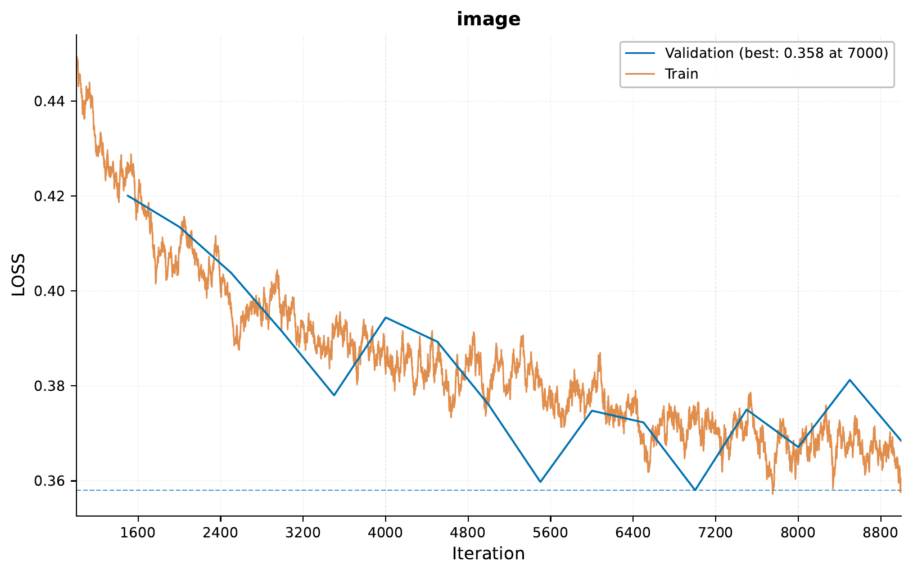
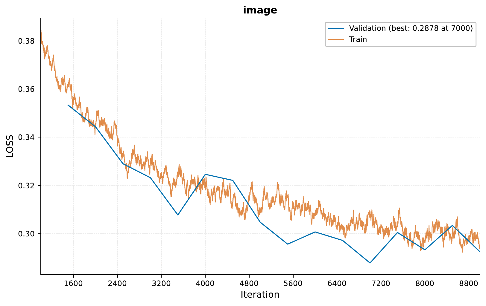

.. _c-image-output-mnist-diffusion-tutorial:

.. role:: raw-html(raw)
    :format: html

Image Output: MNIST Diffusion Models
====================================

In this tutorial, we will explore diffusion models using `EIR`,
focusing on generating MNIST digits.
We'll cover both unconditional and conditional (guided) diffusion models.

.. note::
    This tutorial builds upon concepts from previous image output tutorials.
    Familiarity with basic `EIR` usage is recommended.

A - Data
--------

We'll be using the MNIST dataset for this tutorial.
You can download the data `here <https://drive.google.com/file/d/1B0TRnOzV6zytEkEN9-QRGBNkbptp05sN>`__.

After downloading, your folder structure should look like this:

.. literalinclude:: ../tutorial_files/f_image_output/03_mnist_diffusion/commands/tutorial_folder.txt
    :language: console

B - Unconditional MNIST Diffusion
---------------------------------

First, we'll train an unconditional diffusion model to generate MNIST digits.

Let's examine the configuration files:

.. literalinclude:: ../tutorial_files/f_image_output/03_mnist_diffusion/globals.yaml
    :language: yaml
    :caption: globals.yaml

.. literalinclude:: ../tutorial_files/f_image_output/03_mnist_diffusion/inputs_image_cnn.yaml
    :language: yaml
    :caption: inputs_image_cnn.yaml

.. literalinclude:: ../tutorial_files/f_image_output/03_mnist_diffusion/fusion.yaml
    :language: yaml
    :caption: fusion.yaml

.. literalinclude:: ../tutorial_files/f_image_output/03_mnist_diffusion/output_image.yaml
    :language: yaml
    :caption: output_image.yaml

Now, let's run the training command:

.. literalinclude:: ../tutorial_files/f_image_output/03_mnist_diffusion/commands/01_MNIST_DIFFUSION.txt
    :language: console

After training, we can examine the results:

Here's a grid of 9 randomly generated digits using our unconditional diffusion model at iteration 1000:

.. image:: ../tutorial_files/f_image_output/03_mnist_diffusion/figures/01_mnist_diffusion/unconditional_diffusion_grid_1000.png
    :width: 100%
    :align: center

Here's a grid of 9 randomly generated digits using our unconditional diffusion model at iteration 9000:

.. image:: ../tutorial_files/f_image_output/03_mnist_diffusion/figures/01_mnist_diffusion/unconditional_diffusion_grid_9000.png
    :width: 100%
    :align: center

So we see that there is definitely an improvement at
iteration 9000 compared to iteration 1000, despite there being a couple
of misses where they look more or less random. This would probably
be mitigated by allowing the model to train for longer. However,
even with a very good model, we still have no control over what
digits are generated. This is where conditional diffusion models come in.

C - Conditional (Guided) MNIST Diffusion
----------------------------------------

Next, we'll train a conditional diffusion model that can generate specific MNIST digits based on class input.

Let's examine the additional configuration file for the tabular input:

.. literalinclude:: ../tutorial_files/f_image_output/03_mnist_diffusion/inputs_tabular.yaml
    :language: yaml
    :caption: inputs_tabular.yaml

Now, let's run the training command for the guided diffusion model:

.. literalinclude:: ../tutorial_files/f_image_output/03_mnist_diffusion/commands/02_MNIST_DIFFUSION_GUIDED.txt
    :language: console

After training, we can examine the results:

Here's a grid of generated images for different digit classes:

.. image:: ../tutorial_files/f_image_output/03_mnist_diffusion/figures/02_mnist_diffusion_guided/conditional_diffusion_grid.png
    :width: 100%
    :align: center

We can see here that the conditioning definitely works,
as the model is able to generate specific digits based on the input class. Again,
it's not perfect (e.g. it might sometimes confuse similar digits like 3, 5 and 8),
but it's a fair enough start.

D - Serving the Guided Diffusion Model
--------------------------------------

Finally, we'll serve our guided diffusion model as a web service and interact with it using HTTP requests.

To start the server, use the following command:

.. literalinclude:: ../tutorial_files/f_image_output/03_mnist_diffusion/commands/02_MNIST_DIFFUSION_SERVE.txt
    :language: console

Here's an example Python script to send requests to the server:

.. literalinclude:: ../tutorial_files/f_image_output/03_mnist_diffusion/request_example/python_request_example_module.py
    :language: python
    :caption: python_request_example_module.py

When running this script, you should get a response similar to this:

.. literalinclude:: ../tutorial_files/f_image_output/03_mnist_diffusion/request_example/python_request_example.json
    :language: json
    :caption: Example response

Conclusion
----------

In this tutorial, we have explored how we can
use diffusion models to generate MNIST digits. We have both used
an unconditional model to generate random digits and a conditional
model to generate specific digits based on input class.

The approach here can be extended to other datasets and tasks beyond MNIST digits,
but do note that for more complex datasets, you may need to train for (much) longer
and use larger models, which are unlikely to be feasible on a local laptop.

Thank you for following along with this tutorial!