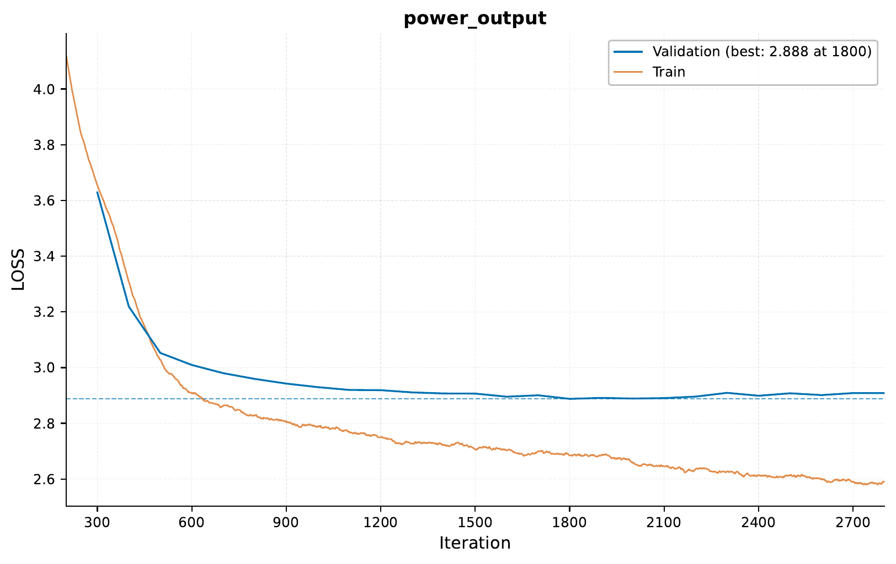

.. _c-time-series-power-prediction-tutorial:

.. role:: raw-html(raw)
    :format: html

01 – Time Series: Power Consumption Prediction
==============================================

In this tutorial, we will explore using `EIR` for time series prediction tasks,
specifically focusing on power consumption forecasting. We'll work with both
simulated and real-world datasets, using a transformer based model to make
predictions.

.. note::
    While we are here using a transformer based deep learning model,
    in real life scenarios, simpler models like
    `(S)ARIMA <https://en.wikipedia.org/wiki/Autoregressive_integrated_moving_average>`_
    can sometimes perform as well or better than DL based models.

.. note::
    This tutorial assumes you are familiar with the basics of `EIR` and
    have gone through previous tutorials. Not required, but recommended.

A - Data
--------

For this tutorial, we'll be using two types of power consumption data:

    1. Simulated data
    2. Real-world data

More details about the datasets can be found below in their respective sections.

To download the data, `use this link. <https://drive.google.com/file/d/11wrOpXdS5RODWqA3Of8mjBsUU3iVebxR>`__

After downloading the data, the folder structure should look like this:

.. literalinclude:: ../tutorial_files/g_time_series/01_time_series_power/commands/tutorial_folder.txt
    :language: console

B - Training Time Series Prediction Models
------------------------------------------

We'll train two separate models: one for the simulated data and another for the real-world data.

Simulated Data Model
^^^^^^^^^^^^^^^^^^^^

Let's start by configuring and training a model on the simulated data.

Simulated Data Generation
^^^^^^^^^^^^^^^^^^^^^^^^^

Our simulated power consumption data incorporates key features of real-world patterns:

1. Daily and weekly cycles using sine waves
2. Long-term trend with a linear component
3. Random noise

The data is scaled to integer values between 0 and 127,
representing arbitrary power consumption units.
We create input sequences (24 time steps) and
corresponding output sequences (next 24 time steps) for our prediction task.

This simulated dataset allows us to test our model's ability to capture
basic patterns before applying it to the real-world data.

Here are the key configuration files:

.. literalinclude:: ../tutorial_files/g_time_series/01_time_series_power/globals_sim.yaml
    :language: yaml
    :caption: globals_sim.yaml

.. literalinclude:: ../tutorial_files/g_time_series/01_time_series_power/input_sequence_sim.yaml
    :language: yaml
    :caption: input_sequence_sim.yaml

.. literalinclude:: ../tutorial_files/g_time_series/01_time_series_power/output_sim.yaml
    :language: yaml
    :caption: output_sim.yaml

With the configurations in place, we can run the following command to start the training process:

.. literalinclude:: ../tutorial_files/g_time_series/01_time_series_power/commands/TIME_SERIES_POWER_01_SIM.txt
    :language: console

Results and Visualization (Simulated Data)
""""""""""""""""""""""""""""""""""""""""""

Here's the training curve for our simulated data model:

.. image:: ../tutorial_files/g_time_series/01_time_series_power/figures/training_curve_LOSS_transformer_1_sim.png
    :width: 100%
    :align: center

Let's look at some example predictions:

.. image:: ../tutorial_files/g_time_series/01_time_series_power/figures/01_time_series_power_sim/sample_0_plot.pdf
    :width: 80%
    :align: center

.. image:: ../tutorial_files/g_time_series/01_time_series_power/figures/01_time_series_power_sim/sample_1_plot.pdf
    :width: 80%
    :align: center

.. image:: ../tutorial_files/g_time_series/01_time_series_power/figures/01_time_series_power_sim/sample_2_plot.pdf
    :width: 80%
    :align: center

So, we can see that at least tecnically, the model is able to capture some
of the patterns in the simulated data.

Real-World Data Model
^^^^^^^^^^^^^^^^^^^^^

For our real-world power consumption prediction task,
we use the "Individual Household Electric Power Consumption" dataset
from the UCI Machine Learning Repository [1]_.
This dataset contains measurements of electric power consumption in one
household with a one-minute sampling rate over a period of almost 4 years
(December 2006 to November 2010).

.. [1] Hebrail, G. & Berard, A. (2006). Individual Household Electric Power Consumption [Dataset]. UCI Machine Learning Repository. https://doi.org/10.24432/C58K54.

The dataset above has been processed as follows:

1. Resampling:
   - Resampled to 20-minute intervals.

2. Discretization:
   - Convert continuous power values into 128 discrete bins.

3. Data Splitting:
   - Divide into training and validation (14 days), and test (last 2 weeks) sets.
   - Splits are made based on non-overlapping sequences.

4. Sequence Generation:
   - Create input-output pairs, each spanning 16 hours (48 time steps).
   - Each pair is based on a sliding window of 1 time step, meaning there is an overlap between samples within each set.

5. Formatting:
   - Convert sequences to space-separated integers for model input.

Here are the key configuration files:

.. literalinclude:: ../tutorial_files/g_time_series/01_time_series_power/globals_real.yaml
    :language: yaml
    :caption: globals_real.yaml

.. literalinclude:: ../tutorial_files/g_time_series/01_time_series_power/input_sequence_real.yaml
    :language: yaml
    :caption: input_sequence_real.yaml

.. literalinclude:: ../tutorial_files/g_time_series/01_time_series_power/output_real.yaml
    :language: yaml
    :caption: output_real.yaml

To train the model on real-world data, run:

.. literalinclude:: ../tutorial_files/g_time_series/01_time_series_power/commands/TIME_SERIES_POWER_01_REAL.txt
    :language: console

Results and Visualization (Real-World Data)
"""""""""""""""""""""""""""""""""""""""""""

Here's the training curve for our real-world data model:

So we can see here that the model starts to
overfit relatively early on the training data.
This is likely due to the limited amount of
effectively unique data after our preprocessing steps.

You may notice some overfitting in our real-life model,
as evidenced by the divergence between training and validation loss curves.
This is likely due to the limited amount of effectively unique data after our
preprocessing steps. After resampling to 20-minute intervals and creating sequences
of length 48 (16 hours), we end up with approximately 2,000 non-overlapping samples,
even though in our training data we have 100k samples
(due to the sliding window approach).

Example predictions on the validation set:

.. image:: ../tutorial_files/g_time_series/01_time_series_power/figures/01_time_series_power_real/sample_0_plot.pdf
    :width: 80%
    :align: center

.. image:: ../tutorial_files/g_time_series/01_time_series_power/figures/01_time_series_power_real/sample_1_plot.pdf
    :width: 80%
    :align: center

.. image:: ../tutorial_files/g_time_series/01_time_series_power/figures/01_time_series_power_real/sample_2_plot.pdf
    :width: 80%
    :align: center

C - Serving
-----------

In this final section, we'll serve our trained model for power consumption prediction
as a web service and interact with it using HTTP requests.

Starting the Web Service
^^^^^^^^^^^^^^^^^^^^^^^^

To serve the model, use the following command:

.. literalinclude:: ../tutorial_files/g_time_series/01_time_series_power/commands/SEQUENCE_TO_SEQUENCE_DEPLOY.txt
    :language: console

Sending Requests
^^^^^^^^^^^^^^^^

With the server running, we can now send requests with power consumption data.

Python Example:

.. literalinclude:: ../tutorial_files/g_time_series/01_time_series_power/request_example/python_request_example_module.py
    :language: python
    :caption: Python request example

Bash Example:

.. literalinclude:: ../tutorial_files/g_time_series/01_time_series_power/request_example/bash_request_example_module.sh
    :language: bash
    :caption: Bash request example

Analyzing Responses
^^^^^^^^^^^^^^^^^^^

Now we can play a bit with the served model and see how it responds to our requests.
Below are 5 unique requests, but each one of them is repeated 5 times to show the
model's consistency. It would probably be better to use 3 unique models to get a
better estimate of the uncertainty, but we will make do with 1 for now.

After sending requests to the served model, let's analyze the responses:

.. literalinclude:: ../tutorial_files/g_time_series/01_time_series_power/serve_results/predictions.json
    :language: json
    :caption: Model predictions

Visualizing Predictions with Uncertainty
""""""""""""""""""""""""""""""""""""""""

Our model provides predictions with uncertainty estimates. Let's visualize these:

.. image:: ../tutorial_files/g_time_series/01_time_series_power/figures/01_time_series_power_test/sample_1_plot_with_uncertainty.pdf
    :width: 80%
    :align: center

.. image:: ../tutorial_files/g_time_series/01_time_series_power/figures/01_time_series_power_test/sample_2_plot_with_uncertainty.pdf
    :width: 80%
    :align: center

.. image:: ../tutorial_files/g_time_series/01_time_series_power/figures/01_time_series_power_test/sample_3_plot_with_uncertainty.pdf
    :width: 80%
    :align: center

Conclusion
----------

In this tutorial, we've explored how to use `EIR` for time series prediction tasks,
specifically focusing on power consumption forecasting. We've covered:

1. Working with both simulated and real-world datasets
2. Configuring and training models for each dataset
3. Visualizing training progress and model predictions
4. Serving the trained model as a web service
5. Interacting with the served model using both Python and Bash
6. Analyzing and visualizing model predictions, including uncertainty estimates

If you made it this far, thank you for reading! We hope this tutorial was
interesting and useful to you!