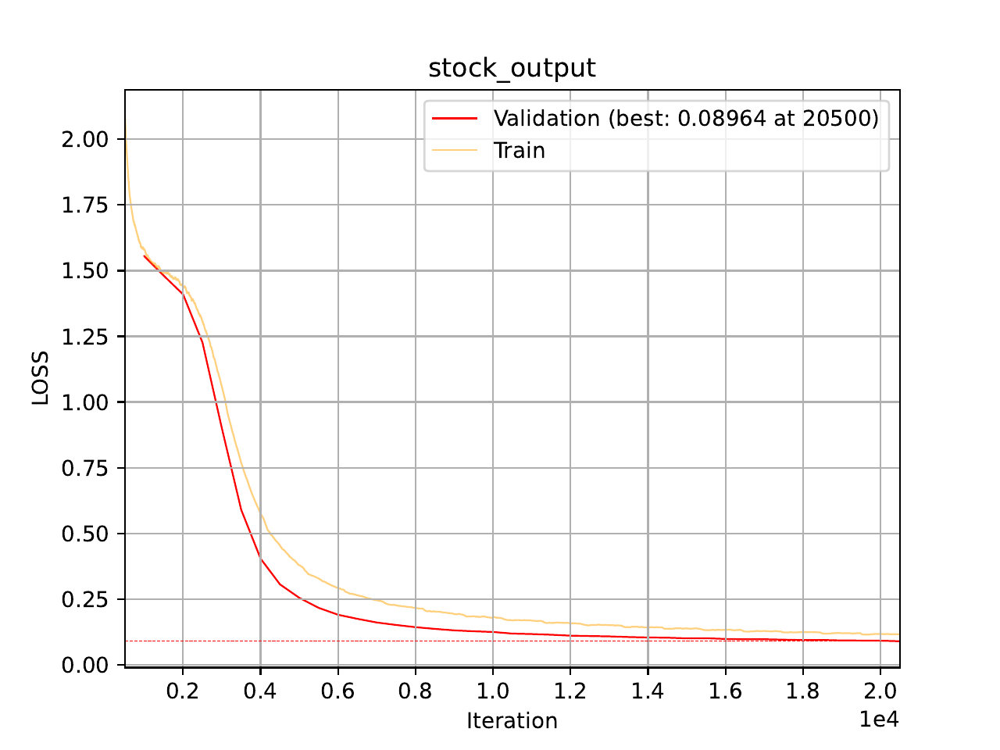
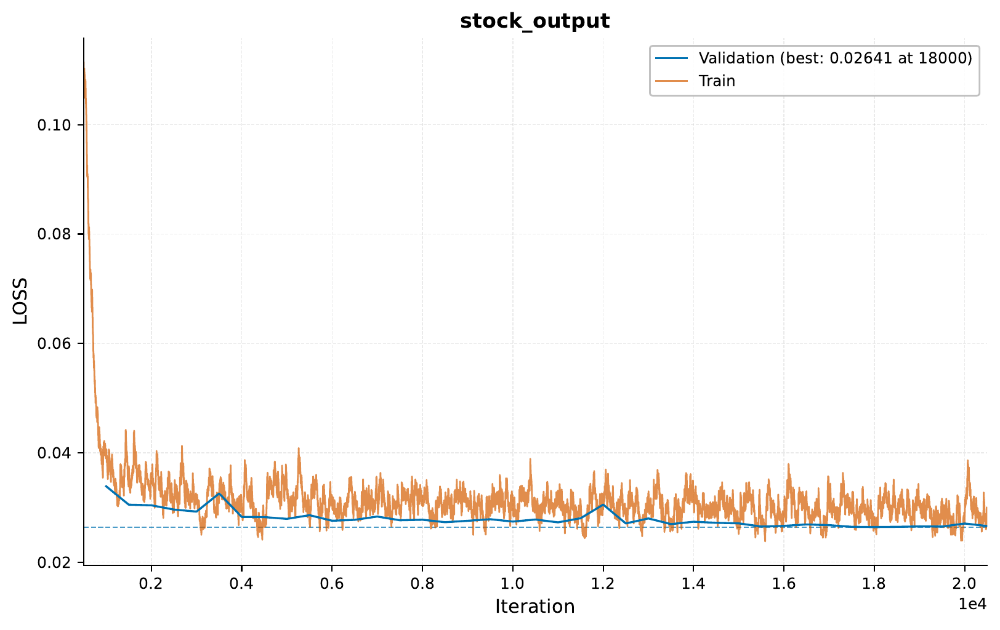
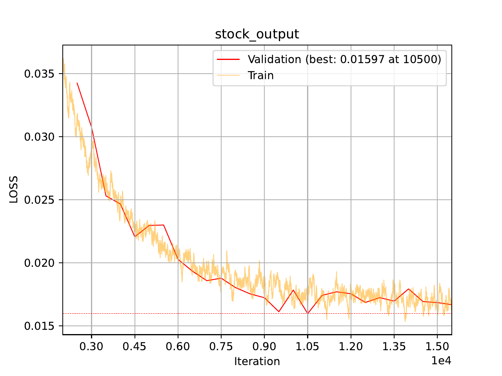

.. _c-time-series-stocks-prediction-tutorial:

.. role:: raw-html(raw)
    :format: html

Time Series: 3 Approaches to Stock Price Prediction
===================================================

In this tutorial, we will explore using ``EIR`` for time series prediction tasks,
focusing on stock price forecasting. We'll work with stock market data and implement
three different approaches: a transformer-based model,
a CNN-based one-shot prediction model,
and a CNN-based diffusion model.

.. note::
    This tutorial builds upon concepts from the previous time series tutorial.
    While not strictly necessary, it's recommended to go through that tutorial first
    if you're new to time series prediction with ``EIR``.

A - Data
--------

For this tutorial, we'll be using pre-processed stock price data.
Here's a brief overview of the data preparation process:

1. Historical stock data of daily close prices downloaded for 30 major companies (e.g., AAPL, GOOGL, MSFT) using the ``yfinance`` library, covering the period from 2000 to 2023.

2. The closing prices are discretized into 256 bins.

3. The data is transformed into sequences of 64 time steps (days) for input, with the corresponding 64 time steps used as the prediction target.

4. The dataset is split into training (95%) and testing (5%) sets.

5. The prepared data is saved in CSV format for sequence-based models and streamed as arrays for array-based models.

So, each sequence in our dataset represents 64 consecutive days of closing stock prices for a particular company.
The prices are discretized into 256 bins, with each number in the sequence representing a bin.
For example, a sequence might look like this:

.. code-block:: bash

    CSCO_20141223,10 10 10 10 10 10 11 11 11 10 10 10 ... 9 10 10 10

This sequence represents Cisco's (CSCO) stock prices starting from December 23, 2014.

.. important::
    Here we do a relatively naive split of the data into training and testing sets.
    Specifically, we the "last" 5% of the data as the test set, which covers
    part of CSCO and all of CVX. Therefore, CVX can probably be considered
    a relatively robust test case, as none of data from this company was used
    in training. However, CSCO might for some samples be plagued by some data leakage
    (i.e. at the "boundary" samples between training and test,
    some data will be in both). For real tasks, it would likely be better to use a more
    sophisticated approach, such a completely different set of companies for training
    and testing.

.. note::
    We prepare the data in two different formats: CSV format for the sequence-based transformer
    models and streaming arrays for the one-shot and diffusion models. For the array-based models,
    we use :ref:`EIR's streaming functionality <i-scaling-streaming-data>` which allows us to
    serve array data through a WebSocket server. This approach is particularly useful when dealing
    with large numbers of array files, as storing hundreds of thousands of individual ``.npy`` files
    on disk can be problematic on many systems (especially laptops with limited file handles or
    when using network storage). The streaming approach also provides more flexibility in data
    loading and can handle real-time data scenarios. For more details on implementing streaming
    servers, see the :ref:`streaming-data-guide`.

To download the data, `use this link. <https://drive.google.com/file/d/1aIbYbd33yystchj5eZfCQHE3-NhMubu4>`__

After downloading the data, the folder structure should look like this:

.. literalinclude:: ../tutorial_files/g_time_series/02_time_series_stocks/commands/tutorial_folder.txt
    :language: console

B - Training Stock Price Prediction Models
------------------------------------------

We'll train three different models for stock price prediction: a transformer-based model,
a one-shot prediction model, and a diffusion model.

1. Transformer-based Model
^^^^^^^^^^^^^^^^^^^^^^^^^^

Let's start by configuring and training a
transformer-based model for stock price prediction.
This is a sequence-to-sequence model
and uses the CSV format for input and output.

Here are the key configuration files:

.. literalinclude:: ../tutorial_files/g_time_series/02_time_series_stocks/globals.yaml
    :language: yaml
    :caption: globals.yaml

.. literalinclude:: ../tutorial_files/g_time_series/02_time_series_stocks/input_sequence.yaml
    :language: yaml
    :caption: input_sequence.yaml

.. literalinclude:: ../tutorial_files/g_time_series/02_time_series_stocks/output.yaml
    :language: yaml
    :caption: output.yaml

To train the transformer-based model, run:

.. literalinclude:: ../tutorial_files/g_time_series/02_time_series_stocks/commands/TIME_SERIES_STOCKS_01.txt
    :language: console

Results and Visualization (Transformer-based Model)
"""""""""""""""""""""""""""""""""""""""""""""""""""

Here's the training curve for our transformer-based model:

Let's look at some example predictions:

.. image:: ../tutorial_files/g_time_series/02_time_series_stocks/figures/02_time_series_stocks/sample_6_plot.pdf
    :width: 80%
    :align: center

.. image:: ../tutorial_files/g_time_series/02_time_series_stocks/figures/02_time_series_stocks/sample_7_plot.pdf
    :width: 80%
    :align: center

.. note::
    Since the training and validation samples are from the same companies,
    this and subsequent models are likely to perform (very) well on the validation set
    (due to potential data leakage). However, we will look at the test set
    later to get a better idea of model performance on unseen data. However,
    performing well here does tell us that the models are learning something
    from the data (even though this learning might just be memorizing).

2. One-shot Prediction Model
^^^^^^^^^^^^^^^^^^^^^^^^^^^^

Next, let's configure and train a one-shot prediction model for stock prices.
This model uses :ref:`EIR's streaming functionality <i-scaling-streaming-data>` to receive
array data through a WebSocket connection.

.. note::
    If the streaming functionality is seeming like a bit of an overkill for this,
    you can also parse the CSV files directly and save the data as
    ``.npy`` files in a folder. Then instead of pointing to the WebSocket server in
    the configuration, you can point to the folder containing the ``.npy`` files.

Setting Up the Streaming Server
"""""""""""""""""""""""""""""""

Before training the one-shot prediction model, we need to start a streaming server
that will provide the array data to EIR. Here's the implementation of our streaming server:

.. literalinclude:: ../../doc_modules/g_time_series/array_streamer.py
    :language: python
    :caption: array_streamer.py

Save this code in a file named ``array_streamer.py``. This server reads the stock data
from the CSV file and streams it as base64-encoded
arrays through a WebSocket connection. It implements EIR's streaming protocol.

Before starting training, first start the streaming server in a separate terminal:

.. code-block:: console

    python -m array_streamer

The server will start on ``ws://localhost:8000/ws`` by default. You should see output
indicating that the server is loading the stock data and is ready to accept connections.

.. note::
    The streaming server must be running before you start the EIR training process.
    Keep this terminal window open during training, as EIR will continuously request
    data from the server.

Training the One-shot Prediction Model
""""""""""""""""""""""""""""""""""""""

Here are the key configuration files:

.. literalinclude:: ../tutorial_files/g_time_series/02_time_series_stocks/globals_one_shot.yaml
    :language: yaml
    :caption: globals_one_shot.yaml

.. literalinclude:: ../tutorial_files/g_time_series/02_time_series_stocks/input_array_prior.yaml
    :language: yaml
    :caption: input_array_prior.yaml

.. literalinclude:: ../tutorial_files/g_time_series/02_time_series_stocks/output_array.yaml
    :language: yaml
    :caption: output_array.yaml

To train the one-shot prediction model, run:

.. literalinclude:: ../tutorial_files/g_time_series/02_time_series_stocks/commands/TIME_SERIES_STOCKS_02.txt
    :language: console

Results and Visualization (One-shot Prediction Model)
"""""""""""""""""""""""""""""""""""""""""""""""""""""

Here's the training curve for our one-shot prediction model:

Let's look at some example predictions:

.. image:: ../tutorial_files/g_time_series/02_time_series_stocks/figures/02_time_series_stocks_one_shot/sample_0_plot.pdf
    :width: 80%
    :align: center

.. image:: ../tutorial_files/g_time_series/02_time_series_stocks/figures/02_time_series_stocks_one_shot/sample_1_plot.pdf
    :width: 80%
    :align: center

3. Diffusion Model
^^^^^^^^^^^^^^^^^^

Finally, let's configure and train a diffusion model for stock price prediction.
Like the one-shot model, this also uses streaming to receive array data.

Setting Up the Streaming Server for Diffusion
""""""""""""""""""""""""""""""""""""""""""""""

For the diffusion model, we need to start the streaming server with the ``--diffusion`` flag
to enable diffusion mode. This configures the server to provide both input and target output arrays
as inputs to the model, which is required for the diffusion training process.

Start the streaming server for diffusion in a separate terminal:

.. code-block:: console

    python -m array_streamer --diffusion

The ``--diffusion`` flag tells the server to include the target output arrays as additional inputs
alongside the original input arrays. During diffusion training, EIR will apply noise to these
target arrays internally as part of the diffusion process (it knows how to do this
because they are linked via the ``input_name`` and ``output_name`` both being
``"stock_output"`` in the ``input_array_diffusion.yaml``
and ``output_array_diffusion.yaml`` configuration files).

.. note::
    If you already have the streaming server running from the one-shot model training,
    you'll need to stop it first and restart it with the ``--diffusion`` flag.

Training the Diffusion Model
""""""""""""""""""""""""""""

Training the Diffusion Model
""""""""""""""""""""""""""""

Here are the key configuration files:

.. literalinclude:: ../tutorial_files/g_time_series/02_time_series_stocks/globals_diffusion.yaml
    :language: yaml
    :caption: globals_diffusion.yaml

.. literalinclude:: ../tutorial_files/g_time_series/02_time_series_stocks/input_array_diffusion.yaml
    :language: yaml
    :caption: input_array_diffusion.yaml

.. literalinclude:: ../tutorial_files/g_time_series/02_time_series_stocks/output_array_diffusion.yaml
    :language: yaml
    :caption: output_array_diffusion.yaml

.. note::
    If you are seeing the ``tensor_broker_config`` for the first time and would like
    more information on it, please take a look at
    :ref:`c-image-output-colorization-and-super-resolution-tutorial`. Shortly put,
    it allows us to send arbitrary hidden states / representations from earlier
    parts of the model to later parts of the model (e.g. like is often done in
    U-Net inspired architectures).

To train the diffusion model, run:

.. literalinclude:: ../tutorial_files/g_time_series/02_time_series_stocks/commands/TIME_SERIES_STOCKS_03.txt
    :language: console

Results and Visualization (Diffusion Model)
"""""""""""""""""""""""""""""""""""""""""""

Here's the training curve for our diffusion model:

Let's look at some example predictions:

.. image:: ../tutorial_files/g_time_series/02_time_series_stocks/figures/02_time_series_stocks_diffusion/sample_0_plot.pdf
    :width: 80%
    :align: center

.. image:: ../tutorial_files/g_time_series/02_time_series_stocks/figures/02_time_series_stocks_diffusion/sample_1_plot.pdf
    :width: 80%
    :align: center

C - Serving
-----------

In this final section, we'll serve our trained models for stock price prediction
as web services and interact with them using HTTP requests.

1. Serving the Transformer-based Model
^^^^^^^^^^^^^^^^^^^^^^^^^^^^^^^^^^^^^^

To serve the transformer-based model, use the following command:

.. literalinclude:: ../tutorial_files/g_time_series/02_time_series_stocks/commands/SEQUENCE_TO_SEQUENCE_STOCKS_DEPLOY.txt
    :language: console

2. Serving the One-shot Prediction Model
^^^^^^^^^^^^^^^^^^^^^^^^^^^^^^^^^^^^^^^^

To serve the one-shot prediction model, use the following command:

.. literalinclude:: ../tutorial_files/g_time_series/02_time_series_stocks/commands/SEQUENCE_TO_SEQUENCE_STOCKS_DEPLOY.txt
    :language: console

3. Serving the Diffusion Model
^^^^^^^^^^^^^^^^^^^^^^^^^^^^^^

To serve the diffusion model, use the following command:

.. literalinclude:: ../tutorial_files/g_time_series/02_time_series_stocks/commands/DIFFUSION_STOCKS_DEPLOY.txt
    :language: console

Sending Requests
^^^^^^^^^^^^^^^^

With the servers running, we can now send requests with stock price data.

Python Example (for the Diffusion Model):

.. literalinclude:: ../tutorial_files/g_time_series/02_time_series_stocks/request_example/python_request_example_module.py
    :language: python
    :caption: Python request example

.. note::
    The Python request example above is for the diffusion model, and it should
    also work for the one-shot prediction model. For the transformer-based model,
    see :ref:`c-time-series-power-prediction-tutorial` for an example.

Analyzing Responses
^^^^^^^^^^^^^^^^^^^

Below is an example of the response from the diffusion model:

.. literalinclude:: ../tutorial_files/g_time_series/02_time_series_stocks/serve_results/predictions.json
    :language: json
    :caption: Model predictions

Visualizing Predictions with Uncertainty
""""""""""""""""""""""""""""""""""""""""

When sending the requests, we sent the same input multiple times to each model, to
potentially gain some insight into the uncertainty of the model predictions. There
is some randomness in the sampling process for the transformer and diffusion
based models. However, the one-shot model is deterministic, meaning it gives
the same output for the same input every time.

Transformer-based Model:

.. image:: ../tutorial_files/g_time_series/02_time_series_stocks/figures/02_time_series_stocks_test/sample_1_plot_with_uncertainty.pdf
    :width: 80%
    :align: center

One-shot Prediction Model:

.. image:: ../tutorial_files/g_time_series/02_time_series_stocks/figures/02_time_series_stocks_test_one_shot/sample_1_plot_with_uncertainty.pdf
    :width: 80%
    :align: center

Diffusion Model:

.. image:: ../tutorial_files/g_time_series/02_time_series_stocks/figures/02_time_series_stocks_test_diffusion/sample_1_plot_with_uncertainty.pdf
    :width: 80%
    :align: center

Conclusion
----------

In this tutorial, we've explored how to use `EIR` for stock price prediction tasks.
We've covered:

1. Working with stock market data
2. Configuring and training three different models:

   - Transformer-based model
   - One-shot prediction model
   - Diffusion model
3. Using EIR's streaming functionality for efficient array data handling
4. Visualizing training progress and model predictions
5. Serving the trained models as web services
6. Interacting with the served models using Python
7. Analyzing and visualizing model predictions, including uncertainty estimates

If you made it this far, thank you for reading! We hope this tutorial was helpful
in demonstrating the capabilities of ``EIR`` for time series prediction tasks.