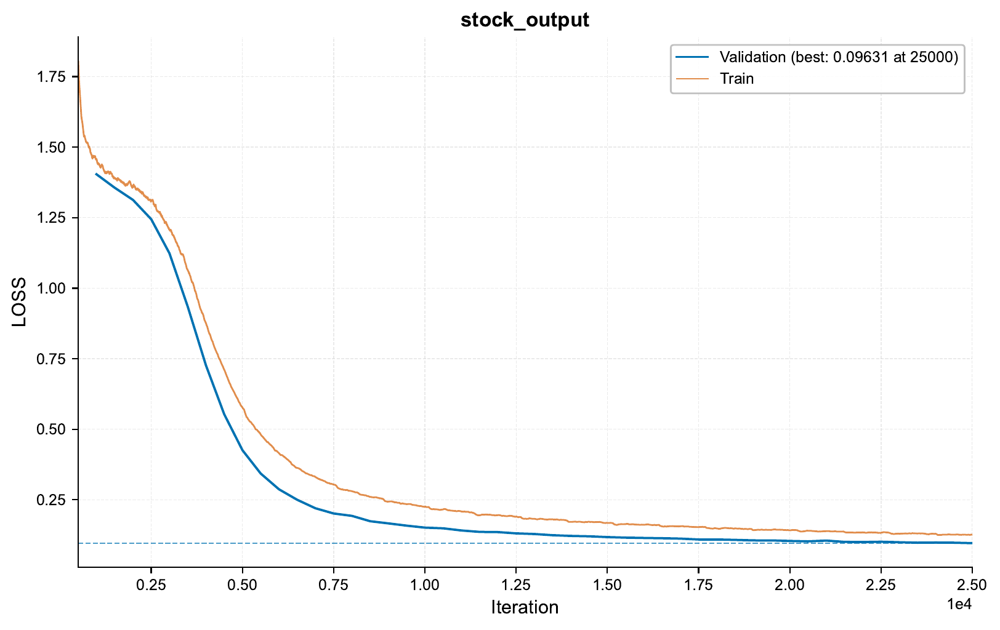
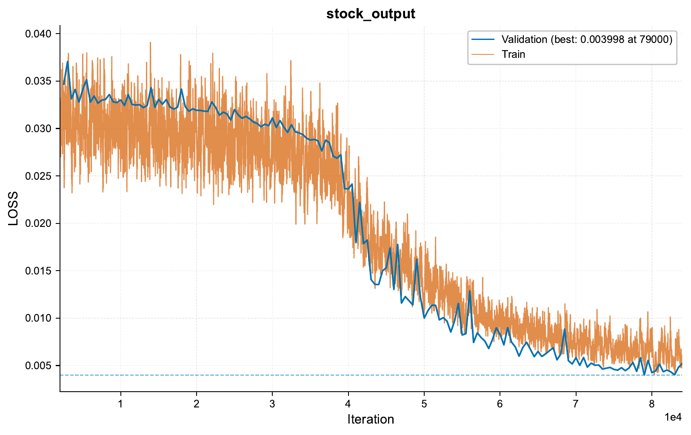
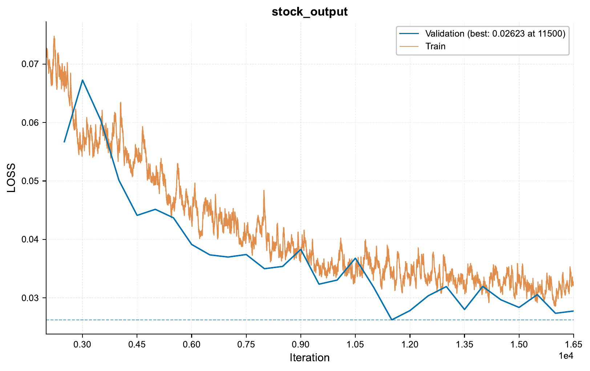

.. _c-time-series-stocks-prediction-tutorial:

.. role:: raw-html(raw)
    :format: html

Time Series: 3 Approaches to Stock Price Prediction
===================================================

In this tutorial, we will explore using ``EIR`` for time series prediction tasks,
focusing on stock price forecasting. We'll work with stock market data and implement
three different approaches: a transformer-based model,
a CNN-based one-shot prediction model,
and a CNN-based diffusion model.

.. note::
    This tutorial builds upon concepts from the previous time series tutorial.
    While not strictly necessary, it's recommended to go through that tutorial first
    if you're new to time series prediction with ``EIR``.

A - Data
--------

For this tutorial, we'll be using pre-processed stock price data.
Here's a brief overview of the data preparation process:

1. Historical stock data of daily close prices downloaded for 30 major companies (e.g., AAPL, GOOGL, MSFT) using the ``yfinance`` library, covering the period from 2000 to 2023.

2. The closing prices are discretized into 256 bins.

3. The data is transformed into sequences of 64 time steps (days) for input, with the corresponding 64 time steps used as the prediction target.

4. The dataset is split into training (95%) and testing (5%) sets.

5. The prepared data is saved in both CSV format and as `DeepLake <https://github.com/activeloopai/deeplake>`__ datasets.

So, each sequence in our dataset represents 64 consecutive days of closing stock prices for a particular company.
The prices are discretized into 256 bins, with each number in the sequence representing a bin.
For example, a sequence might look like this:

.. code-block:: bash

    CSCO_20141223,10 10 10 10 10 10 11 11 11 10 10 10 ... 9 10 10 10

This sequence represents Cisco's (CSCO) stock prices starting from December 23, 2014.

.. important::
    Here we do a relatively naive split of the data into training and testing sets.
    Specifically, we the "last" 5% of the data as the test set, which covers
    part of CSCO and all of CVX. Therefore, CVX can probably be considered
    a relatively robust test case, as none of data from this company was used
    in training. However, CSCO might for some samples be plagued by some data leakage
    (i.e. at the "boundary" samples between training and test,
    some data will be in both). For real tasks, it would likely be better to use a more
    sophisticated approach, such a completely different set of companies for training
    and testing.

.. note::
    We save the data in these two different formats as the sequence based transformer
    models read the CSV format, whereas the one-shot and diffusion models read arrays
    from the DeepLake dataset. Therefore, the data is effectively being duplicated,
    but, as DeepLake here is just storing the sequences converted to arrays. We could
    also have saved the arrays as ``.npy`` files on disk, but we chose DeepLake here
    for demonstration purposes, as it can be useful e.g. for large datasets where
    storing a large number of files on disk can be troublesome. When using DeepLake,
    the expected format is that each sample has an "ID" tensor (unique per sample) and
    a data tensor, which can be arbitrarily named (see example below in the input
    configurations for the one-shot and diffusion models).

To download the data, `use this link. <https://drive.google.com/file/d/1aIbYbd33yystchj5eZfCQHE3-NhMubu4>`__

After downloading the data, the folder structure should look like this:

.. literalinclude:: ../tutorial_files/g_time_series/02_time_series_stocks/commands/tutorial_folder.txt
    :language: console

B - Training Stock Price Prediction Models
------------------------------------------

We'll train three different models for stock price prediction: a transformer-based model,
a one-shot prediction model, and a diffusion model.

1. Transformer-based Model
^^^^^^^^^^^^^^^^^^^^^^^^^^

Let's start by configuring and training a
transformer-based model for stock price prediction.
This is a sequence-to-sequence model
and uses the CSV format for input and output.

Here are the key configuration files:

.. literalinclude:: ../tutorial_files/g_time_series/02_time_series_stocks/globals.yaml
    :language: yaml
    :caption: globals.yaml

.. literalinclude:: ../tutorial_files/g_time_series/02_time_series_stocks/input_sequence.yaml
    :language: yaml
    :caption: input_sequence.yaml

.. literalinclude:: ../tutorial_files/g_time_series/02_time_series_stocks/output.yaml
    :language: yaml
    :caption: output.yaml

To train the transformer-based model, run:

.. literalinclude:: ../tutorial_files/g_time_series/02_time_series_stocks/commands/TIME_SERIES_STOCKS_01.txt
    :language: console

Results and Visualization (Transformer-based Model)
"""""""""""""""""""""""""""""""""""""""""""""""""""

Here's the training curve for our transformer-based model:

Let's look at some example predictions:

.. image:: ../tutorial_files/g_time_series/02_time_series_stocks/figures/02_time_series_stocks/sample_6_plot.pdf
    :width: 80%
    :align: center

.. image:: ../tutorial_files/g_time_series/02_time_series_stocks/figures/02_time_series_stocks/sample_7_plot.pdf
    :width: 80%
    :align: center

.. note::
    Since the training and validation samples are from the same companies,
    this and subsequent models are likely to perform (very) well on the validation set
    (due to potential data leakage). However, we will look at the test set
    later to get a better idea of model performance on unseen data. However,
    performing well here does tell us that the models are learning something
    from the data (even though this learning might just be memorizing).

2. One-shot Prediction Model
^^^^^^^^^^^^^^^^^^^^^^^^^^^^

Next, let's configure and train a one-shot prediction model for stock prices.

Here are the key configuration files:

.. literalinclude:: ../tutorial_files/g_time_series/02_time_series_stocks/globals_one_shot.yaml
    :language: yaml
    :caption: globals_one_shot.yaml

.. literalinclude:: ../tutorial_files/g_time_series/02_time_series_stocks/input_array_prior.yaml
    :language: yaml
    :caption: input_array_prior.yaml

.. note::
    Note how we are here using the ``input_inner_key`` argument for the ``input_info``,
    but this refers to the data name in the DeepLake dataset.

.. literalinclude:: ../tutorial_files/g_time_series/02_time_series_stocks/output_array.yaml
    :language: yaml
    :caption: output_array.yaml

To train the one-shot prediction model, run:

.. literalinclude:: ../tutorial_files/g_time_series/02_time_series_stocks/commands/TIME_SERIES_STOCKS_02.txt
    :language: console

Results and Visualization (One-shot Prediction Model)
"""""""""""""""""""""""""""""""""""""""""""""""""""""

Here's the training curve for our one-shot prediction model:

Let's look at some example predictions:

.. image:: ../tutorial_files/g_time_series/02_time_series_stocks/figures/02_time_series_stocks_one_shot/sample_0_plot.pdf
    :width: 80%
    :align: center

.. image:: ../tutorial_files/g_time_series/02_time_series_stocks/figures/02_time_series_stocks_one_shot/sample_1_plot.pdf
    :width: 80%
    :align: center

3. Diffusion Model
^^^^^^^^^^^^^^^^^^

Finally, let's configure and train a diffusion model for stock price prediction.

Here are the key configuration files:

.. literalinclude:: ../tutorial_files/g_time_series/02_time_series_stocks/globals_diffusion.yaml
    :language: yaml
    :caption: globals_diffusion.yaml

.. literalinclude:: ../tutorial_files/g_time_series/02_time_series_stocks/input_array_diffusion.yaml
    :language: yaml
    :caption: input_array_diffusion.yaml

.. literalinclude:: ../tutorial_files/g_time_series/02_time_series_stocks/output_array_diffusion.yaml
    :language: yaml
    :caption: output_array_diffusion.yaml

.. note::
    If you are seeing the ``tensor_broker_config`` for the first time and would like
    more information on it, please take a look at
    :ref:`c-image-output-colorization-and-super-resolution-tutorial`. Shortly put,
    it allows us to send arbitrary hidden states / representations from earlier
    parts of the model to later parts of the model (e.g. like is often done in
    U-Net inspired architectures).

To train the diffusion model, run:

.. literalinclude:: ../tutorial_files/g_time_series/02_time_series_stocks/commands/TIME_SERIES_STOCKS_03.txt
    :language: console

Results and Visualization (Diffusion Model)
"""""""""""""""""""""""""""""""""""""""""""

Here's the training curve for our diffusion model:

Let's look at some example predictions:

.. image:: ../tutorial_files/g_time_series/02_time_series_stocks/figures/02_time_series_stocks_diffusion/sample_0_plot.pdf
    :width: 80%
    :align: center

.. image:: ../tutorial_files/g_time_series/02_time_series_stocks/figures/02_time_series_stocks_diffusion/sample_1_plot.pdf
    :width: 80%
    :align: center

C - Serving
-----------

In this final section, we'll serve our trained models for stock price prediction
as web services and interact with them using HTTP requests.

1. Serving the Transformer-based Model
^^^^^^^^^^^^^^^^^^^^^^^^^^^^^^^^^^^^^^

To serve the transformer-based model, use the following command:

.. literalinclude:: ../tutorial_files/g_time_series/02_time_series_stocks/commands/SEQUENCE_TO_SEQUENCE_STOCKS_DEPLOY.txt
    :language: console

2. Serving the One-shot Prediction Model
^^^^^^^^^^^^^^^^^^^^^^^^^^^^^^^^^^^^^^^^

To serve the one-shot prediction model, use the following command:

.. literalinclude:: ../tutorial_files/g_time_series/02_time_series_stocks/commands/SEQUENCE_TO_SEQUENCE_STOCKS_DEPLOY.txt
    :language: console

3. Serving the Diffusion Model
^^^^^^^^^^^^^^^^^^^^^^^^^^^^^^

To serve the diffusion model, use the following command:

.. literalinclude:: ../tutorial_files/g_time_series/02_time_series_stocks/commands/DIFFUSION_STOCKS_DEPLOY.txt
    :language: console

Sending Requests
^^^^^^^^^^^^^^^^

With the servers running, we can now send requests with stock price data.

Python Example (for the Diffusion Model):

.. literalinclude:: ../tutorial_files/g_time_series/02_time_series_stocks/request_example/python_request_example_module.py
    :language: python
    :caption: Python request example

.. note::
    The Python request example above is for the diffusion model, and it should
    also work for the one-shot prediction model. For the transformer-based model,
    see :ref:`c-time-series-power-prediction-tutorial` for an example.

Analyzing Responses
^^^^^^^^^^^^^^^^^^^

Below is an example of the response from the diffusion model:

.. literalinclude:: ../tutorial_files/g_time_series/02_time_series_stocks/serve_results/predictions.json
    :language: json
    :caption: Model predictions

Visualizing Predictions with Uncertainty
""""""""""""""""""""""""""""""""""""""""

When sending the requests, we sent the same input multiple times to each model, to
potentially gain some insight into the uncertainty of the model predictions. There
is some randomness in the sampling process for the transformer and diffusion
based models. However, the one-shot model is deterministic, meaning it gives
the same output for the same input every time.

Transformer-based Model:

.. image:: ../tutorial_files/g_time_series/02_time_series_stocks/figures/02_time_series_stocks_test/sample_1_plot_with_uncertainty.pdf
    :width: 80%
    :align: center

One-shot Prediction Model:

.. image:: ../tutorial_files/g_time_series/02_time_series_stocks/figures/02_time_series_stocks_test_one_shot/sample_1_plot_with_uncertainty.pdf
    :width: 80%
    :align: center

Diffusion Model:

.. image:: ../tutorial_files/g_time_series/02_time_series_stocks/figures/02_time_series_stocks_test_diffusion/sample_1_plot_with_uncertainty.pdf
    :width: 80%
    :align: center

Conclusion
----------

In this tutorial, we've explored how to use `EIR` for stock price prediction tasks.
We've covered:

1. Working with stock market data
2. Configuring and training three different models:
   - Transformer-based model
   - One-shot prediction model
   - Diffusion model
3. Visualizing training progress and model predictions
4. Serving the trained models as web services
5. Interacting with the served models using Python
6. Analyzing and visualizing model predictions, including uncertainty estimates

If you made it this far, thank you for reading! We hope this tutorial was helpful
in demonstrating the capabilities of ``EIR`` for time series prediction tasks.