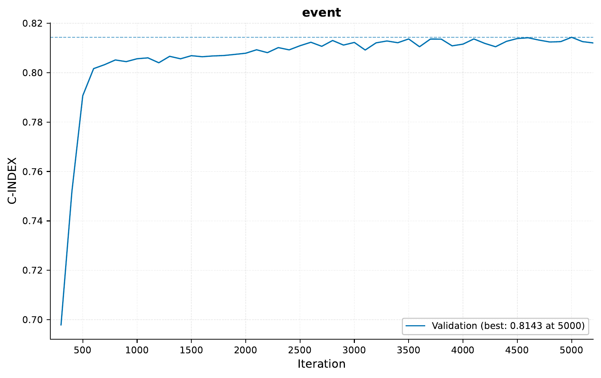
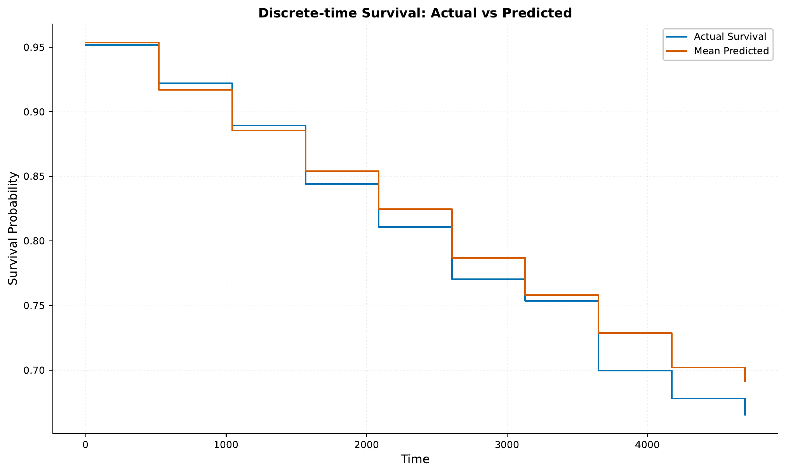
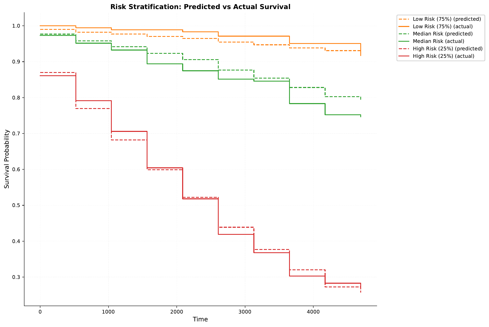
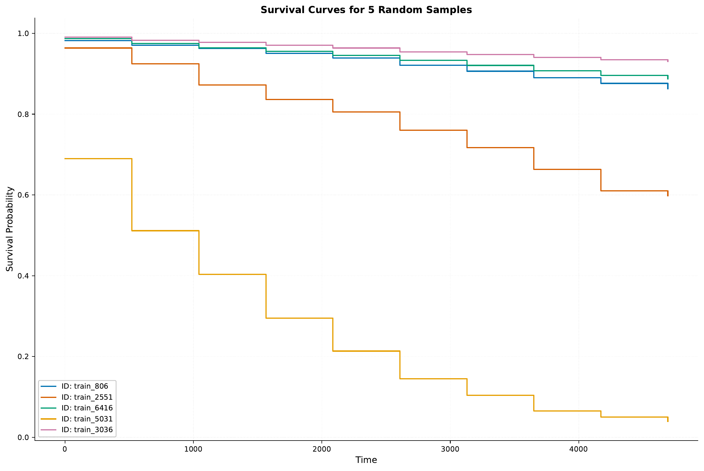

.. _h-survival-analysis-tutorial:

.. role:: raw-html(raw)
    :format: html

Survival Analysis: Free Light Chain Analysis
============================================

In this tutorial, we will explore using `EIR` for survival analysis tasks,
specifically focusing on predicting survival outcomes based
on serum free light chain data. We'll work with a real-world dataset from a
Mayo Clinic study that investigated the relationship between serum free light chain
levels and mortality in the general population.

.. note::
    This tutorial assumes you are familiar with the basics of `EIR` and
    have gone through previous tutorials. Not required, but recommended.

A - Dataset Overview
--------------------

We'll be using the Free Light Chain (FLChain)
dataset from the Mayo Clinic study, which contains:

* 7,874 subjects
* 9 features including:
    * **age**: Age in years
    * **sex**: Gender (F=female, M=male)
    * **kappa**: Serum free light chain, kappa portion
    * **lambda**: Serum free light chain, lambda portion
    * **flc.grp**: Serum free light chain group
    * **creatinine**: Serum creatinine
    * **mgus**: Monoclonal gammopathy diagnosis status
* The endpoint is death, which occurred for 2,169 subjects (27.5%)

.. note::
    The dataset comes from a study investigating how non-clonal serum immunoglobulin
    free light chains can predict overall survival in the general population.
    More details can be found in the Mayo Clinic Proceedings paper by
    Dispenzieri et al. (2012).

To download the data, `use this link. <https://drive.google.com/file/d/17iojKFXUBf-xgltogdNTbKa2qtyNP3ar>`__

After downloading the data, the folder structure should look like this:

.. literalinclude:: ../tutorial_files/h_survival_analysis/01_flchain/commands/tutorial_folder.txt
    :language: console

B - Training a Survival Model
-----------------------------

Let's configure and train a model on the FLChain data. Here are the key configuration files:

.. literalinclude:: ../tutorial_files/h_survival_analysis/01_flchain/globals.yaml
    :language: yaml
    :caption: globals.yaml

.. literalinclude:: ../tutorial_files/h_survival_analysis/01_flchain/input.yaml
    :language: yaml
    :caption: input.yaml

.. literalinclude:: ../tutorial_files/h_survival_analysis/01_flchain/fusion.yaml
    :language: yaml
    :caption: fusion.yaml

.. literalinclude:: ../tutorial_files/h_survival_analysis/01_flchain/output.yaml
    :language: yaml
    :caption: output.yaml

To train the model, run the following command:

.. literalinclude:: ../tutorial_files/h_survival_analysis/01_flchain/commands/FLCHAIN_1.txt
    :language: console

Results and Model Performance
^^^^^^^^^^^^^^^^^^^^^^^^^^^^^

Here's the training curve showing the C-index (concordance index) over time:

The C-index is a measure of the model's discrimination ability in survival analysis.
A C-index of 0.5 indicates random predictions, while 1.0 indicates perfect discrimination.
Our model achieves a C-index of around 0.8 on the validation set,
indicating good predictive performance.

For a given sampling iteration,
some survival curves are plotted in the ``results/samples/<iteration>/`` directory.

C - Model Deployment and Analysis
---------------------------------

Let's deploy our trained model as a web service and analyze its predictions across different patient subgroups.

Starting the Web Service
^^^^^^^^^^^^^^^^^^^^^^^^

To serve the model, use:

.. literalinclude:: ../tutorial_files/h_survival_analysis/01_flchain/commands/FLCHAIN_DEPLOY.txt
    :language: console

Making Predictions
^^^^^^^^^^^^^^^^^^

Here's how to send requests to the model:

.. literalinclude:: ../tutorial_files/h_survival_analysis/01_flchain/request_example/python_request_example_module.py
    :language: python
    :caption: Python request example

Here is an example of the response:

.. literalinclude:: ../tutorial_files/h_survival_analysis/01_flchain/request_example/python_request_example.json
    :language: json
    :caption: Survival response example

Survival Analysis by Age Groups
^^^^^^^^^^^^^^^^^^^^^^^^^^^^^^^

After sending all the samples in the test set to the model,
we can analyze the survival probabilities across different patient subgroups.
Here is how that looks:

.. image:: ../tutorial_files/h_survival_analysis/01_flchain/figures/survival_analysis/survival_curve_by_age.pdf
    :width: 80%
    :align: center

.. image:: ../tutorial_files/h_survival_analysis/01_flchain/figures/survival_analysis/survival_curve_by_sex.pdf
    :width: 80%
    :align: center

.. image:: ../tutorial_files/h_survival_analysis/01_flchain/figures/survival_analysis/survival_curve_by_flcgrp.pdf
    :width: 80%
    :align: center

Here we can see for example, as expected,
that older patients have lower survival probabilities.

Conclusion
----------

In this tutorial, we've explored how to:

1. Work with real-world survival analysis data
2. Configure and train a survival prediction model
3. Deploy the model as a web service
4. Analyze survival probabilities across different patient subgroups

If you made it this far, thank you for reading! We hope this tutorial provided useful insights
into applying deep learning to survival analysis tasks.