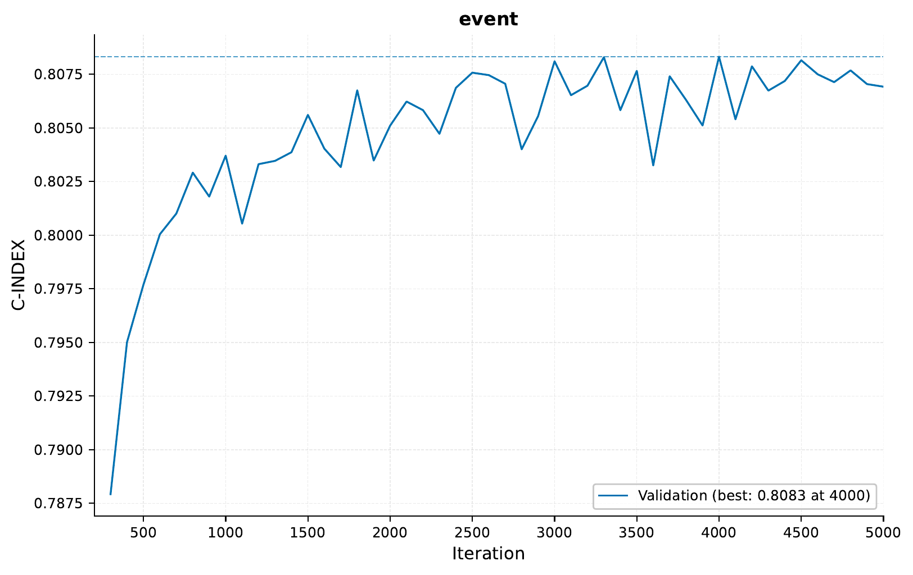
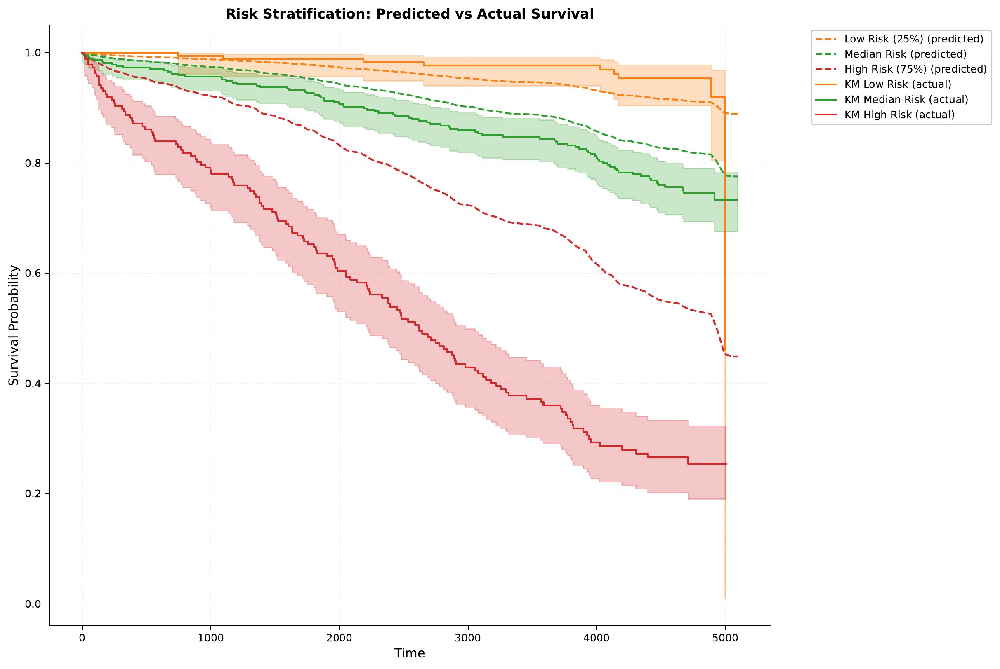
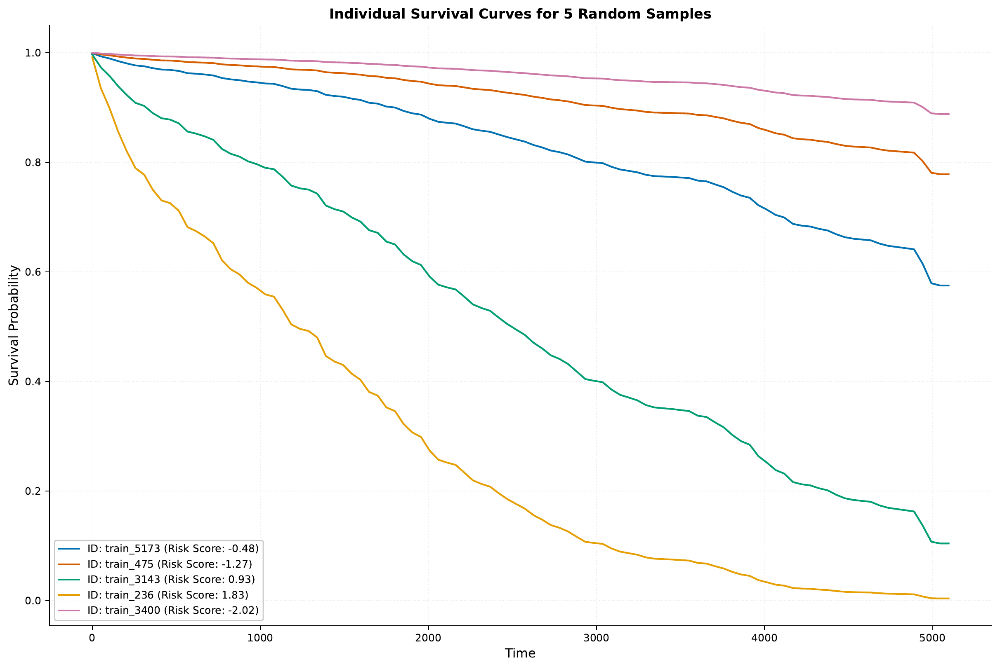
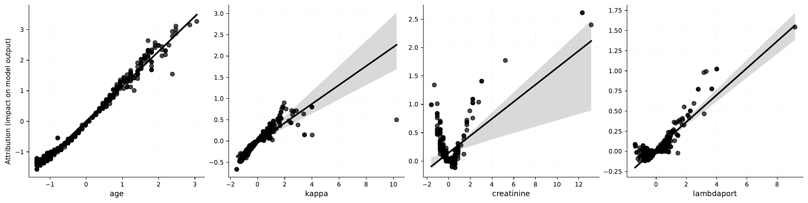
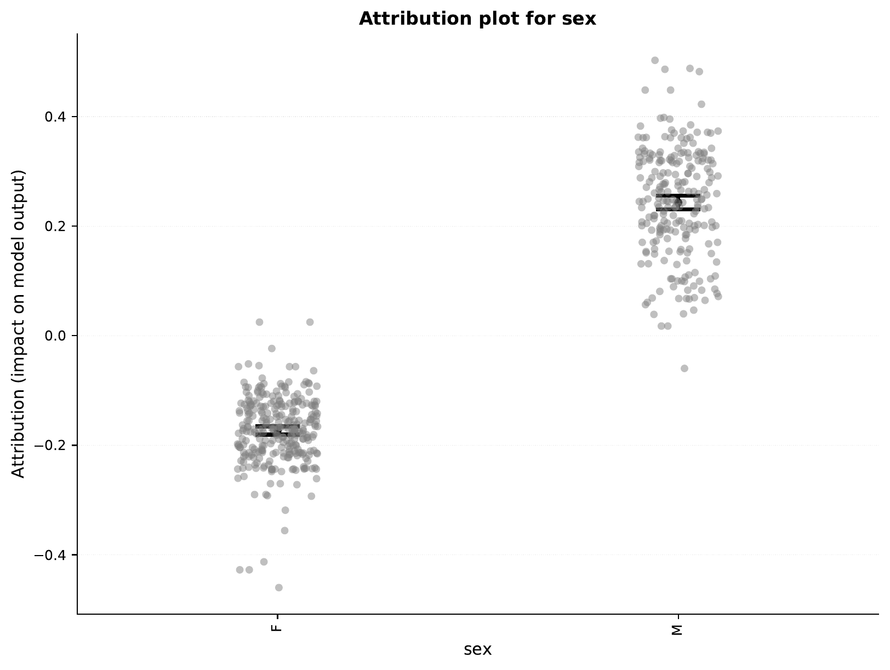

.. _h-survival-analysis-cox-tutorial:

.. role:: raw-html(raw)
    :format: html

Survival Analysis: Cox Proportional Hazards Model
=================================================

In this tutorial, we will explore using a Cox Proportional Hazards model for survival analysis
with `EIR`. We'll use the same Free Light Chain dataset as in the previous tutorial, but this
time using a continuous-time approach rather than discrete-time bins.

.. note::
    This tutorial builds on :ref:`h-survival-analysis-tutorial`. Please make sure you're
    familiar with that tutorial first, as we'll be using the same dataset and similar concepts.

A - Dataset Overview
--------------------

We'll be using the same Free Light Chain (FLChain) dataset from the Mayo Clinic study as in
the previous tutorial. For details about the dataset, please refer to
:ref:`h-survival-analysis-tutorial`.

The folder structure should look like this:

.. literalinclude:: ../tutorial_files/h_survival_analysis/02_flchain_cox/commands/tutorial_folder.txt
    :language: console

B - Training a Cox Model
------------------------

Let's configure and train a Cox model on the FLChain data. The key difference from the previous
tutorial is that we'll use the Cox Proportional Hazards loss function instead of discretizing
the time axis. Here are the configuration files:

.. literalinclude:: ../tutorial_files/h_survival_analysis/02_flchain_cox/globals.yaml
    :language: yaml
    :caption: globals.yaml
    :emphasize-lines: 8-11

Notice also here that we are using some flags for attribution analysis,
which is also supported for survival models
(as well as tabular, i.e. supervised outputs).

.. literalinclude:: ../tutorial_files/h_survival_analysis/02_flchain_cox/input.yaml
    :language: yaml
    :caption: input.yaml

.. literalinclude:: ../tutorial_files/h_survival_analysis/02_flchain_cox/fusion.yaml
    :language: yaml
    :caption: fusion.yaml

.. literalinclude:: ../tutorial_files/h_survival_analysis/02_flchain_cox/output.yaml
    :language: yaml
    :caption: output.yaml
    :emphasize-lines: 8-9

Note the key difference in output.yaml where we specify "CoxPHLoss" as our loss function.

To train the model, run:

.. literalinclude:: ../tutorial_files/h_survival_analysis/02_flchain_cox/commands/FLCHAIN_1.txt
    :language: console

Results and Model Performance
^^^^^^^^^^^^^^^^^^^^^^^^^^^^^

Here's the training curve showing the C-index (concordance index) over time:

As in the previous tutorial, our model achieves good discrimination with a C-index around 0.8
on the validation set.

The model generates survival curves for visualization. Here are some examples from the
``results/samples/<iteration>/`` directory:

Notice how these curves are smoother than in the discrete-time model, as we're not restricted
to fixed time intervals.

Now, you might remember from above that we set the `attribution_analysis` flag to `True`
for the current experiments. If we look under ``results/samples/<iteration>/attribution/``,
we can find various information on how the input features contribute to the model's predictions
towards a higher risk score.

First, let's take a look at the overall feature importance:

.. image:: ../tutorial_files/h_survival_analysis/02_flchain_cox/figures/feature_importance.png
    :width: 100%
    :align: center

So, perhaps unsurprisingly, the `age` feature is
the most important feature in the model. We can take a look
at the ``continuous_attributions.png`` file to see how the
`age` feature (and others) contributes to the risk score.

Indeed, with increasing age (here normalized), the risk score increases.

We can also take a look at the feature importance of categorical inputs, here
the `sex` feature:

So, the model seems to assign higher risk
to males compared to females.

C - Model Deployment and Analysis
---------------------------------

Let's deploy and analyze our Cox model.

Starting the Web Service
^^^^^^^^^^^^^^^^^^^^^^^^

To serve the model:

.. literalinclude:: ../tutorial_files/h_survival_analysis/02_flchain_cox/commands/FLCHAIN_DEPLOY.txt
    :language: console

Making Predictions
^^^^^^^^^^^^^^^^^^

Here's an example of sending requests to the model:

.. literalinclude:: ../tutorial_files/h_survival_analysis/02_flchain_cox/request_example/python_request_example_module.py
    :language: python
    :caption: Python request example

Note that unlike the discrete-time model, this model returns risk scores that are then
converted to survival probabilities using the baseline hazard function.

Here is an example of the response:

.. literalinclude:: ../tutorial_files/h_survival_analysis/02_flchain_cox/request_example/python_request_example.json
    :language: json
    :caption: Survival response example

Survival Analysis by Patient Characteristics
^^^^^^^^^^^^^^^^^^^^^^^^^^^^^^^^^^^^^^^^^^^^

After analyzing the test set predictions, here are the survival curves stratified by
different patient characteristics:

.. image:: ../tutorial_files/h_survival_analysis/02_flchain_cox/figures/survival_analysis/survival_curve_by_age.pdf
    :width: 80%
    :align: center

.. image:: ../tutorial_files/h_survival_analysis/02_flchain_cox/figures/survival_analysis/survival_curve_by_sex.pdf
    :width: 80%
    :align: center

.. image:: ../tutorial_files/h_survival_analysis/02_flchain_cox/figures/survival_analysis/survival_curve_by_flcgrp.pdf
    :width: 80%
    :align: center

The smooth curves from the Cox model help visualize the continuous nature of the survival
process and the proportional effect of different risk factors.

Now, looking at the curve for "sex", you might notice an interesting discrepancy
compared to what we saw earlier with the attributions. The survival
seems to have flipped, where now we see higher survival probabilities for
males compared females. If we fit and plot a Kaplan-Meier curve for the training
data, we see that it does agree with our attributions earlier:

However, when we look at the test data, we see the opposite:

So, it seems that while the model has learned overall that males have higher risk,
there might be some other factors in the test data (e.g. due to randomness) where
in this subset, males seemingly have lower risk.

Conclusion
----------

In this tutorial, we've shown how to:

1. Configure and train a Cox Proportional Hazards model
2. Deploy the model as a web service
3. Generate and interpret continuous survival curves
4. Analyze survival patterns across patient subgroups