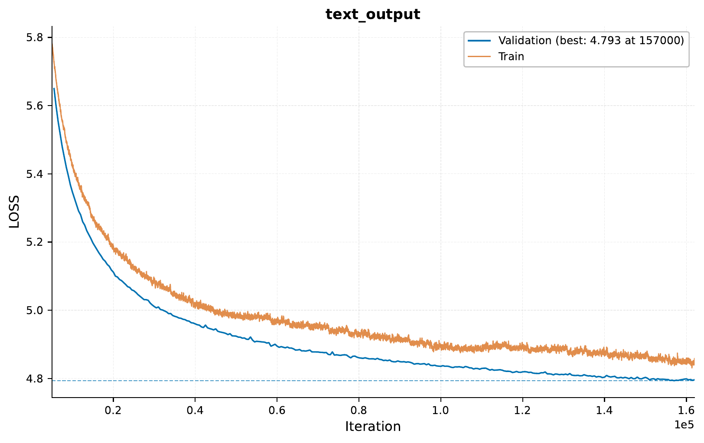

.. _i-scaling-streaming-data:

.. role:: raw-html(raw)
    :format: html

01 – Streaming Data: Training with FineWeb
==========================================

In this tutorial, we will explore `EIR`'s built-in support for training with streaming data.
Streaming allows us to train models on datasets that are too large to fit in memory
or when data becomes available in real-time. We'll demonstrate this using the FineWeb
dataset, showing how to set up both the streaming server and the training configuration.

.. note::
    This tutorial assumes you are familiar with the basics of `EIR`.
    While not required, it's recommended to have gone through the basic tutorials first.

.. note::
    See :ref:`streaming-data-guide` for more information on streaming data in EIR.

A - Overview
------------

When working with streaming data in EIR, there are two main components:

1. A WebSocket server that streams the data
2. The EIR training configuration that connects to this stream

The server needs to implement a specific protocol that EIR understands, but once
that's set up, using streaming data is as simple as pointing to the WebSocket URL
in your configuration.

B - Setting Up
--------------

For this tutorial, we'll be using a simple server that streams text from the
FineWeb dataset. Here's the folder structure we'll be working with:

.. literalinclude:: ../tutorial_files/i_scaling/01_streaming_data/commands/tutorial_folder.txt
    :language: console

Let's look at our configurations. The global config specifies basic training parameters:

.. literalinclude:: ../tutorial_files/i_scaling/01_streaming_data/globals.yaml
    :language: yaml
    :caption: globals.yaml

For fusion, we use a simple pass-through configuration since we're only doing
sequence generation:

.. literalinclude:: ../tutorial_files/i_scaling/01_streaming_data/fusion.yaml
    :language: yaml
    :caption: fusion.yaml

The key configuration is the output config, where we specify our streaming source:

.. literalinclude:: ../tutorial_files/i_scaling/01_streaming_data/output.yaml
    :language: yaml
    :caption: output.yaml
    :emphasize-lines: 2

Note the ``output_source`` pointing to our WebSocket server. This tells EIR
to expect streaming data from this address.

C - Training
------------

Before starting training, we need to ensure our streaming server is running.
The server will serve chunks of text from the FineWeb dataset. See section F
of this tutorial for the complete implementation of the server. To start it,
copy the content of the file ``text_streamer.py`` to a Python file and run it
with ``python text_streamer.py``.

Once it's running, in another terminal, we can start training:

.. literalinclude:: ../tutorial_files/i_scaling/01_streaming_data/commands/STREAMING_SEQUENCE_GENERATION.txt
    :language: console

During training, EIR will connect to the streaming server and receive data in
batches. Let's look at some samples generated during training.

At iteration 500:

.. literalinclude:: ../tutorial_files/i_scaling/01_streaming_data/figures/auto_generated_iter_500.txt
    :language: console
    :caption: Auto-generated sequence at iteration 500

.. literalinclude:: ../tutorial_files/i_scaling/01_streaming_data/figures/manual_generated_iter_500.txt
    :language: console
    :caption: Manually generated sequence at iteration 500

By iteration 2500, we can see improvement:

.. literalinclude:: ../tutorial_files/i_scaling/01_streaming_data/figures/auto_generated_iter_2500.txt
    :language: console
    :caption: Auto-generated sequence at iteration 2500

.. literalinclude:: ../tutorial_files/i_scaling/01_streaming_data/figures/manual_generated_iter_2500.txt
    :language: console
    :caption: Manually generated sequence at iteration 2500

Here's the training curve showing our progress:

D - Understanding the Streaming Server
--------------------------------------

The streaming server implements a simple WebSocket interface that EIR expects.
Here's a minimal example of what's happening behind the scenes:

.. code-block:: python

    @app.websocket("/ws")
    async def websocket_endpoint(websocket: WebSocket):
        await manager.connect(websocket)

        try:
            while True:
                data = await websocket.receive_json()

                if data["type"] == "getData":
                    batch = manager.get_sequence_batch(
                        batch_size=data["payload"]["batch_size"]
                    )

                    if not batch:
                        await manager.send_personal_message(
                            message={"type": "data", "payload": ["terminate"]},
                            websocket=websocket,
                        )
                        break

                    await manager.send_personal_message(
                        message={"type": "data", "payload": batch},
                        websocket=websocket,
                    )

F - Complete Server Implementation
----------------------------------

Here's the complete implementation of our streaming server, which you can use
as a reference for implementing your own:

.. literalinclude:: ../../doc_modules/i_scaling/text_streamer.py
    :language: python
    :caption: text_streamer.py

The server handles requests for data batches and streams them to EIR during
training. This approach allows us to:

1. Train on datasets larger than memory
2. Process data in real-time
3. Implement custom data loading logic
4. Handle validation data separation

E - Conclusion
--------------

This tutorial has shown how to:

1. Configure EIR for streaming data
2. Set up a basic streaming server
3. Train a model using streamed data

Streaming is particularly useful when:

- Working with large datasets
- Processing real-time data
- Implementing custom data loading logic

Thank you for reading!