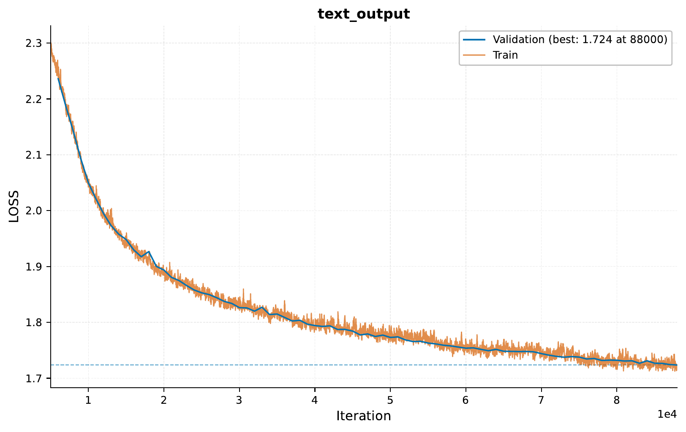
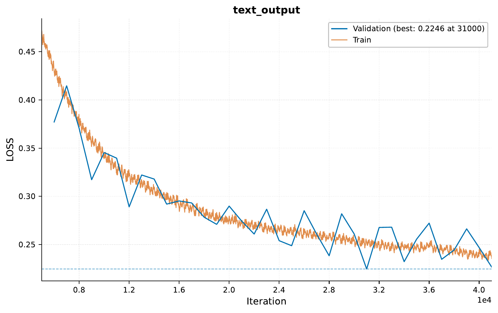

.. _i-scaling-compute-gpt:

.. role:: raw-html(raw)
    :format: html

02 – Scaling Compute: Training a BabyGPT
========================================

In this tutorial, we will examine how we can scale up `EIR` to train a baby version
of the GPT model, streaming data from the FineWeb dataset for model training.

.. note::
    This tutorial assumes you are familiar with the basics of `EIR`.
    While not required, it's recommended to have gone through the basic tutorials first.

.. note::
    See :ref:`i-scaling-streaming-data` and :ref:`streaming-data-guide`
    for more information on streaming data in EIR.

A - Overview
------------

This tutorial largely follows the same approach as in :ref:`i-scaling-streaming-data`.
Again, we will be using a WebSocket server to stream data, but this time we will be
focusing on scaling compute by training a larger model.

B - Setting Up
--------------

Here's the folder structure we'll be working with:

.. literalinclude:: ../tutorial_files/i_scaling/02_scaling_compute/commands/tutorial_folder.txt
    :language: console

The global config specifies basic training and below are highlighted a couple
related to scaling:

.. literalinclude:: ../tutorial_files/i_scaling/02_scaling_compute/globals.yaml
    :language: yaml
    :caption: globals.yaml
    :emphasize-lines: 8-10,17-24

Now, the optimization parameters are not directly related to scaling, but follow
common practice used to train large language models such as GPT2. However, we
do specify that we want to compile the model and train with a ``bf16-mixed`` precision,
which is becoming common practice for training large models. Additionally, many
options related to e.g. hardware are set to ``auto`` (which is the default),
which allows the framework to automatically select the best options for the
compute environment being used.
Note a lot of this functionality is
taking advantage of the excellent done by the folks at `PyTorch <https://pytorch.org/>`__
and `Fabric <https://lightning.ai/docs/fabric/stable/>`__.

You might also notice the ``streaming_setup_samples`` option there, read a
bit further down to when we are discussing the ``output.yaml`` for more
details.

For fusion, we use a simple pass-through configuration since we're only doing
sequence generation:

.. literalinclude:: ../tutorial_files/i_scaling/02_scaling_compute/fusion.yaml
    :language: yaml
    :caption: fusion.yaml

Compared to the streaming tutorial, we can see here how we are increasing the
maximum sequence length used by the model (now 512), as well as a bunch of parameters
in the model configuration.

.. literalinclude:: ../tutorial_files/i_scaling/02_scaling_compute/output.yaml
    :language: yaml
    :caption: output.yaml
    :emphasize-lines: 10,15-22

You might also notice something new here, we are using the ``tokenizer`` option to point
to the file ``fineweb_tokenizer.json``. This is a tokenizer file created
with the `tokenizers <https://huggingface.co/docs/tokenizers/index>`__ library,
specifically the BPE tokenizer, trained on 0.5m samples from the FineWeb dataset.
You can download the tokenizer file from
`this link. <https://drive.google.com/file/d/10nqy1z3wqt-KHOlYw_t-UgfcEMdFSySO>`__.
Now, we can also omit this and allow ``EIR`` to train the optimizer from scratch,
this is where the ``streaming_setup_samples`` option comes in. This option controls
how many samples are collected from the streaming server to use for setup (e.g.,
training the tokenizer, estimating means for imputation, etc.). However, training
the tokenizer can take a while, so to speed things up a bit, we are using
the pre-trained tokenizer.

C - Training
------------

Before starting training, we need to ensure our streaming server is running.
The server will serve chunks of text from the FineWeb dataset. Once it's
running, we can start training:

.. literalinclude:: ../tutorial_files/i_scaling/02_scaling_compute/commands/STREAMING_SEQUENCE_GENERATION.txt
    :language: console

Now, to train this, you almost certainly need a GPU. For this tutorial,
the model was trained for around 2 hours on two H100 GPUs.

At iteration 500:

.. container:: wrapped-output

    .. literalinclude:: ../tutorial_files/i_scaling/02_scaling_compute/figures/auto_generated_iter_500.txt
        :language: console
        :caption: Auto-generated sequence at iteration 500

.. container:: wrapped-output

    .. literalinclude:: ../tutorial_files/i_scaling/02_scaling_compute/figures/manual_generated_iter_500.txt
        :language: console
        :caption: Manually generated sequence at iteration 500

By iteration 52000, we can see improvement:

.. container:: wrapped-output

    .. literalinclude:: ../tutorial_files/i_scaling/02_scaling_compute/figures/auto_generated_iter_52000.txt
        :language: console
        :caption: Auto-generated sequence at iteration 52000

.. container:: wrapped-output

    .. literalinclude:: ../tutorial_files/i_scaling/02_scaling_compute/figures/manual_generated_iter_52000.txt
        :language: console
        :caption: Manually generated sequence at iteration 52000

Here's the training curve showing our progress:

D - Complete Server Implementation
----------------------------------

Here's the complete implementation of our streaming server, which you can use
as a reference for implementing your own:

.. literalinclude:: ../../doc_modules/i_scaling/text_streamer.py
    :language: python
    :caption: text_streamer.py

E - Supervised Fine-Tuning from a Pretrained Model
--------------------------------------------------

In this section,
we will explore how to perform supervised fine-tuning (SFT)
using a pretrained model.
This approach allows us to leverage the knowledge already
captured in a pretrained model and adapt it to a new specific task.

For this example,
we'll use the model we trained in the previous section
as our pretrained checkpoint and fine-tune it on the Alpaca dataset,
which contains instruction-following examples.

Training
""""""""

.. note::
    If you look at the code in the ``text_streamer.py`` file,
    you might notice that the dataset to use is grabbed from a
    ``DATASET_NAME`` environment variable. To use the Alpaca dataset,
    start the server with the following command:
    ``DATASET_NAME=tatsu-lab/alpaca python text_streamer.py``.

Before starting the fine-tuning process,
we need to set up our command with the path to the pretrained model:

.. literalinclude:: ../tutorial_files/i_scaling/02_scaling_compute/commands/SFT_FROM_PRETRAINED_EXPERIMENT.txt
    :language: console
    :emphasize-lines: 8-9

Note the important parameters in the command above:

- We're specifying a new output folder for our fine-tuned model
- We're providing the path to our pretrained checkpoint via the ``pretrained_checkpoint`` parameter

This time, our training should be much faster since we're starting from a pretrained model. Let's look at the training curve:

Let's examine the output at different stages of training. At iteration 500:

.. container:: wrapped-output

   .. literalinclude:: ../tutorial_files/i_scaling/02_scaling_compute/figures/sft_pretrained_auto_generated_iter_500.txt
       :language: console
       :caption: Auto-generated response at iteration 500

The initial outputs might be somewhat incoherent as the model is still learning the instruction format.
By iteration 12000, we can see significant improvement:

.. container:: wrapped-output

    .. literalinclude:: ../tutorial_files/i_scaling/02_scaling_compute/figures/sft_pretrained_auto_generated_iter_12000.txt
        :language: console
        :caption: Auto-generated response at iteration 12000

Now the model is starting to generate coherent responses that follow the instruction format, demonstrating the effectiveness of supervised fine-tuning.

F - Deploying the Model
-----------------------

In this section, we'll demonstrate how to deploy our fine-tuned model as a web service and interact with it using HTTP requests.

Starting the Web Service
""""""""""""""""""""""""

To serve the model, we use the ``eirserve`` command:

.. literalinclude:: ../tutorial_files/i_scaling/02_scaling_compute/commands/SFT_GENERATION_DEPLOY.txt
    :language: console

This command initiates a web service that listens for incoming requests on the default port (8000). Note that we're specifying:

- The GPU device for inference
- The path to our fine-tuned model

Sending Requests
""""""""""""""""

With the server running, we can now send inference requests to our model. Here are two approaches to interact with the deployed model:

Python Example
''''''''''''''

Here's a Python function for sending requests to the model:

.. literalinclude:: ../tutorial_files/i_scaling/02_scaling_compute/request_example/python_request_example_module.py
    :language: python
    :caption: python_request_example_module.py

When running this code, we get the following response:

.. literalinclude:: ../tutorial_files/i_scaling/02_scaling_compute/request_example/python_request_example.json
    :language: json
    :caption: python_request_example.json

.. note::
    Notice how in the response, we often end up with multiple instruction-answer pairs.
    This is because how the data is structured for the model in the streaming server,
    where multiple samples are aggregated together into a single sequence. Optimally,
    we might want to change this for the SFT part to only feed one sample at a time,
    or build some trimming functionality into our response handling.

Bash Example
''''''''''''

Alternatively, you can use a simple curl command from bash:

.. literalinclude:: ../tutorial_files/i_scaling/02_scaling_compute/request_example/bash_request_example_module.sh
    :language: console
    :caption: bash_request_example_module.sh

This produces a similar response:

.. literalinclude:: ../tutorial_files/i_scaling/02_scaling_compute/request_example/bash_request_example.json
    :language: json
    :caption: bash_request_example.json

Analyzing Responses
"""""""""""""""""""

Let's look at some example responses from our model for various instructions:

.. literalinclude:: ../tutorial_files/i_scaling/02_scaling_compute/serve_results/predictions.json
    :language: json
    :caption: predictions.json

As we can see, the model is able to generate appropriate responses for different types of instructions, from generating creative content to providing explanations and advice.

G - Conclusion
--------------

In this tutorial,
we've explored how to scale up ``EIR`` to
train a baby version of the GPT model,
stream data for training,
and perform supervised fine-tuning using a pretrained checkpoint.
We've also learned how to
deploy the model as a web service and
interact with it using HTTP requests.

Thank you for reading!