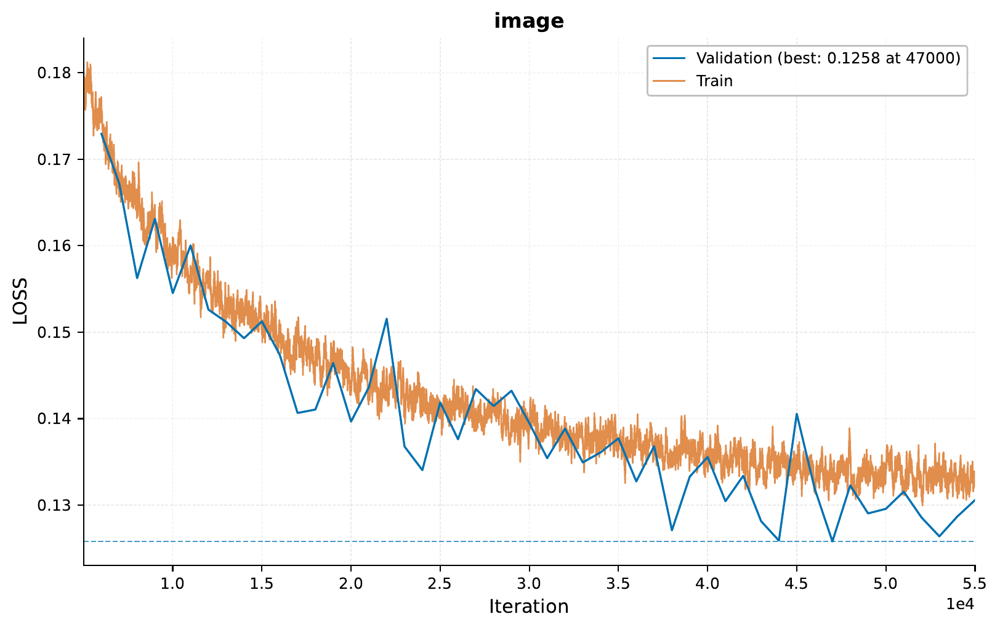
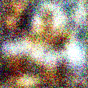

.. _i-scaling-diffusion:

.. role:: raw-html(raw)
    :format: html

03 – Scaling Diffusion: Image Generation from Text
==================================================

In this tutorial, we will explore how to scale diffusion models to generate images from text captions
using `EIR`. We'll train a model on artistic images with their descriptions,
demonstrating how diffusion models can be adapted for text-to-image generation tasks.

.. note::
    This tutorial builds upon concepts from previous scaling tutorials.
    Familiarity with basic `EIR` usage and diffusion models is recommended.

A - Overview
------------

Diffusion models have emerged as powerful tools for generating high-quality images.
When conditioned on text descriptions, they can create images that align with specific textual inputs.
This tutorial demonstrates how to:

1. Set up a streaming server for image-caption pairs from an art dataset
2. Configure and train a text-conditional diffusion model
3. Serve the model and generate images from various art style descriptions

B - Setting Up
--------------

Here's the folder structure we'll be working with:

.. literalinclude:: ../tutorial_files/i_scaling/03_scaling_diffusion/commands/tutorial_folder.txt
    :language: console

Let's examine the configuration files:

.. literalinclude:: ../tutorial_files/i_scaling/03_scaling_diffusion/globals.yaml
    :language: yaml
    :caption: globals.yaml

.. literalinclude:: ../tutorial_files/i_scaling/03_scaling_diffusion/inputs_image_cnn.yaml
    :language: yaml
    :caption: inputs_image_cnn.yaml

.. literalinclude:: ../tutorial_files/i_scaling/03_scaling_diffusion/inputs_caption.yaml
    :language: yaml
    :caption: inputs_caption.yaml

.. literalinclude:: ../tutorial_files/i_scaling/03_scaling_diffusion/fusion.yaml
    :language: yaml
    :caption: fusion.yaml

.. literalinclude:: ../tutorial_files/i_scaling/03_scaling_diffusion/output_image.yaml
    :language: yaml
    :caption: output_image.yaml

C - Image-Caption Streaming Server
----------------------------------

For this tutorial, we use a WebSocket server to stream image-caption pairs.
The implementation is provided in
the `image_caption_streamer.py` file.
This server loads art images from the WikiArt dataset along with
their descriptions and processes them for training.
Before training, you need to run the server e.g. via
``python image_caption_streamer.py``

.. literalinclude:: ../../doc_modules/i_scaling/image_caption_streamer.py
    :language: python
    :caption: image_caption_streamer.py

D - Training the Diffusion Model
--------------------------------

To train our text-conditional diffusion model, we run:

.. literalinclude:: ../tutorial_files/i_scaling/03_scaling_diffusion/commands/IMAGE_CAPTION_DIFFUSION.txt
    :language: console

The model will learn to generate artistic images that match given text descriptions.
This process can take
considerable time, depending on your hardware.
For this tutorial, we trained on a single H100 GPU for a few hours.

E - Examining Results
---------------------

After training, we can examine the loss curve:

Let's compare the model's output at early and later stages of training. Here are examples of generated images
at iteration 1000:

And at iteration 50000:

We can see significant improvement in image quality and at later iterations.
Early outputs (iteration 1000) are mostly noise with some vague structure,
while later outputs
(iteration 50000) show clear improvement. While we are not examining the captions
here, we will take a look at that while serving the model in the next couple
of sections.

F - Serving the Model
---------------------

To deploy our trained model as a web service, we use:

.. literalinclude:: ../tutorial_files/i_scaling/03_scaling_diffusion/commands/IMAGE_CAPTION_DIFFUSION_SERVE.txt
    :language: console

This command starts a server that listens for HTTP requests and uses our trained model to generate images
based on text descriptions.

G - Generating Images from Captions
-----------------------------------

Here's an example Python script to send requests to the server:

.. literalinclude:: ../tutorial_files/i_scaling/03_scaling_diffusion/request_example/python_request_example_module.py
    :language: python
    :caption: python_request_example_module.py

The server responds with JSON that includes the generated image:

.. literalinclude:: ../tutorial_files/i_scaling/03_scaling_diffusion/request_example/python_request_example.json
    :language: json
    :caption: Example response

Let's look at a grid of images generated from different art style captions:

Each image is generated from a caption that specifies an artist, title, style, type, and year.
For example: "Gustav Klimt / Whispers of Gold / Symbolism / portrait / 1904"

H - Conclusion
--------------

In this tutorial, we've explored how to scale diffusion models in `EIR` to generate images from text captions.
We've created a streaming setup for image-caption pairs, trained a conditional diffusion model,
and served it to generate images based on art style descriptions.

Thank you for following this tutorial!
