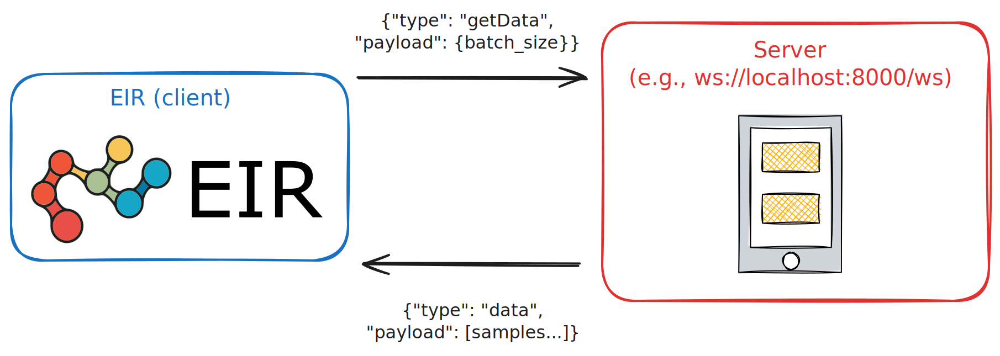
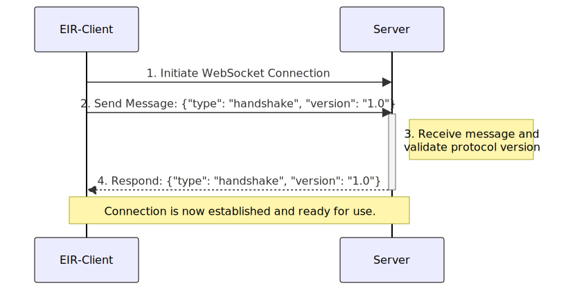
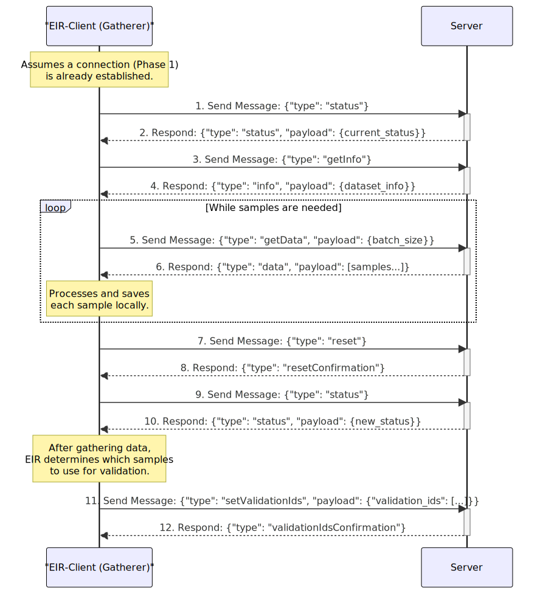
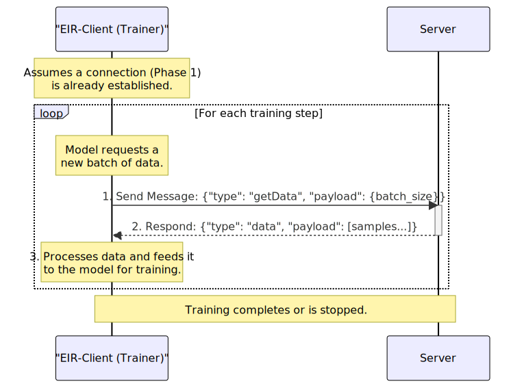
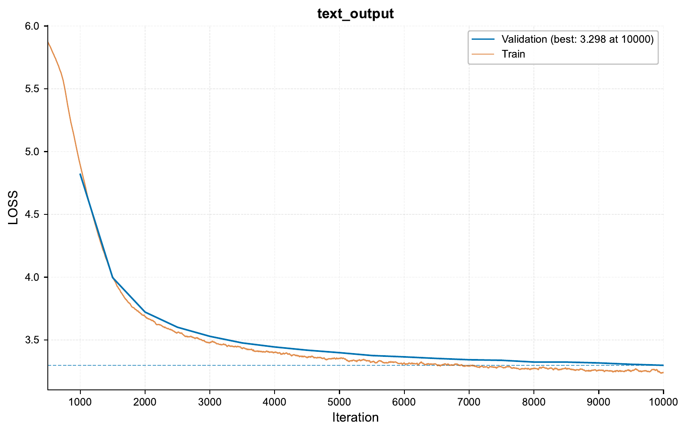

.. _streaming-data-guide:

.. role:: raw-html(raw)
    :format: html

Streaming Data Hands-On Guide
=============================

This guide covers EIR's streaming data functionality,
which allows for real-time data streaming during training.
The guide focuses on how to implement a compatible
WebSocket server that can stream data to EIR.

Overview
--------

EIR includes built-in support
for receiving streaming data via WebSocket connections.
To use this functionality, you only need to:

1. Implement a WebSocket server that follows EIR's protocol specification
2. Point to your server's WebSocket address in EIR's configuration files

For example,
to use streaming data in EIR,
you would simply specify the WebSocket URL in your configuration:

.. code-block:: yaml

    output_info:
      output_source: ws://localhost:8000/ws
      output_name: text_output
      output_type: sequence

EIR will automatically handle the connection, data receiving, and processing.

Protocol Specification
----------------------

To be compatible with EIR, your WebSocket server must implement the following protocol:

Message Structure
^^^^^^^^^^^^^^^^^

All messages use JSON format:

.. code-block:: python

    {
        "type": str,    # Message type
        "payload": Any  # Message payload
    }

Servers and the EIR client
^^^^^^^^^^^^^^^^^^^^^^^^^^

Before going further, it's useful to further define some terminology:

- **Client (EIR)**: The EIR client that connects to the server and processes the streamed data.
    - *This is built into EIR and not modified by you.*
- **Server**: The WebSocket server that streams data to EIR.
    - *This is what you implement and customize.*

So, while EIR handles the client side,
we have to make sure our server implements the correct protocol
to communicate with EIR.

Core Protocol Messages
^^^^^^^^^^^^^^^^^^^^^^

Your server should be prepared to handle several message types from the EIR client. At a high level, these are the key interactions:

- **Handshake & Keep-Alive**:
    - ``handshake``: The very first message sent by the client to establish a compatible connection. Your server must respond in kind.
    - ``heartbeat``: A simple message to keep the connection alive and check for responsiveness.

- **Data & Schema Exchange**:
    - ``getInfo``: The client asks for the structure of your data (e.g., input/output names and types). Your server replies with an ``info`` message.
    - ``getData``: The client requests a batch of data samples. Your server replies with a ``data`` message containing the samples.

- **State Management**:
    - ``status``: The client can ask for the current state of your data stream (e.g., how many samples have been sent).
    - ``reset``: The client can instruct the server to reset its data stream to the beginning. This is crucial for allowing EIR to read the stream multiple times (e.g., once for setup and once for training).

Logic Flow When Streaming
-------------------------

When we run ``eirtrain`` where one of the input/output sources is a WebSocket URL,
we can roughly split the process into 3 main phases.

Phase 1: Handshake and Setup
^^^^^^^^^^^^^^^^^^^^^^^^^^^^

First is the setup phase, where the EIR client connects to your WebSocket server
and checks that it can communicate properly.

Below is an example of the connection logic
for phase 1 that we can implement in our server.

.. literalinclude:: ../doc_modules/user_guides/simulation_streamer.py
   :language: python
   :caption: simulation_streamer.py - Phase 1 Connection Logic
   :linenos:
   :start-after: # start-connect-websocket
   :end-before: # end-connect-websocket

Phase 2: Data Setup
^^^^^^^^^^^^^^^^^^^

Here, the EIR client requests information about the data structure
from the server. After that, EIR will request samples of data
until the ``streaming_setup_samples`` under ``data_preparation`` in the
global configuration file is reached.

These samples are saved locally in the experiment directory
during the experiment run phase, and should be deleted
after the experiment is complete.

The reason for this is twofold:

1. **Training Data Statistics** EIR uses these samples to gather and compute various statistics
   about the potentially raw training data to use for training. For example:

    - The mean and standard deviation of image pixel values for normalization.
    - The vocabulary of text data for tokenization.
    - The unique values in categorical data for encoding.
    - ... and so on.

2. **Validation Data Setup** EIR also uses these samples to set up the validation data.

Below is an example of the FastAPI websocket endpoint
including the logic for handling phase 2 messages.

.. literalinclude:: ../doc_modules/user_guides/simulation_streamer.py
    :language: python
    :caption: simulation_streamer.py - Phase 2 Data Setup Logic
    :linenos:
    :start-after: # start-websocket-endpoint
    :end-before: # end-websocket-endpoint

Phase 3: Training Data Streaming
^^^^^^^^^^^^^^^^^^^^^^^^^^^^^^^^

Finally, we reach the training phase,
where the EIR client requests data samples for training.
This is really nothing too new after
setting up the data structure in phase 2, now
we just need to keep sending data samples to EIR for training.

Putting it All Together
-----------------------

Now that we have the basic logic for each phase,
let's put it all together for a toy example where
we train a seq-to-seq model on a simple, simulated dataset.

Setting up a WebSocket server
^^^^^^^^^^^^^^^^^^^^^^^^^^^^^

We will implement our streaming logic in the following files:

- ``single_sample_simulation.py``: Contains the logic for generating a single sample of data, containing both the input and output sequences for the seq-to-seq model.
- ``data_simulator.py``: Contains the logic for generating a batch of data samples, resetting the data stream, and keeping track of the current sample index.
- ``simulation_streamer.py``: The main WebSocket server implementation, reads data from the simulator and handles the WebSocket connection with EIR.

Here are the three files in their entirety:

.. literalinclude:: ../doc_modules/user_guides/single_sample_simulation.py
    :language: python
    :caption: single_sample_simulation.py - Single Sample Generation Logic

.. literalinclude:: ../doc_modules/user_guides/data_simulator.py
    :language: python
    :caption: data_simulator.py - Batch Data Generation Logic

.. literalinclude:: ../doc_modules/user_guides/simulation_streamer.py
    :language: python
    :caption: simulation_streamer.py - WebSocket Server Implementation

Assuming we have these files in the same directory,
we can run the WebSocket server with ``python simulation_streamer.py``
or ``python -m simulation_streamer``. This will start the server
on ``ws://localhost:8000/ws`` by default.

Training with EIR
^^^^^^^^^^^^^^^^^

Here's the folder structure we'll be working with:

.. literalinclude:: ../tutorials/tutorial_files/user_guides/01_streaming_data/commands/tutorial_folder.txt
    :language: console

Let's look at our configurations. The global config specifies basic training parameters:

.. literalinclude:: ../tutorials/tutorial_files/user_guides/01_streaming_data/globals.yaml
    :language: yaml
    :caption: globals.yaml

For the input configuration, we are using the simulated input sequence
in our data simulator. Notice how we are pointing to the WebSocket server
as the input source:

.. literalinclude:: ../tutorials/tutorial_files/user_guides/01_streaming_data/input.yaml
    :language: yaml
    :caption: input.yaml
    :emphasize-lines: 2

For fusion, we use a simple pass-through configuration since we're only doing
sequence generation:

.. literalinclude:: ../tutorials/tutorial_files/user_guides/01_streaming_data/fusion.yaml
    :language: yaml
    :caption: fusion.yaml

Just like the input configuration,
the output configuration specifies our WebSocket server
as the output source:

.. literalinclude:: ../tutorials/tutorial_files/user_guides/01_streaming_data/output.yaml
    :language: yaml
    :caption: output.yaml
    :emphasize-lines: 2

Note the ``output_source`` pointing to our WebSocket server. This tells EIR
to expect streaming data from this address.

As mentioned earlier, before starting training,
we need to ensure our streaming server is running.

Once it's running, in another terminal, we can start training:

.. literalinclude:: ../tutorials/tutorial_files/user_guides/01_streaming_data/commands/STREAMING_SEQUENCE_GENERATION.txt
    :language: console

During training, EIR will connect to the streaming server and receive data in
batches. Let's look at some samples generated during training.

At iteration 500:

.. literalinclude:: ../tutorials/tutorial_files/user_guides/01_streaming_data/figures/auto_generated_iter_500.txt
    :language: console
    :caption: Auto-generated sequence at iteration 500

At iteration 2500:

.. literalinclude:: ../tutorials/tutorial_files/user_guides/01_streaming_data/figures/auto_generated_iter_2500.txt
    :language: console
    :caption: Auto-generated sequence at iteration 2500

Here's the training curve showing our progress:

The nice thing here is that once we have the major
pieces in place for streaming data, it is easier
to adapt this to a different logic within the current
experiment (e.g. changing the data generation logic),
or apply this to different datasets.